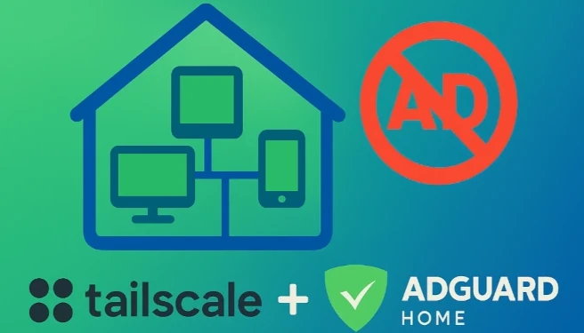


## Introduction

In this post I'll show you how I set up a network-wide adblocker and DNS filter, which lets me kill ads across every device I own and boost my network's security.
To pull this off in a flexible, secure way, I use **Tailscale** to build a **tailnet** that includes all my devices.
For the DNS-level web filtering, I rely on the excellent **AdGuard Home**.


## Tailscale

Tailscale is a next-generation Software Defined Network (SDN) that lets you connect all your devices easily and securely (**peer-to-peer VPN**), building a private network between them without complex configuration or dedicated hardware.
Worth noting: generally, all traffic between VPN peers never passes through third-party devices, which means stronger security.

Tailscale uses the open-source WireGuard protocol to set up encrypted point-to-point connections between devices, making sure only the ones belonging to your private network — called a **tailnet** — can talk to each other.

It works on a hybrid centralized-distributed model: a coordination server handles the exchange of public keys and addresses, letting each node independently set up its own encrypted tunnels with other devices — even across firewalls and NAT — without opening ports or fiddling with network policies.

> This way, Tailscale builds a peer-to-peer mesh network that cuts latency and boosts throughput, making device-to-device communication direct and secure.

## Adguard Home

**AdGuard Home** is software that works as a network-wide DNS server, designed to block ads, trackers, and malicious content across every device connected to your home network.
It works by filtering DNS requests — the requests that translate domain names into IP addresses — blocking the ones aimed at domains known for advertising, tracking, and malware, before the connection is even established.

In practice: when a device on your network tries to resolve a domain, AdGuard Home checks whether that domain is on one of its blocklists, and if it is, it blocks the connection by returning an unreachable IP address (a "black hole").
This stops devices from loading unwanted or potentially dangerous content, improving privacy and online security across your entire network.

AdGuard Home also lets you customize filtering rules, add your own custom blocklists, and monitor your network's DNS activity. You can set it up to enforce parental controls and block entire websites on specific devices.

On top of that, AdGuard Home uses "upstream" DNS servers to resolve requests that aren't blocked, supporting security protocols like DNS-over-HTTPS and DNS-over-TLS to keep your DNS queries private.

> This solution is ideal if you want centralized, customizable control over ad filtering and DNS security across every device at home or in the office, without installing software on each individual device.

## Architecture 

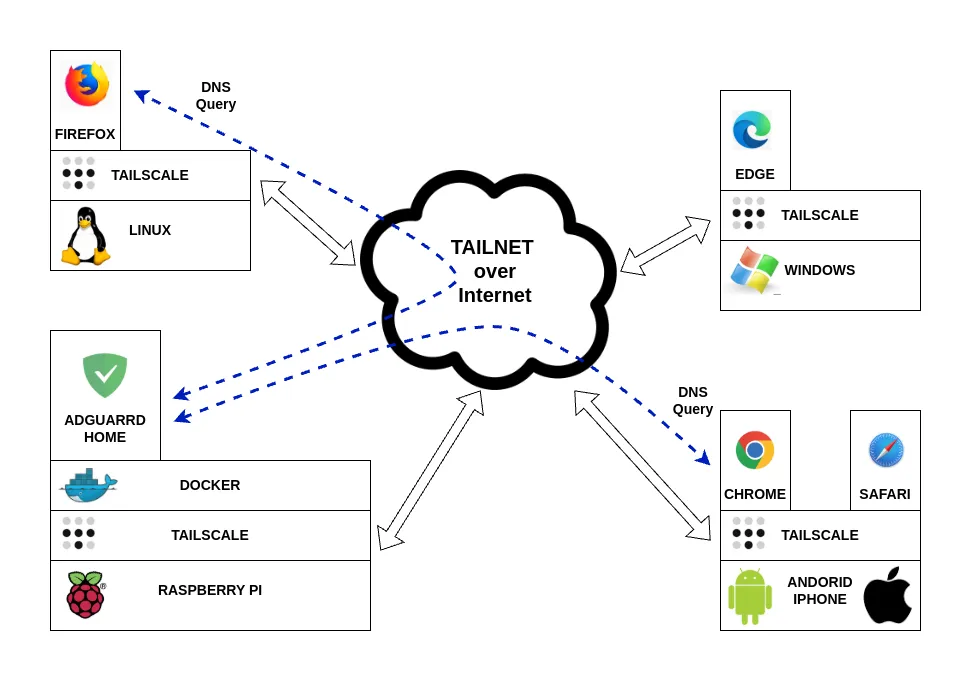

The overall setup works like this: Tailscale builds a **private tailnet** covering every device on your network (Windows PCs, Linux machines, TVs, Android phones, iPhones, and so on).
These devices are configured to use our AdGuard Home instance as their DNS server, where filtering and DNS resolution happen.

That way, your devices are protected transparently, with no need to install any extra software on each one.

Of course, AdGuard Home itself also needs to run on a device that's part of the tailnet. It can run on a **Raspberry Pi**, a local NAS, a cloud VM, or really any system connected to the internet and reachable through Tailscale.

It's really important to stress that with this setup, you're not exposing a DNS server directly on the internet.
Exposing a public DNS server without proper safeguards is risky and not something I'd recommend — it can put you and other users at serious security risk.

Thanks to Tailscale, DNS traffic stays confined inside the private virtual network (tailnet), giving you secure, private access to the AdGuard Home server without opening ports or exposing services to the outside world.

> This approach combines the convenience of a centralized, customizable DNS filter with the security of a modern peer-to-peer VPN, without compromising your network's privacy or security.

## Installation and Configuration

### Raspberry Pi OS and Docker

For this article, I'm assuming you already have a Raspberry Pi with Docker installed. If not, feel free to follow whatever guide you prefer to install Raspberry Pi OS and Docker.

### Tailscale

The Tailscale client, which connects your devices to your tailnet, is easy to install:

#### Windows

Requires Windows 10 or later.

- Download and install the client from this [official link](https://pkgs.tailscale.com/stable/tailscale-setup-latest.exe)

#### macOS

Requires macOS Big Sur 11.0 or later.

- Download and install the client from this [official link](https://pkgs.tailscale.com/stable/Tailscale-latest-macos.pkg)
- Or grab it directly from the [Mac App Store](https://apps.apple.com/ca/app/tailscale/id1475387142?mt=12)

#### Linux

- Run this from a terminal:

```bash
curl -fsSL https://tailscale.com/install.sh | sh
```

#### iOS

Requires iOS 15 or later.

- Download directly from the [App Store](https://apps.apple.com/us/app/tailscale/id1470499037?ls=1)

#### Android

Requires Android 8 or later.

- Download directly from the [Play Store](https://play.google.com/store/apps/details?id=com.tailscale.ipn)

For every installation type, you'll need to create an account (free for up to 100 devices) and connect your devices to the same tailnet.

Once installation is done, logging into the Tailscale dashboard should show you all your devices, active and connected.

### DNS Configuration

The goal here is making sure every DNS request from tailnet clients gets processed by our AdGuard Home instance, running on the Raspberry Pi.
In my case, AdGuard Home runs on the Raspberry Pi named "factotum".

To configure DNS correctly, note down the IP address assigned to the Raspberry Pi (for example: `100.101.102.103`).

Now head to the DNS configuration tab in the Tailscale dashboard and set it up like this:

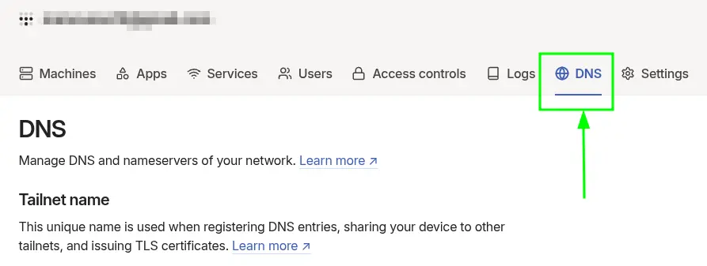

1. Edit the DNS settings
2. Enter the IP address of your Raspberry Pi (where AdGuard Home is running)
3. Select *Override DNS Server* so your clients actually use the DNS server you specified

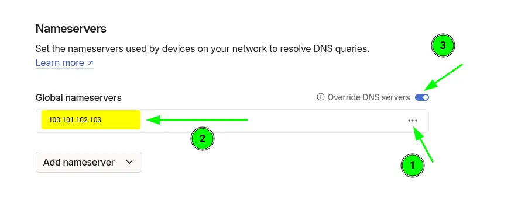

> With this in place, your clients — with no other configuration needed — will use your AdGuard Home instance running on the Raspberry Pi as their DNS server. This setup gives you strong privacy, and it's entirely under your control.

### AdGuard Home

Since the Raspberry Pi can host plenty of other services too (Immich, Jellyfin, and so on), AdGuard Home gets installed in isolation, independent from everything else, using a Docker container.

To do that, I created a `services` directory in the Raspberry Pi's home folder. This directory will host every service I want to make available to my tailnet clients.

Inside `services`, I create a dedicated directory for AdGuard Home, called `adguardhome`. Inside that, I create two directories AdGuard Home needs at runtime, called `config` and `work`.

```bash
cd ~

mkdir -p services/adguardhome/{work,config}
```

You should end up with a directory structure like this:

```bash
services/
├── adguardhome
│   ├── config
│   └── work
```

Now, inside the `adguardhome` directory, create a file called `docker-compose.yml` with this content:

```bash
name: adguardhome

services:
  adguardhome:
    container_name: adguardhome
    image: adguard/adguardhome
    platform: linux/arm64
    volumes:
      - ./work:/opt/adguardhome/work
      - ./config:/opt/adguardhome/conf
    network_mode: host
    restart: always
```

Start the AdGuard Home container:

```bash
cd ~/services/adguardhome

docker compose up -d
```

After a few seconds, the container will be up and running, and you'll be able to reach AdGuard Home's web management console.
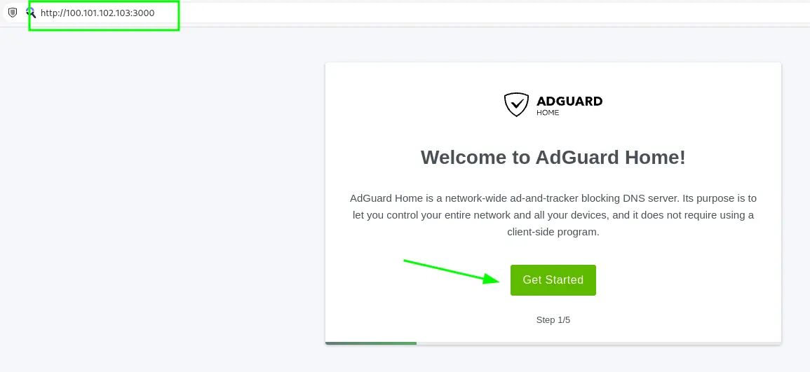

Set the ports for the admin dashboard and the DNS port (the defaults are fine).
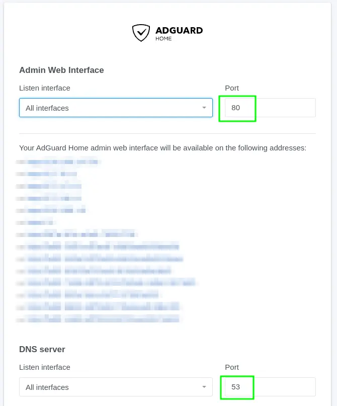

Proceed without changes
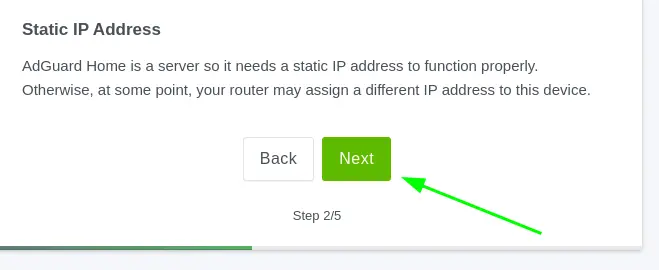

Create the admin account
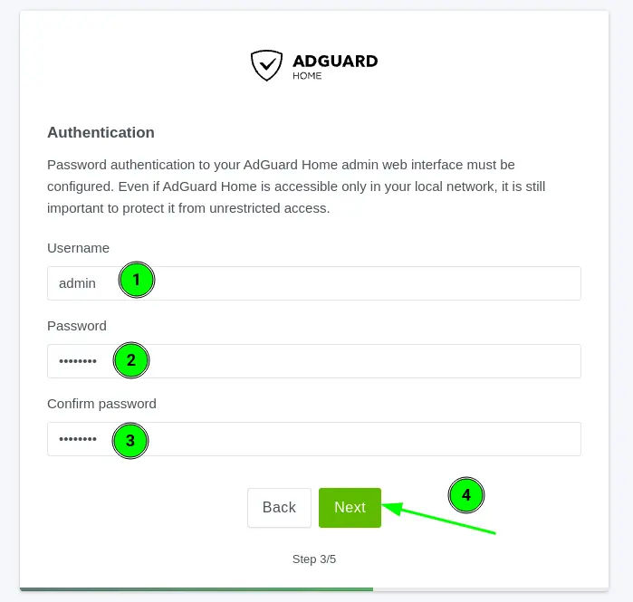

Proceed without changes
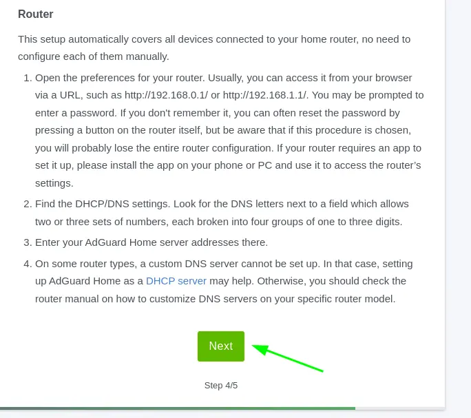

Proceed without changes
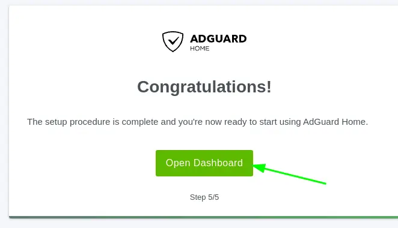

Good — now you can log in as AdGuard Home's administrator.
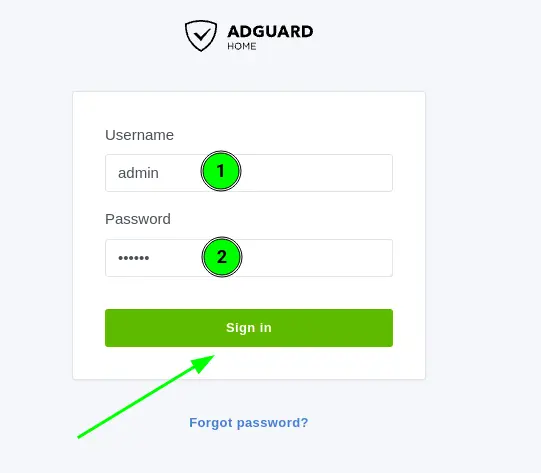

If everything went fine, you'll see the initial dashboard with usage stats.
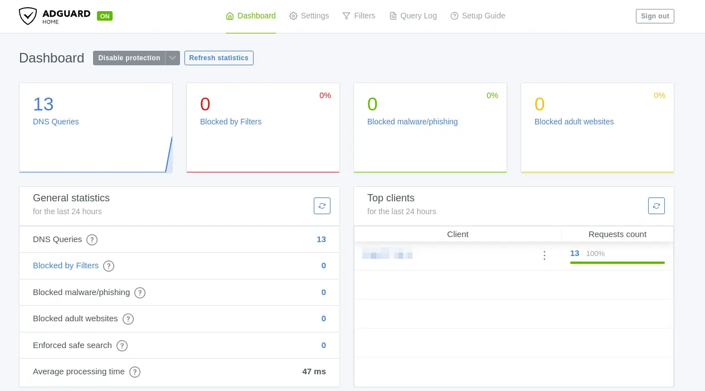

*Settings->General Settings*

Here I'll show you my own settings, but obviously feel free to adapt them to your own needs.
If you're not sure what a given setting does, you can just follow my configuration — it's tried and tested, and works perfectly.

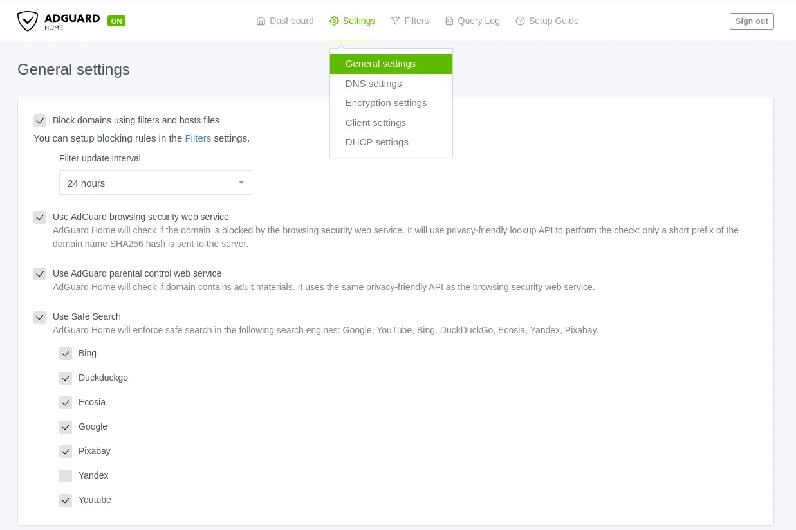

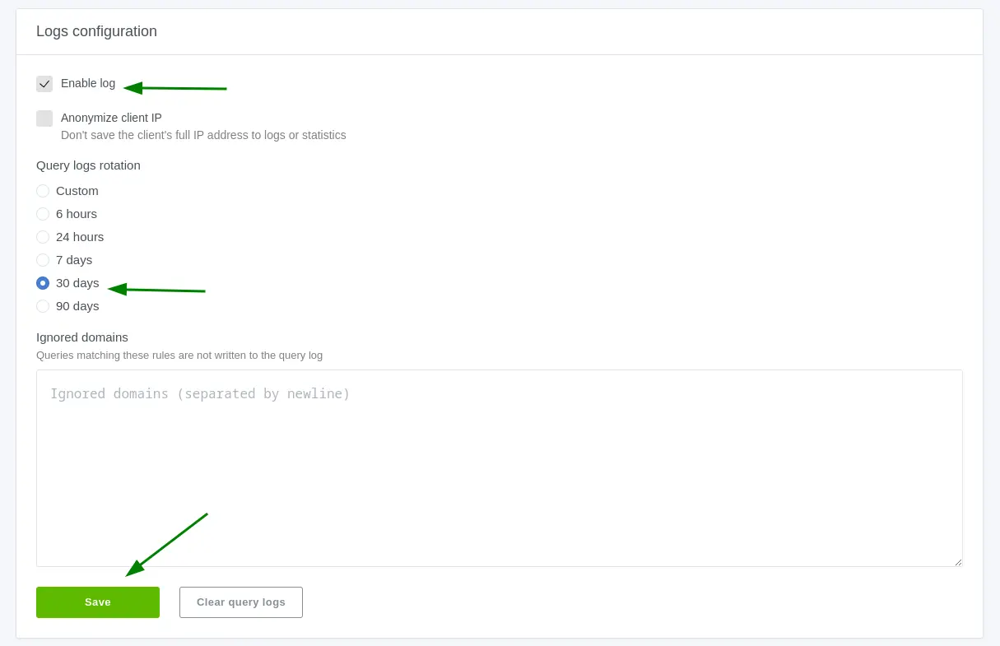

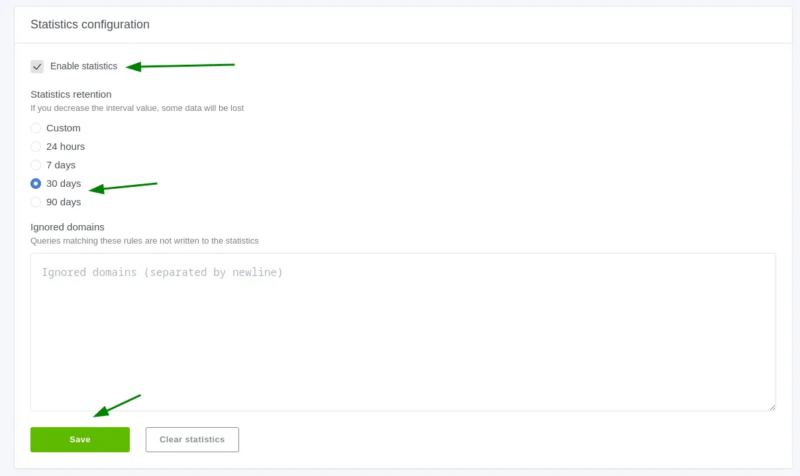

*Settings->DNS Settings*

I use *Quad9* as my upstream DNS resolver, but you can pick whichever resolver you prefer — just change the IP address.
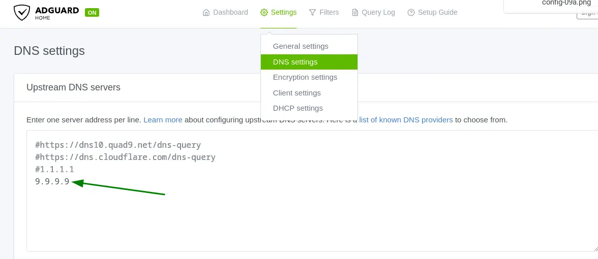

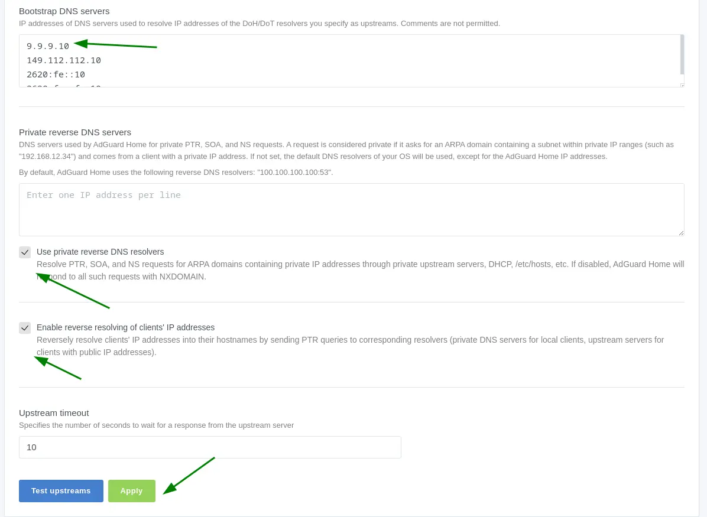

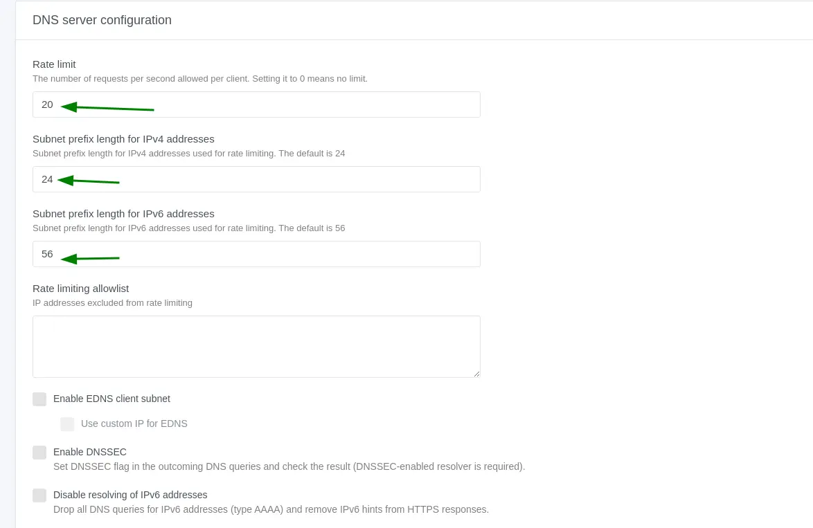

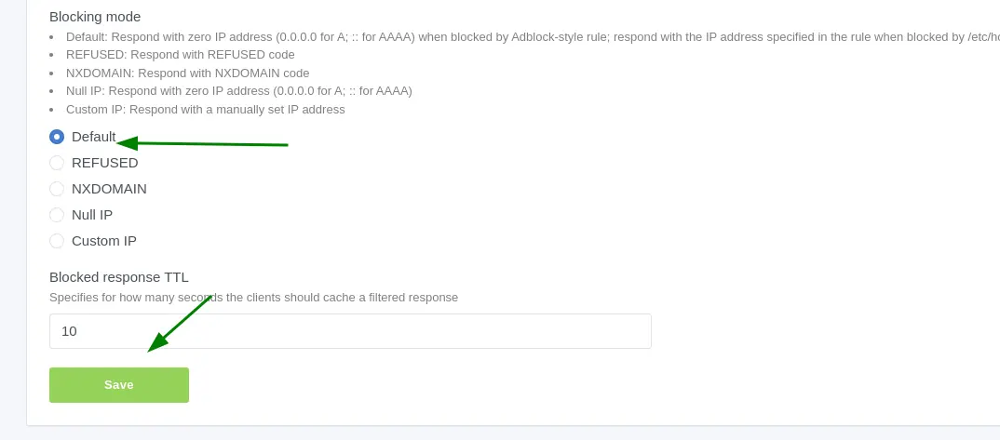

*Filters->DNS blocklist*

Here you can specify a set of domain lists that AdGuard Home will filter.
A few are already preconfigured, but I'd suggest adding these too:

- Steven Black: https://raw.githubusercontent.com/StevenBlack/hosts/master/alternates/fakenews-gambling-porn-social/hosts
- ppfeufer list: https://github.com/ppfeufer/adguard-filter-list/blob/master/blocklist?raw=true

You can also add your own custom list of domains to filter. I, for instance, use GitHub gists: I create a gist with the domains I want filtered and add the reference here, so AdGuard Home loads my list without any trouble.

The gist URL will look something like:
`https://gist.githubusercontent.com/***your-account***/38e9dg4c1bebfb15a654062495c711fa/raw`

The blocklist format is dead simple:

```bash
||config.edge.skype.com^
||avatars.githubusercontent.com^
||github-cloud.s3.amazonaws.com^
```

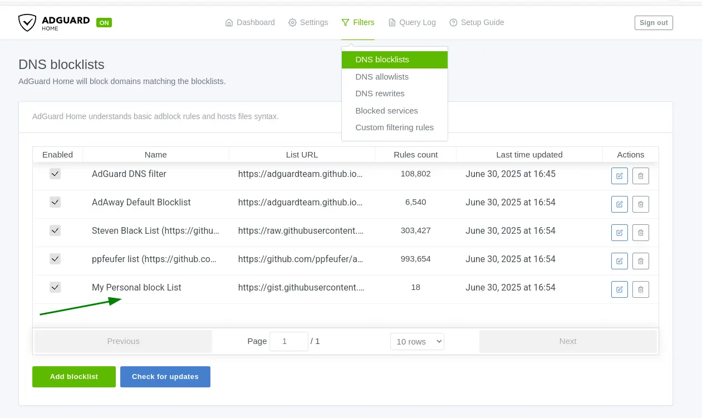

*Filters->DNS allowlist*

The same way, you can set up an allowlist (a list of exceptions you don't want filtered). You can use the same gist trick as above.
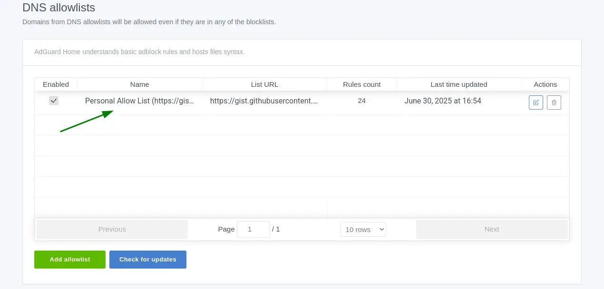

*Filters->Blocked services*

Here you can filter specific services, just by flipping on the relevant setting.
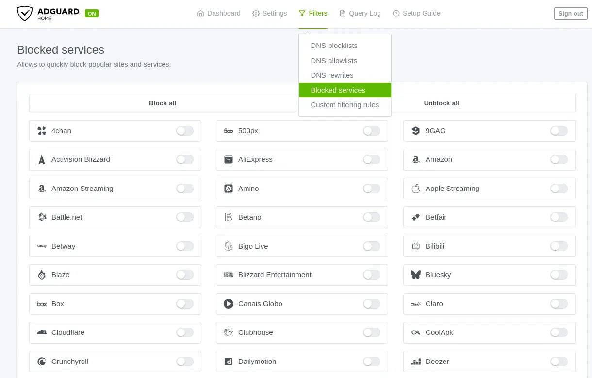

*Filters->Custom filtering rules*

Here you can add filtering rules on top of everything else configured so far.

The format is:

- `||domain.com^` to filter domain.com and all its subdomains
- `@@||domain.com^` to exclude domain.com and its subdomains from filtering

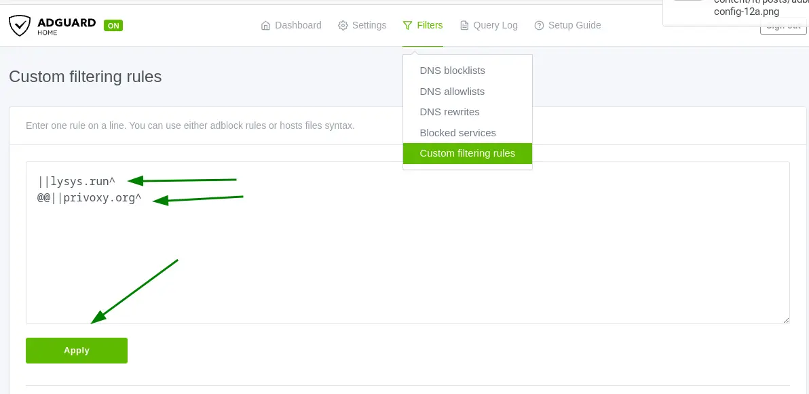

## Conclusion

Congrats on making it this far! You now have a powerful DNS filter that blocks the vast majority of ads and protects you from trackers and malicious sites.
And it's all fully secure: thanks to Tailscale, this service is available across every one of your devices, with no need to install any sketchy apps of dubious origin.

If you want to take your DNS query privacy a step further, I've written a guide on [setting up Unbound as a private DNS resolver](/posts/configurare-unbound-resolver-DNS-privato-AdGuard-Home-RaspberryPi-Docker-massima-privacy/) to use as AdGuard Home's upstream, instead of a public DNS.

If you have any doubts or questions, drop a comment below. And if you found this article useful, share it with your network!

Happy adblocking!
