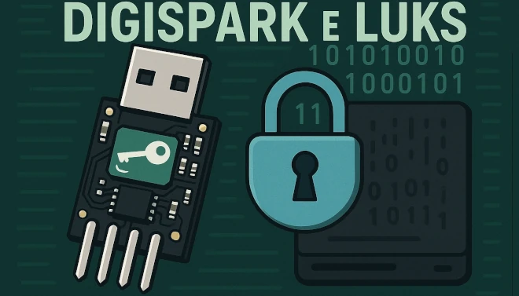
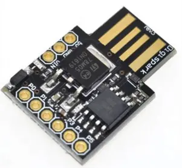
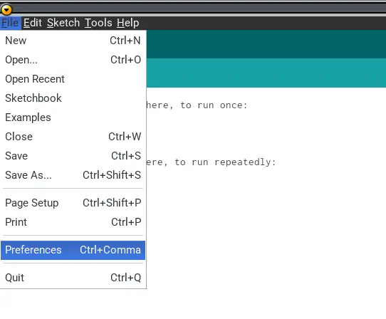
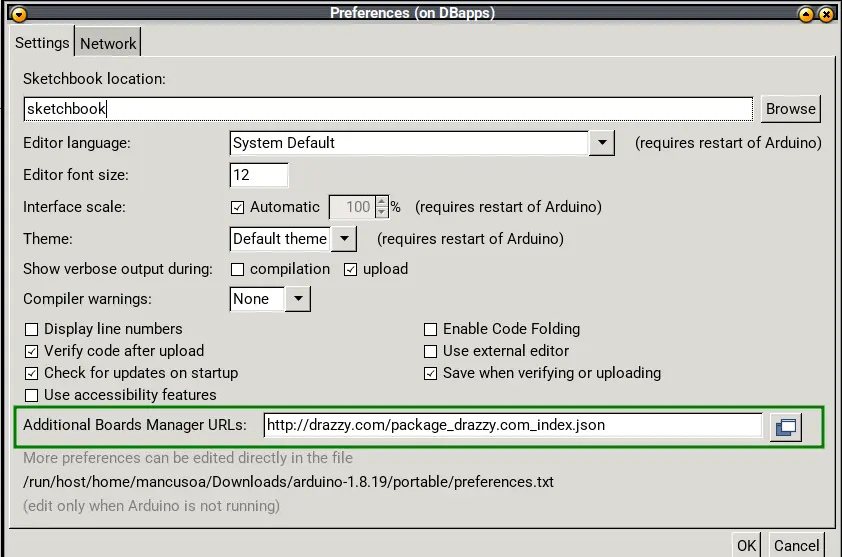
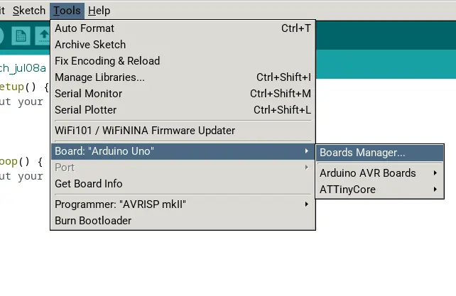
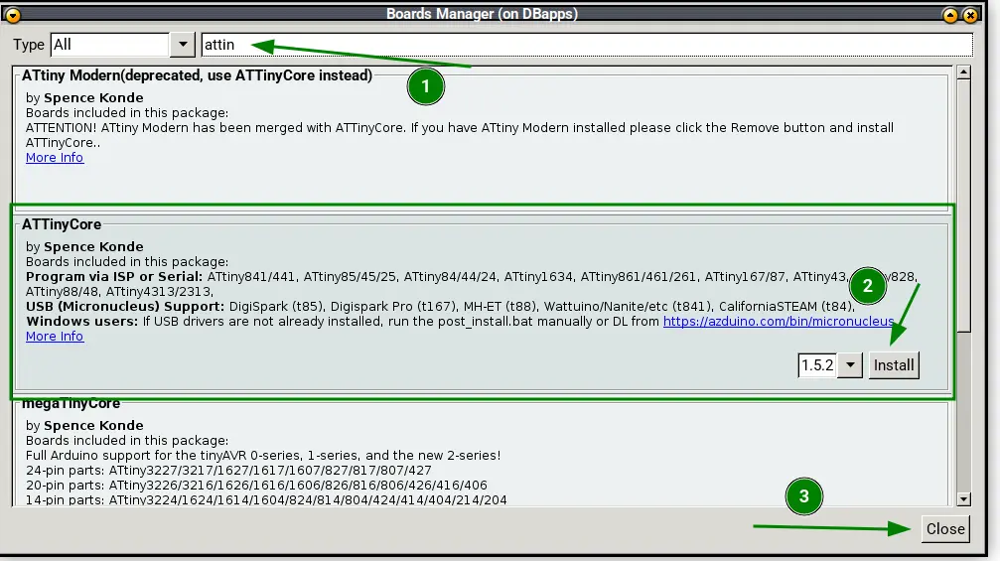
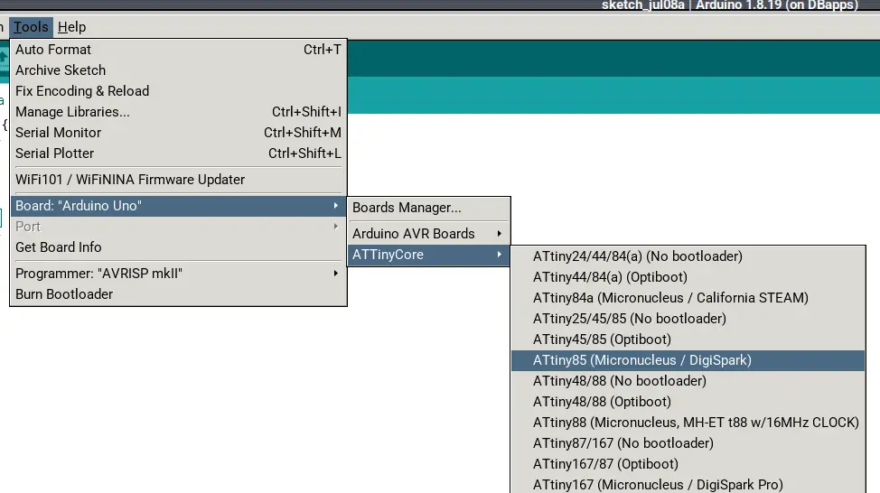
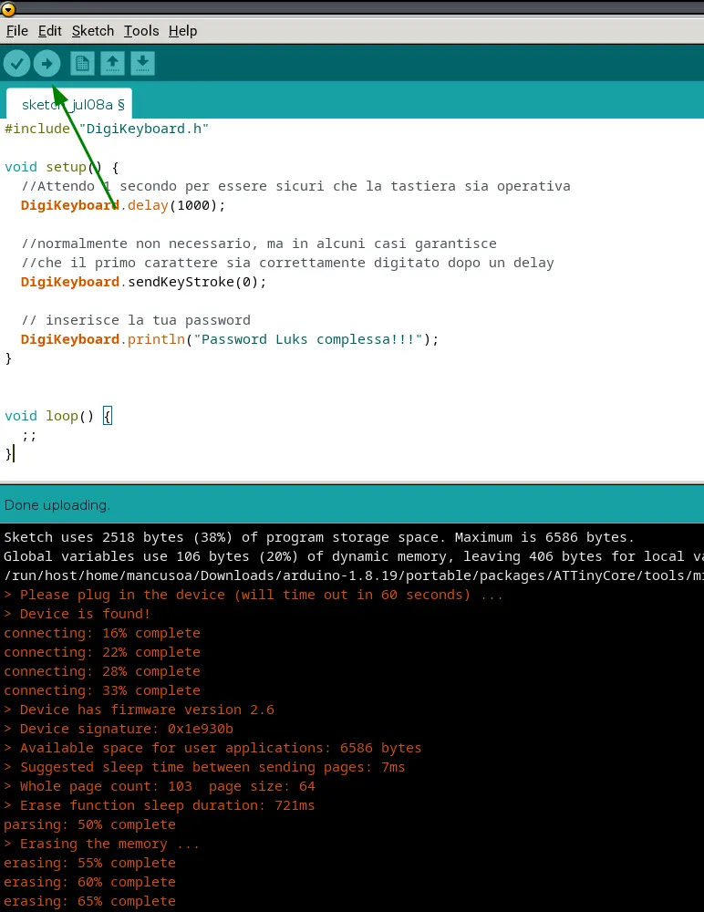

## Introduction

One of the most important pieces of advice in **information security** is about how strong your passwords are.
A good password needs to be complex enough that it can't be cracked by brute-force (or other attacks) in any reasonable amount of time.
The problem is, we humans usually struggle to remember long, complex passwords, so we tend to pick ones we can easily recall instead.

My motto is `if you can remember it, I can guess it`. It's a bit of a provocation, meant to make the point that you shouldn't have to remember a secure password at all.

For everyday use of an operating system, it's a great idea to use a password manager.
But there are situations where that's just not an option. For example, if your Linux system's filesystem is encrypted and protected by LUKS, you'll be asked to enter a password during boot — and obviously, your password manager isn't available at that point.

To get around the problem of remembering a **secure** password, I decided to build a system that uses a small USB device (**Digispark**) to type the password automatically.

Let's walk through every step needed to set up the development environment and program the Digispark so that, once plugged into your PC's USB port, it types the password for you.


## Digispark or Clone

The Digispark is an extremely compact development board built around the **ATtiny85** microcontroller. There are plenty of dirt-cheap clones out there (1 euro or so).
It's a cheap, tiny solution for electronics and automation projects — think Arduino, but smaller and less powerful.

Its key specs:

- **Size**: roughly 18×18 mm, making it one of the smallest boards you'll find



- **Microcontroller**: ATtiny85 at 16 MHz, 8kB of flash memory (about 6kB usable after the bootloader)

- **Power**: via USB or an external source

- **I/O**: 6 general-purpose pins (analog and digital; 2 are shared with USB if the sketch actively communicates over USB)

- **USB interface**: the PCB is shaped to plug directly into a Type-A USB port

- **Cost**: extremely low, and easy to find

---


## Installing and Setting Up the Arduino IDE

If you already have the Arduino IDE installed, feel free to skip ahead. Either way, here's how to install the *portable* version.

### Download Arduino Portable

```bash
wget https://downloads.arduino.cc/arduino-1.8.19-linux64.tar.xz
```

### Installing Arduino Portable

```bash
tar xvf arduino-1.8.19-linux64.tar.xz
```

This creates a directory called `arduino-1.8.19`. Let's create the *portable* directory:


```bash
cd arduino-1.8.19
mkdir portable
```

### Installing Digispark Support

Launch the Arduino IDE:

```bash
./arduino
```

- Go to **File -> Preferences**
- Under **Additional Board Manager URLs**, enter:

```bash
http://drazzy.com/package_drazzy.com_index.json
```

- Click OK





- Now go to **Tools -> Board -> Board Manager**
- Install **ATTinyCore version 1.5.2**





<br>

---


## Installing Digispark Libraries

- Download the libraries needed to program the Digispark
- Copy the libraries into `arduino-1.8.19/libraries`

```bash
cd arduino-1.8.19

wget https://github.com/digistump/DigistumpArduino/releases/download/1.6.7/digistump-avr-1.6.7.zip

unzip digistump-avr-1.6.7.zip

cd 1.6.7/libraries

cp -vr * ../../libraries
```

---


## Flashing the Bootloader

- Let's install the bootloader that suits our needs — one with a shorter initial wait time:

```bash
cd arduino-1.8.19

git clone https://github.com/ArminJo/micronucleus-firmware.git
```

- Now let's flash it:

```bash
portable/packages/ATTinyCore/tools/micronucleus/2.5-azd1b/micronucleus --no-ansi --run --timeout 60 micronucleus-firmware/firmware/upgrades/upgrade-t85_entry_on_powerOn_activePullup_fastExit.hex
```

- Within 60 seconds, plug the Digispark into a USB port
- The bootloader will flash automatically

```bash
> Please plug in the device (will time out in 60 seconds) ... 
> Device is found!
connecting: 16% complete
connecting: 22% complete
connecting: 28% complete
connecting: 33% complete
> Device has firmware version 2.6
> Device signature: 0x1e930b 
> Available space for user applications: 6586 bytes
> Suggested sleep time between sending pages: 7ms
> Whole page count: 103  page size: 64
> Erase function sleep duration: 721ms
parsing: 50% complete
> Erasing the memory ...
erasing: 55% complete
erasing: 60% complete
erasing: 65% complete
> Starting to upload ...
writing: 70% complete
writing: 75% complete
writing: 80% complete
> Starting the user app ...
running: 100% complete
>> Micronucleus done. Thank you!
```
---


## Writing the Code for Automatic Password Entry

- Launch the Arduino IDE
- Under **Tools -> Board -> ATTinyCore**, select **ATTiny85 (micronucleus/digispark)**



- Now copy this code (tweak it as you like — this is a minimal example):

```c
#include "DigiKeyboard.h"

void setup() {
  //Attendo 1 secondo per essere sicuri che la tastiera sia operativa
  DigiKeyboard.delay(1000);
  
  //normalmente non necessario, ma in alcuni casi garantisce 
  //che il primo carattere sia correttamente digitato dopo un delay
  DigiKeyboard.sendKeyStroke(0);
  
  // inserisce la tua password
  DigiKeyboard.println("Password Luks complessa!!!"); 
}


void loop() {
  ;;
}
```

---


## Uploading the Code to the Digispark Board

- Upload the sketch (click the right-pointing arrow icon, or press CTRL+U)
- Within 60 seconds, plug in the Digispark and the upload will begin



- When you plug the Digispark into a USB port, your password gets typed automatically, once, after about 3 seconds
- Watch out: not every character is typed correctly every time (symbols especially)
- Double-check carefully that the typed password matches

---


## Security Considerations

There are a few important things worth considering from a security standpoint:

- Some might consider this solution not very secure, since the password is stored in plaintext in the Digispark's firmware
- If an attacker got hold of both your PC and your Digispark, they could recover the password — though not without some effort

My use case looks like this:

- The PC and the Digispark live in different places (backpack and keychain)
- If my PC gets stolen or lost but not the Digispark, the thief **CANNOT** access my data
- If the Digispark gets stolen or lost but not the PC, the thief could potentially get the key — which I can change in the meantime
- If both the PC and the Digispark get stolen or lost at the same time, the thief gets access to the data
- Without the Digispark, my unlock password would have to be weaker
- With the Digispark, I can use a much stronger password

Weighing all this, I think this solution gives an *adequate* level of security for my use case, exposing me to data theft only in a low-probability scenario.

If system hardening interests you, another useful trick is isolating your most exposed applications: I've written a guide on [running Chrome securely with Docker](/posts/guida-google-chrome-docker-sicuro/), which follows the same philosophy of shrinking your attack surface.

---


## Tips

Careful: if you set the password stored on the Digispark as your only LUKS key, you're creating a **single point of failure**.
If you lose the Digispark or it breaks, you'll no longer be able to access your data.

My suggestions:

- Write the password down somewhere safe, protected, and well guarded
- Set up a second LUKS key to use as a backup

---

## Conclusion

With this setup, at boot time on my Linux system, instead of typing my LUKS unlock password, I just plug in the Digispark and it types it for me.
That lets me use a long, complex password, boosting my disk's security.

Of course, you can use this method for any other password, not just to unlock LUKS.
I'll leave it to you to come up with creative uses for this trick — and if you do, let me know in the comments below.
