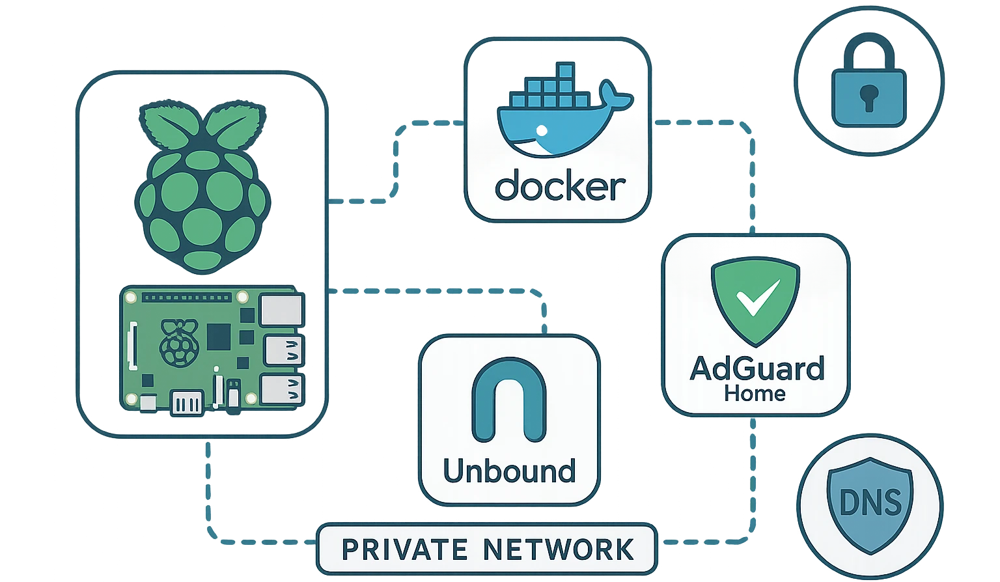
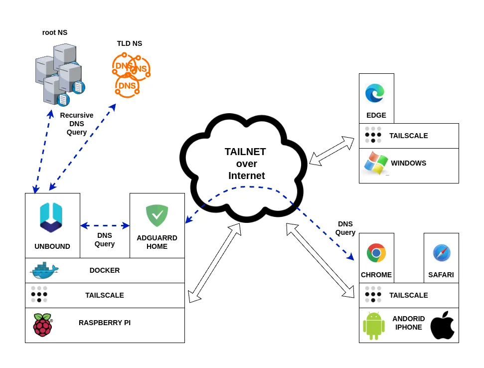
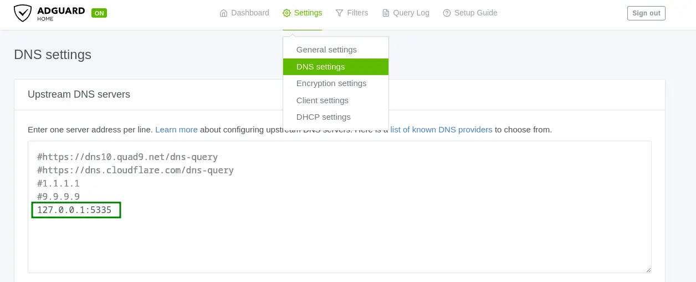

## Introduction

In an earlier article ([How to Build a Network-Wide AdBlocker with Tailscale and AdGuard Home](https://mancusoa.it/posts/adblocker-rete-tailscale-adguardhome/)), I showed how to build a network-wide adblocker that effectively protects all your devices (PCs, laptops, smartphones, and so on) using AdGuard Home installed on a Raspberry Pi, tied together with a private network via Tailscale.

In that architecture, though, there's still one thing worth addressing: AdGuard Home uses a public resolver as its upstream DNS (say, 1.1.1.1, 8.8.8.8, or your ISP's own).

That comes with a few real privacy limitations:

- **Tracking and profiling**
  Public DNS resolvers can log every DNS request you send, tying it to your IP address. That data can be used to profile your browsing habits.

- **No anonymity**
  Public DNS providers can retain query logs for varying periods, potentially exposing your DNS history.

- **Rules that don't line up with the European GDPR**
  Many public DNS services are run by companies outside the EU, with data transfers to countries with weaker privacy protections than the GDPR.

- **Filtering and censorship**
  Some public DNS services apply filters to certain domains, limiting your freedom of access without you fully realizing it.

So using public DNS doesn't eliminate the risks of tracking, profiling, and data retention. Only a private DNS resolver — one you run yourself — gives you real control over your DNS requests and their privacy.

In this article, we'll extend the network adblocking setup to deal with these issues, by installing and configuring a private DNS resolver using the open-source software **Unbound**.

## Unbound

**Unbound** is an open-source, caching recursive DNS resolver, built to be fast, lightweight, and secure. It supports modern, open-standard features that boost online privacy, like DNS-over-TLS and DNS-over-HTTPS, which encrypt the communication between client and resolver.

It also implements advanced techniques to limit the amount of data exchanged with authoritative servers, improving both privacy and robustness, including:

- Query name minimization (QNAME Minimization)
- Aggressive use of DNSSEC-validated caching
- Support for authority zones, useful for loading local copies of the root zone

## Solution Architecture

DNS flow diagram: devices → AdGuard Home → Unbound → Internet



As you can see from the diagram, **Unbound** slots perfectly into the network adblocker architecture. AdGuard Home's filtering features stay exactly the same — what changes is how unfiltered domain names actually get resolved.

Instead of using a public DNS, AdGuard Home uses Unbound as its local recursive resolver. Thanks to a dedicated configuration, Unbound minimizes the queries sent to public servers, avoiding sending the full domain name to third parties and substantially boosting your browsing privacy.

## Building the Unbound Docker Image

To run Unbound in a Docker container, we need to build a custom image.

Let's work inside the `services` directory on the Raspberry Pi and create a dedicated folder:

```bash
cd ~

mkdir -p services/unbound
```

Inside `services/unbound`, create the file `entrypoint.sh` with this content:

```bash
#!/bin/sh
# Crea la directory se non esiste e assegna permessi
mkdir -p /var/lib/unbound
chown unbound:unbound /var/lib/unbound

# Genera o aggiorna la root key
if [ ! -s /var/lib/unbound/root.key ]; then
    echo "Generating root trust anchor..."
    unbound-anchor -a /var/lib/unbound/root.key
    chown unbound:unbound /var/lib/unbound/root.key
fi

echo "Running unbound........."

# Avvia Unbound come utente unbound
exec su-exec unbound unbound -d -c /etc/unbound/unbound.conf
```

Also create the `Dockerfile` in the same directory:

```bash
FROM alpine:latest

# Installa Unbound
RUN apk add --no-cache unbound su-exec

RUN echo 'server:' >  /etc/unbound/unbound.conf && \
    echo 'include-toplevel: "/etc/unbound/unbound.conf.d/*.conf"' > /etc/unbound/unbound.conf

COPY entrypoint.sh /entrypoint.sh
RUN chmod +x /entrypoint.sh

ENTRYPOINT ["/entrypoint.sh"]
```


The directory structure will look like this:

```bash
unbound/
├── Dockerfile
└── entrypoint.sh
```

As you can see, our DNS resolver's final image is based on Alpine Linux, keeping things compact and lightweight.

If you want to dig deeper into using Docker to isolate and secure other services, I've also written a guide on [running Chrome securely with Docker](/posts/guida-google-chrome-docker-sicuro/), which follows a similar containerization approach.

```bash
docker build -t unbound .
```


The `entrypoint.sh` script takes care of creating and refreshing the *root.key* file Unbound needs, every time the container starts.

Check the image is there with:

```bash
docker image ls
REPOSITORY                                   TAG       IMAGE ID       CREATED        SIZE
unbound                                      latest    65f2afce99d1   2 days ago     13.2MB
adguard/adguardhome                          latest    a5f2eed84b99   5 weeks ago    71MB
```


## Configuring Unbound

Let's create a `config` directory and put our custom configuration in `unbound-custom.conf`:

```bbash
unbound/
├── config
│   └── unbound-custom.conf
├── docker-compose.yml
├── Dockerfile
└── entrypoint.sh
```


Here's an example base configuration for `unbound-custom.conf`:

```bash
server:
    #general
 
    # File with trusted keys, kept uptodate using RFC5011 probes,
    auto-trust-anchor-file: "/var/lib/unbound/root.key"

    #logging
    # verbosity number, 0 is least verbose. 1 is default.
    verbosity: 2

    #log to stderr
    use-syslog: no
    logfile: ""

    # print UTC timestamp in ascii to logfile, default is epoch in seconds.
    log-time-ascii: yes

    # log timestamp in ISO8601 format if also log-time-ascii is enabled.
    # (y-m-dTh:m:s.msec[+-]tzhours:tzminutes)
    log-time-iso: yes

    # print one line with time, IP, name, type, class for every query.
    log-queries: yes

    # log with tag 'query' and 'reply' instead of 'info' for
    # filtering log-queries and log-replies from the log.
    log-tag-queryreply: yes

    #binding interface and port
    # specify the interfaces and port to answer queries from by ip-address.
    interface: 0.0.0.0
    port: 5335
    # control which clients are allowed to make (recursive) queries
    access-control: 127.0.0.0/8 allow

    #disable IPv6 if not needed
    do-ip4: yes
    do-udp: yes
    do-tcp: yes
    do-ip6: no

    #hardening
    # Harden against out of zone rrsets, to avoid spoofing attempts.
    harden-glue: yes

    # Harden against receiving dnssec-stripped data
    harden-dnssec-stripped: yes

    # Use 0x20-encoded random bits in the query to foil spoof attempts.
    use-caps-for-id: yes

    # enable to not answer id.server and hostname.bind queries.
    hide-identity: yes

    # enable to not answer version.server and version.bind queries.
    hide-version: yes

    # Sent minimum amount of information to upstream servers to enhance privacy.
    qname-minimisation: yes
    
    # Aggressive NSEC uses the DNSSEC NSEC chain to synthesize NXDOMAI
    aggressive-nsec: yes

    # If nonzero, unwanted replies are not only reported in statistics,
    # but also a running total is kept per thread. If it reaches the
    # threshold, a warning is printed and a defensive action is taken,
    # the cache is cleared to flush potential poison out of it.
    # A suggested value is 10000000, the default is 0 (turned off).
    unwanted-reply-threshold: 10000000

    #efficency
    prefetch: yes

    # Serve expired responses from cache, with serve-expired-reply-ttl in
    # the response, and then attempt to fetch the data afresh.
    serve-expired: yes
    
    # Limit serving of expired responses to configured seconds after
    # expiration.
    serve-expired-ttl: 86400

    # EDNS reassembly buffer to advertise to UDP peers (the actual buffer
    # is set with msg-buffer-size).
    edns-buffer-size: 1232
	
    # the time to live (TTL) value lower bound, in seconds. Default 0.
    # If more than an hour could easily give trouble due to stale data.
    cache-min-ttl: 3600

    # the time to live (TTL) value cap for RRsets and messages in the
    # cache. Items are not cached for longer. In seconds.
    cache-max-ttl: 86400

    # the amount of memory to use for the RRset cache.
    rrset-cache-size: 8m

    # the amount of memory to use for the message cache.
    msg-cache-size: 4m

    # number of threads to create. 1 disables threading.
    num-threads: 4
    
    # the number of slabs to use for the RRset cache.
    rrset-cache-slabs: 4
    
    # the number of slabs to use for the message cache.
    msg-cache-slabs: 4	
```


### Explanation of some key parameters

- **harden-glue: yes**

    Unbound checks that glue records are consistent and trustworthy.
    It cuts the risk of accepting forged DNS responses that could compromise the security of resolution.
    This setting is recommended to harden the resolver's security.

- **harden-dnssec-stripped: yes**
    
    Strengthens DNSSEC validation security.
    Protects against attacks where an upstream DNS server or an intermediary intentionally strips out DNSSEC information.

- **use-caps-for-id: yes**
    
    Sends DNS queries with randomized casing in domain names.
    This adds an extra layer of difficulty for anyone attempting DNS spoofing or cache poisoning attacks.

- **edns-buffer-size: 1232**

    Sets the maximum buffer size (in bytes) the resolver advertises in DNS queries via EDNS0 (Extension mechanisms for DNS).
    The currently recommended value is 1232 bytes, a good trade-off between size and fragmentation.

- **prefetch: yes**

    Lets the DNS server automatically refresh cache entries before they expire.
    This speeds up the DNS service.
    
- **serve-expired: yes** and **serve-expired-ttl: 86400**

    Improves the resolver's availability and response speed if there are temporary issues with authoritative servers.
    
- **cache-min-ttl: 3600**

    Sets the minimum time (in seconds) a DNS response is kept in cache, regardless of the original TTL value provided by the DNS record.

- **cache-max-ttl: 86400**

    The maximum time (in seconds) a DNS response is kept in cache, regardless of the original TTL value provided by the DNS record.


- **rrset-cache-size: 8m**

    The size of the cache dedicated to DNS records (RRsets) — the response data stored to speed up future lookups.

- **msg-cache-size: 4m**
    
    The size of the cache for complete DNS messages (the DNS responses stored exactly as received).

- **num-threads: 4**

    Sets the number of software threads the DNS server will spin up to handle requests.

- **rrset-cache-slabs: 4**

    Sets the number of "slabs" (segments) the RRset cache is split into.
    
- **hide-identity: yes**

    Hides the DNS server's identity when specific queries ask for information about the server itself.

- **qname-minimisation: yes**
    
    Enables a privacy/security feature called **QNAME Minimization**.
    QNAME Minimization cuts down the amount of information sent to intermediate DNS servers, sending only the minimum part of the name needed to get the next delegation.
    
    **Improves privacy**: intermediate DNS servers only see the portion of the domain they actually need to know, not the whole name.
    
    **Improves security**: shrinks the attack surface for DNS spoofing or data-harvesting attacks.

- **aggressive-nsec: yes**

    Cuts DNS traffic at every level of the DNS hierarchy.
    Improves resolver performance, especially with lots of queries for non-existent names.

- **unwanted-reply-threshold: 1000000**
    
    Counts suspicious DNS replies per thread and, once the threshold is crossed, clears the cache to protect the resolver from cache poisoning attacks.


## Starting Unbound in Docker

Let's create the `docker-compose.yml` file to start the container:

```bash
services:
  unbound:
    image: unbound
    container_name: unbound
    volumes:
      - ./config:/etc/unbound/unbound.conf.d
    network_mode: host
    restart: always
```


Start the container in the background:


```bash
docker compose up -d
```


## Configuring AdGuard Home to Use Unbound as Upstream DNS

To wrap up the setup, let's change AdGuard Home to use the local Unbound resolver as its upstream DNS, at `127.0.0.1` on port `5335`.



Steps:

1. Go to `Settings` → `DNS settings`
2. Comment out or remove any public DNS resolvers already listed
3. Enter `127.0.0.1:5335` as the upstream DNS
4. Click `Apply` to save

## Verifying It Works

To confirm DNS queries are being resolved locally by Unbound, check the container's logs:

```bash
cd ~/services/unbound

docker compose logs -f

nbound  | 2025-07-04T09:58:37.234+00:00 unbound[1:1] info: response for github.com. DS IN
unbound  | 2025-07-04T09:58:37.234+00:00 unbound[1:1] info: reply from <com.> 192.33.14.30#53
unbound  | 2025-07-04T09:58:37.234+00:00 unbound[1:1] info: query response was nodata ANSWER
unbound  | 2025-07-04T09:58:37.235+00:00 unbound[1:1] info: NSEC3s for the referral proved no DS.
unbound  | 2025-07-04T09:58:37.235+00:00 unbound[1:1] info: NSEC3s for the referral proved no DS.
unbound  | 2025-07-04T09:58:37.235+00:00 unbound[1:1] info: Verified that unsigned response is INSECURE
unbound  | 2025-07-04T09:58:37.235+00:00 unbound[1:1] info: Verified that unsigned response is INSECURE
```


When you browse the web — say, by opening https://mancusoa.it — you'll see DNS queries being resolved by Unbound in the logs, with details on the responses and the authoritative servers contacted.

Log example:

```bash
unbound  | 2025-07-04T10:14:31.616+00:00 unbound[1:1] query: 127.0.0.1 mancusoa.it. A IN
unbound  | 2025-07-04T10:14:31.616+00:00 unbound[1:1] info: resolving mancusoa.it. A IN
unbound  | 2025-07-04T10:14:31.616+00:00 unbound[1:1] query: 127.0.0.1 mancusoa.it. HTTPS IN
unbound  | 2025-07-04T10:14:31.617+00:00 unbound[1:1] info: resolving mancusoa.it. HTTPS IN
unbound  | 2025-07-04T10:14:31.626+00:00 unbound[1:1] info: response for mancusoa.it. HTTPS IN
unbound  | 2025-07-04T10:14:31.626+00:00 unbound[1:1] info: reply from <.> 193.0.14.129#53
unbound  | 2025-07-04T10:14:31.626+00:00 unbound[1:1] info: query response was REFERRAL
unbound  | 2025-07-04T10:14:31.643+00:00 unbound[1:1] info: response for mancusoa.it. HTTPS IN
unbound  | 2025-07-04T10:14:31.643+00:00 unbound[1:1] info: reply from <it.> 194.0.25.44#53
unbound  | 2025-07-04T10:14:31.643+00:00 unbound[1:1] info: query response was REFERRAL
unbound  | 2025-07-04T10:14:31.643+00:00 unbound[1:1] info: resolving ns1080.ui-dns.de. A IN
unbound  | 2025-07-04T10:14:31.643+00:00 unbound[1:1] info: resolving ns1114.ui-dns.biz. A IN
unbound  | 2025-07-04T10:14:31.644+00:00 unbound[1:1] info: resolving ns1059.ui-dns.com. A IN
unbound  | 2025-07-04T10:14:31.644+00:00 unbound[1:1] info: response for mancusoa.it. A IN
unbound  | 2025-07-04T10:14:31.644+00:00 unbound[1:1] info: reply from <.> 192.36.148.17#53
unbound  | 2025-07-04T10:14:31.644+00:00 unbound[1:1] info: query response was REFERRAL
unbound  | 2025-07-04T10:14:31.653+00:00 unbound[1:1] info: response for ns1080.ui-dns.de. A IN
unbound  | 2025-07-04T10:14:31.653+00:00 unbound[1:1] info: reply from <.> 193.0.14.129#53
unbound  | 2025-07-04T10:14:31.653+00:00 unbound[1:1] info: query response was REFERRAL
unbound  | 2025-07-04T10:14:31.665+00:00 unbound[1:1] info: response for ns1059.ui-dns.com. A IN
unbound  | 2025-07-04T10:14:31.665+00:00 unbound[1:1] info: reply from <com.> 192.54.112.30#53
unbound  | 2025-07-04T10:14:31.665+00:00 unbound[1:1] info: query response was REFERRAL
unbound  | 2025-07-04T10:14:31.665+00:00 unbound[1:1] info: resolving ns-com.ui-dns.org. A IN
unbound  | 2025-07-04T10:14:31.665+00:00 unbound[1:1] info: resolving ns-com.ui-dns.biz. A IN
unbound  | 2025-07-04T10:14:31.670+00:00 unbound[1:1] info: response for mancusoa.it. A IN
unbound  | 2025-07-04T10:14:31.670+00:00 unbound[1:1] info: reply from <it.> 194.119.192.34#53
...
...
...
```

This confirms the system is working correctly.


## Conclusion

Boosting DNS privacy with a private resolver like Unbound is simple and worthwhile. Beyond protecting your browsing from profiling and tracking, you'll often get faster DNS responses too, thanks to the local cache.

In this article we covered a basic setup, without enabling protocols like **DNS-over-TLS (DoT)** or **DNS-over-HTTPS (DoH)**, which can further encrypt DNS requests for even better privacy.

I'd encourage you to try out these protocols and share your experience and setup in the comments.
