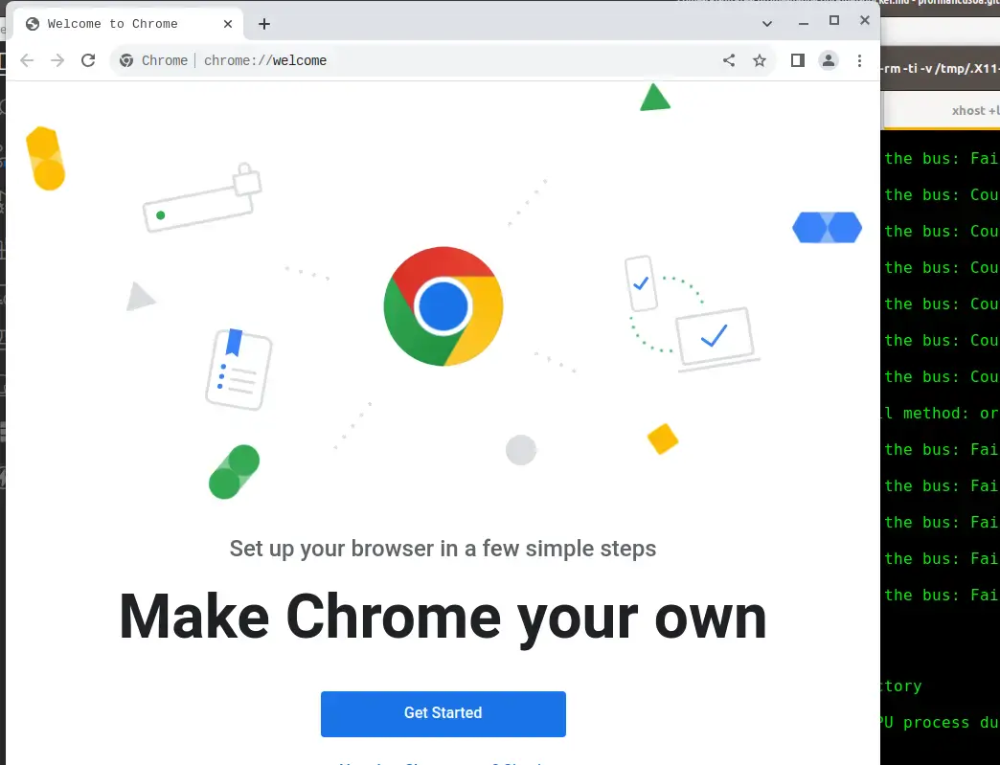

## Let's Browse Securely

Google Chrome is one of the most widely used browsers in the world, loved for its speed and ease of use. Still, if you want to boost your security while browsing, you can run Chrome inside a Docker container, getting yourself an isolated, protected environment.

Browsing the web hides plenty of traps, often well disguised.
Any of us can end up a victim of the bad actors roaming the web. An innocent-looking link can hide all sorts of hazards, some of them serious and genuinely dangerous for your computer.

To cut down on these risks, Chrome ships with a `sandbox` mechanism that tries to isolate the browser from the underlying system.
As effective as that is, though, it can be taken further by fully isolating the browser from the operating system and your home directory.

## Confining Chrome in a Docker Container

To add this extra layer of security, we can confine Google Chrome's execution to a Docker container. That way, the browser runs exclusively inside the container, completely isolated from the underlying Linux system.
Chrome won't be able to touch your PC's filesystem or interact with any other running process.

This gives us a browser that's fully isolated from the rest of the system — one we can use to browse more freely, even visiting sites that seem a bit sketchy. If anything weird happens, it stays entirely contained within the container, and nothing on your actual filesystem can be compromised.

Once the browsing session ends, the Docker container gets completely destroyed, leaving no trace of your previous browsing behind.

## Creating a Docker Container for Google Chrome

To run Chrome in a Docker container, we first need to build the container image using a `Dockerfile`, then launch the container the right way. Here are the steps:

### 1 - Download the Dockerfile

Clone this repository from my GitHub account:

```bash
$ git clone https://github.com/profmancusoa/google-chrome-dockerized
```

The repository includes the `Dockerfile` I built to generate the image:

```bash
# Usa l'ultima versione di Debian come base
FROM debian:latest

# Aggiorna il sistema e installa strumenti necessari
RUN apt update && apt install -y wget gnupg2

# Aggiunge la chiave GPG ufficiale di Google Chrome
RUN wget -q -O - https://dl.google.com/linux/linux_signing_key.pub | apt-key add -

# Aggiunge il repository ufficiale di Chrome e installa il browser
RUN echo "deb [arch=amd64] http://dl.google.com/linux/chrome/deb/ stable main" >> /etc/apt/sources.list.d/chrome.list
RUN apt update && apt install -y google-chrome-stable

# Avvia Chrome in modalità sandbox disabilitata (attenzione ai rischi di sicurezza)
CMD ["google-chrome", "--no-sandbox"]
```

### 2 - Build the Container Image

Now go into the directory and start building the Docker image with the `docker build` command:

```bash
$ cd google-chrome-dockerized
$ docker build -t google-chrome .
```

This will take a few minutes, depending on how fast your internet connection is.
Once it's done, a new Docker image will be sitting on your system:

```bash
$ docker images | grep google

google-chrome                   latest             2dd030b2446b   5 hours ago     1.07GB
```

### 3 - Launch Google Chrome Inside Docker

To run Chrome inside the container, we need to let the container use Linux's X server Unix socket. That way, Chrome will display correctly on your system's screen.

To do that, we also need to make sure we grant the Docker container connection permissions, with this command:

```bash
$ xhost +local:docker
```

Now we can launch the container that will run Chrome properly in an isolated environment, with this command:

```bash
$ docker run --rm -ti -v /tmp/.X11-unix:/tmp/.X11-unix -v /dev/shm:/dev/shm  --device /dev/dri -e DISPLAY=$DISPLAY google-chrome
```

<br>



<br>

### 4 - Automate Launching Chrome in Docker

To avoid having to remember all these commands every time I want to browse securely, let's create an `alias` in your .zshrc file — or .bashrc, if you're on bash:

```bash
alias dgoogle='xhost +local:docker && docker run --rm -ti -v /tmp/.X11-unix:/tmp/.X11-unix -v /dev/shm:/dev/shm  --device /dev/dri -e DISPLAY=$DISPLAY google-chrome'
```

Now you can kick off a secure browsing session just by typing `dgoogle`.

Feel free to rename the alias to whatever you like, of course.

## Conclusion

By putting the tools Linux gives us to good use, combined with a bit of Docker _"magic"_, we can meaningfully boost the security of our web browsing sessions.

Thanks for reading this guide on running Google Chrome in a Docker container for safer browsing. If you found it useful, share it with your network, and leave me a comment below with your thoughts or questions.

If application isolation is something that interests you, I've applied a similar approach to protect a system password too: check out the guide on [Digispark for automating LUKS unlock](/posts/guida-completa-digispark-automatizzare-password-luks/).

PS: you can check out the <a href="https://www.youtube.com/embed/t3-Rr5UzRgU">video</a> that goes with this post.
