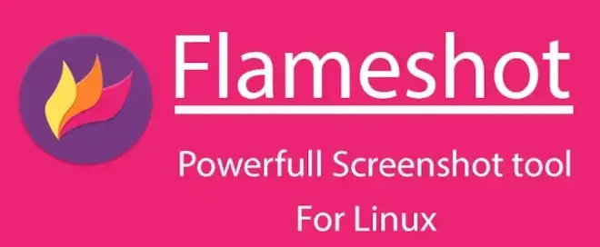

## **What Is Flameshot?**

> _Flameshot is a free, open-source, cross-platform tool for capturing screenshots, packed with built-in features designed to save you time._

In our day-to-day work, taking screenshots is often essential — for presentations, tutorials, videos, or just sharing information. Flameshot is a great fit for the job, thanks to how easy it is to use and how many features it packs in. It's available on every major platform, Linux included.

### **Flameshot's Main Features**

Flameshot ships with an intuitive, versatile graphical interface (GUI). Here are some of its standout features:

- **Flexible capture:** capture the whole screen, a specific window, or a manually selected region.
- **Instant annotations:** add arrows, circles, text, or highlights straight onto the captured image.
- **Customization:** tweak your screenshots to make them clearer and more detailed.

<br>

---

## **How to Install Flameshot on Linux**

Installing Flameshot on Linux is easy, since it's included in the official repositories of every major distro. Here are the commands for the most common ones:

```bash
# Debian/Ubuntu
sudo apt install flameshot

# Arch Linux
pacman --sync flameshot

# Fedora
dnf install flameshot
```

**NOTE**: on other distros, the command will look pretty much the same.

---

## Using the Command Line (CLI)

One of Flameshot's most powerful features is that you can drive it entirely from the command line. That's particularly handy for:

- Automating things through scripts.
- Quick captures without opening the GUI.

Here's a practical example:

```bash
$ flameshot full -d 200 --region 1024x769+358+189 -p dir_images
```

Breaking down the command

- `-d 200`: sets a 200ms delay before the screenshot, handy for getting the area ready to capture.
- `--region 1024x769+358+189`: specifies a custom area to capture, in the format Width x Height + X + Y. In this example, the capture starts at coordinates x=358, y=189, with dimensions 1024x769 px.
- `-p dir_images`: automatically saves the screenshot to the dir_images directory.

<br>

---

## Conclusion

Flameshot is an essential tool for anyone who works with screenshots regularly. I've personally used it for years, and I find its advanced features — especially the ones available from the command line — a genuine time-saver.

What do you think? Have you tried Flameshot?

Share your experiences or any alternative uses you've discovered in the comments. I'd love to hear other creative ways to get the most out of it!
