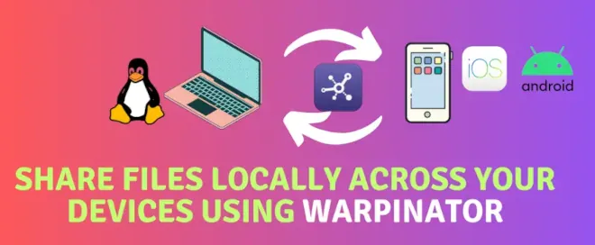

## Warpinator: Share Files Easily on Your Local Network

**Warpinator** is a free, open-source tool designed to make sending and receiving files between computers on the same local network dead simple. With Warpinator, you can share files quickly and securely, with no cloud services or external devices involved.

### Why Choose Warpinator?

- **Guaranteed security**: no file ever leaves your local network.
- **Ease of use**: just install the app, set a group code, and you're off.
- **Bandwidth savings**: no need to upload files to external servers.
- **Flexibility**: works with no complex setup or dedicated servers.

Built by the **Linux Mint** team, Warpinator offers an intuitive user interface and supports several Linux distros. It's a great fit for anyone looking for an open-source solution to transfer files over a local network.

In this post, we'll walk through installing and setting up Warpinator on Debian-based systems, like **Ubuntu**, **Pop!\_OS**, and others.

---

## Installing Warpinator on Ubuntu

On Ubuntu, the official Warpinator package isn't available. Don't worry — I'll show you how to build the `.deb` package and install it easily.

It might look intimidating, but Warpinator's developers have made the process much simpler than it seems.

### Setting Up the Environment

To build and install **Warpinator**, you need to set up your development environment with all the required packages. Follow these steps to configure your system correctly.

#### Step 1: Install the Required Packages

Open a shell on your Linux system and run this command to install every package you'll need:

```bash
sudo apt install python3-grpc-tools python3-grpcio gir1.2-xapp-1.0 \
gist libxapp1 python3-setproctitle python3-xapp xapps-common debhelper dh-python \
gnome-pkg-tools meson gobject-introspection appstream python3-grpc-tools git
```

This installs the essential dev tools, libraries, and dependencies you'll need to build and package Warpinator.

### Cloning the Warpinator Repository

The first step to getting Warpinator's source code is cloning the official repository. Run these commands to grab the files you need:

```bash
# Clona il repository ufficiale di Warpinator
git clone https://github.com/linuxmint/warpinator.git

# Accedi alla directory del progetto
cd warpinator

# Esegui il checkout dell'ultima versione stabile
git checkout 1.6.4
```

What you're doing here:

- **Cloning the repository**: pulling the source code straight from GitHub.
- **Entering the directory**: moving into the folder where the project lives.
- **Picking a stable version**: making sure you're using a tested release (in this case, version 1.6.4).

### Building the Warpinator Debian Package

Once you've cloned the source files, the next step is building a `.deb` package you can install on Debian-based systems like Ubuntu.

#### Step 1: Build the Package

Run this command to kick off the build process:

```bash
# Build del pacchetto Debian .deb
dpkg-buildpackage -b --no-sign
```

What this command does:

- **dpkg-buildpackage**: the tool for building Debian packages.
- **-b**: builds the binary package without including the sources.
- **--no-sign**: skips signing the package, keeping the process simpler.

#### Step 2: Install Warpinator

Once you've built the `.deb` package, you're ready to install **Warpinator** on your system. Follow these steps to finish the installation.

##### Step 2.1: Move Up a Directory

First, go back up to the parent directory relative to the project:

```bash
cd ..
```

##### Step 2.2: Install the .deb Package

Run this command to install the package:

```bash
sudo dpkg -i warpinator_1.6.4_all.deb
```

During installation, you'll see output that looks something like this:

```bash
(Lettura del database... 384604 file e directory attualmente installati.)
Preparativi per estrarre warpinator_1.6.4_all.deb...
Estrazione di warpinator (1.6.4) su (1.6.4)...
Configurazione di warpinator (1.6.4)...
Elaborazione dei trigger per mailcap (3.70+nmu1ubuntu1)...
Elaborazione dei trigger per desktop-file-utils (0.26-1ubuntu3)...
Elaborazione dei trigger per gnome-menus (3.36.0-1ubuntu3)...
Elaborazione dei trigger per libglib2.0-0:i386 (2.72.4-0ubuntu1)...
Elaborazione dei trigger per libglib2.0-0:amd64 (2.72.4-0ubuntu1)...
Elaborazione dei trigger per hicolor-icon-theme (0.17-2)...
```

#### Step 3: Configuring Warpinator

Now that you've installed **Warpinator** on your Linux system, you can configure it to share files efficiently. Follow these steps to set up the main parameters.

##### Step 3.1: Open the Preferences

Launch Warpinator and, from the top-left menu, select **_Preferences_**.

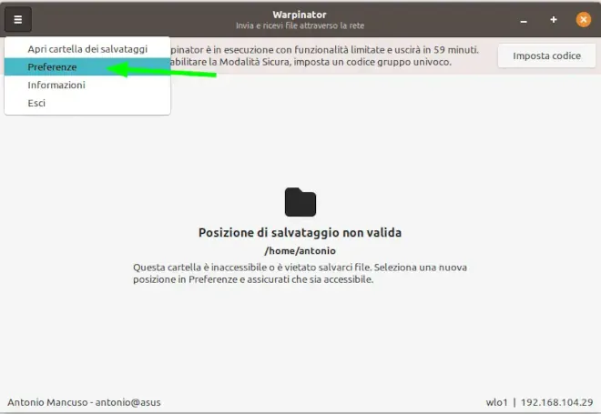

---

##### Step 3.2: Set the File Exchange Directory

On the **_General_** tab, in the **_File Transfers_** section, specify the directory where you want received files to be saved.

- Example directory: `/home/antonio/Downloads/warpinator`.
- Pick a directory that's convenient and makes sense for how you work.

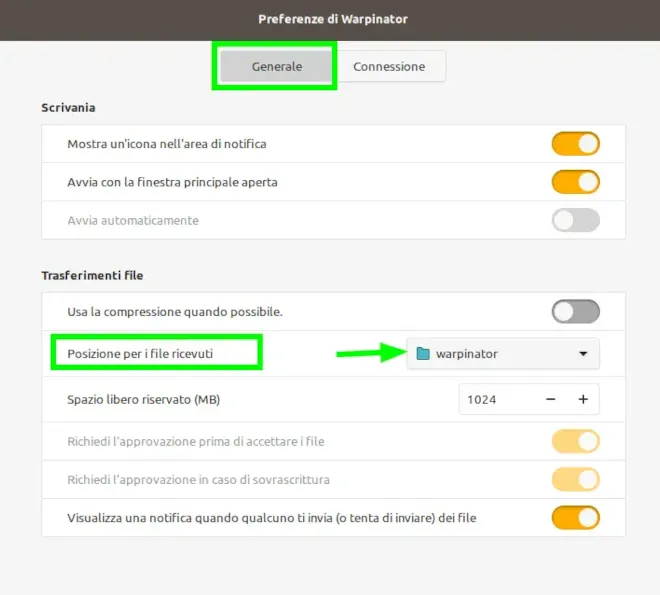

---

##### Step 3.3: Set Up the Group Code and Network

On the **_Connection_** tab, set a **group code** to protect transfers from unauthorized access. Click **_Set code_** to apply the change.

You should also choose which **network interface** to use for transfers — your Wi-Fi connection, for instance, if available.

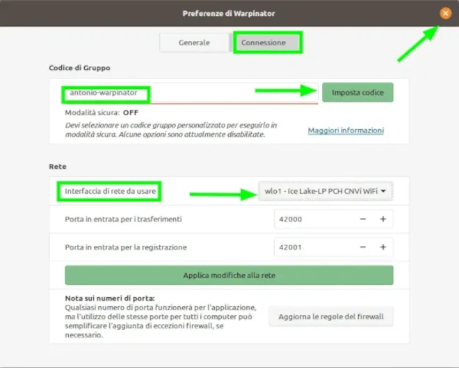

Once you've configured your preferences, the received-files directory, and the group code, **Warpinator** is ready to go. Start sharing files easily and securely!

#### Step 4: Installing on Your Smartphone

**Warpinator** is also available for Android and iOS. To install the app on your device, head to your platform's store (Google Play Store or App Store) and search for **_Warpinator_**.

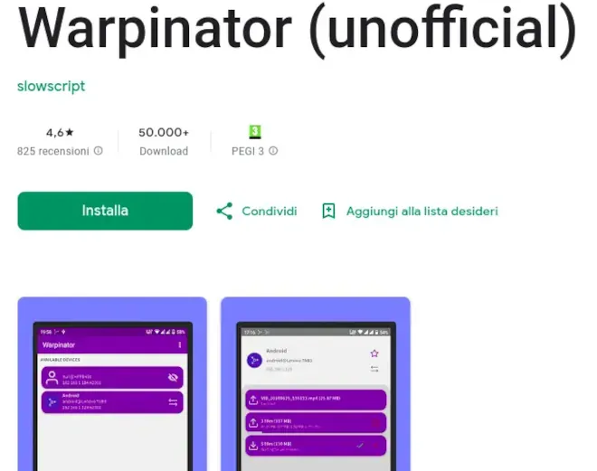

---

##### Step 4.1: Configuring Warpinator on Your Smartphone

Once the app is installed, follow these steps to set it up:

1. Open the app on your smartphone.
2. Tap the three dots in the top right to reach the settings menu.

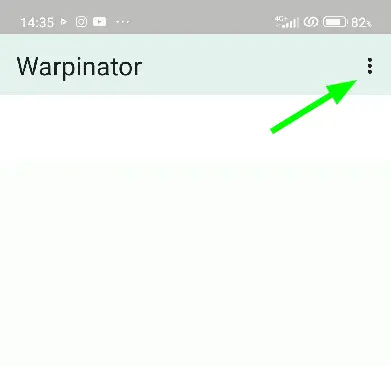

---

##### Step 4.2: Set the Group Code

To make sure it's compatible with your Linux computer:

1. Go to **_Settings_**.
2. Enter the same **_group code_** you set up on Linux.

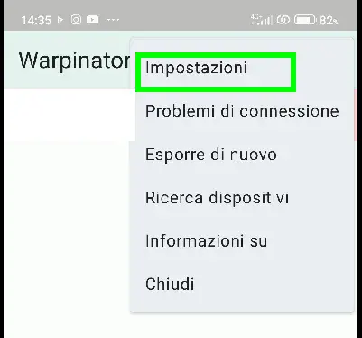


---

Once the group code is set, your smartphone is ready to connect to **Warpinator** on your computer and start sharing files over the local network.

#### Step 5: Exchanging Files Between Linux and Your Smartphone

To use **Warpinator** to transfer files between Linux and your smartphone, it's essential to make sure your PC's firewall isn't blocking ports **42000** and **42001**, which are needed to establish the connection.

##### Step 5.1: Checking the Firewall Ports

If those ports are blocked, your smartphone won't be able to connect to your PC. Purely for testing purposes, you can temporarily disable the firewall on your Linux system with this command:

```bash
sudo iptables -F
```

Note: if the connection works properly after running this command, you'll need to permanently configure your firewall to allow traffic on ports 42000 and 42001.

If Warpinator's connection works with this command, you'll need to permanently configure your firewall to allow traffic on ports 42000 and 42001.

At this point, both on the PC and the smartphone, you'll be able to see the devices found on the network that share the same group code.

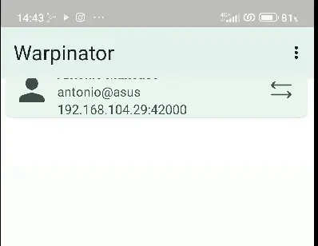

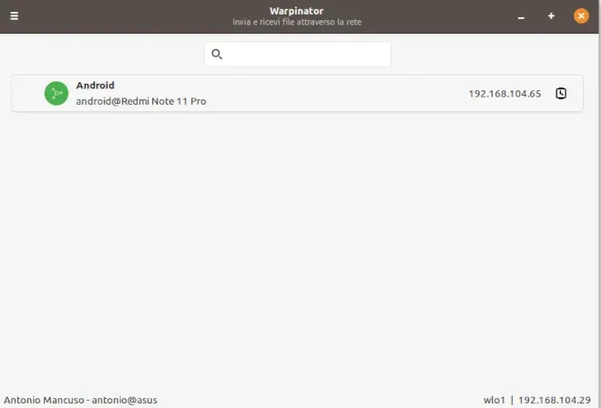

---

Now you can choose whether to share an entire directory or a single file.

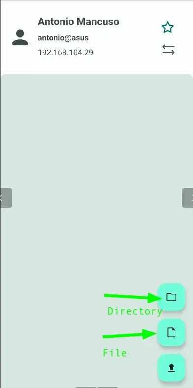

---

Once you've selected the file, the transfer starts immediately. On the PC, you'll be prompted to accept the file transfer.

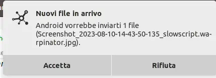

---

Once you accept the request, the file is transferred and saved in the directory you configured when setting up Warpinator on Linux.

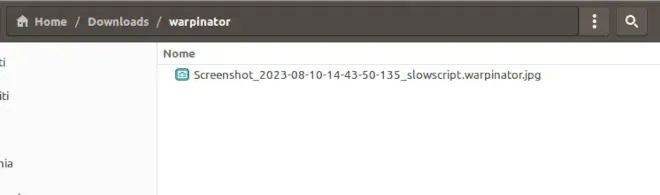

## Conclusion

**Warpinator** is a fantastic, open-source, secure tool that lets you exchange files between your smartphone and Linux PC over the local network, keeping your data private.

In this guide, we covered:

- How to install **Warpinator** on Linux and on smartphone (Android).
- How to properly configure the apps for the best experience.
- How to transfer a file from Android to Linux in just a few simple steps.

I'd encourage you to use this tool to simplify file transfers, instead of falling back on outdated methods like emailing yourself photos or documents.

If you found this guide useful, leave a comment below, give the article a like, and share it with your social network. **Try Warpinator today and see just how easy secure file transfer can be!**
