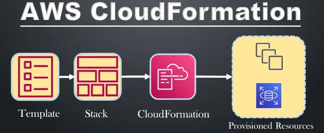

## How to Name an EC2 Instance in AWS CloudFormation

AWS CloudFormation is a powerful service that lets you **model and configure AWS resources** using text-based templates. This is the **Infrastructure as Code (IaC)** paradigm in action, making resource management more efficient and repeatable.

In this article, I'll show you how to give a specific name to an EC2 instance using AWS CloudFormation, making your life easier in the AWS console.

---

## **What Does AWS CloudFormation Do?**

AWS CloudFormation lets you define AWS resources using templates written in YAML or JSON. You can specify things like EC2 instances, security groups, and much more — all declaratively.

Here's a basic template example for creating an EC2 instance with a security group:

```yaml
---
AWSTemplateFormatVersion: "2010-09-09"
Description: AWS CloudFormation EC2 Template
Resources:
  SG-Mia-EC2:
    Type: AWS::EC2::SecurityGroup
    Properties:
      GroupDescription: Apre la porta HTTPS 443
      GroupName: SG-Mia-EC2
      SecurityGroupIngress:
        - IpProtocol: tcp
          FromPort: "443"
          ToPort: "443"
          CidrIp: 0.0.0.0/0
  EC2-Mia-EC2:
    Type: AWS::EC2::Instance
    Properties:
      ImageId: ami-0c318278dac68c29a
      InstanceType: t3.micro
      SecurityGroups:
        - Ref: SG-Mia-EC2
```

This template creates an EC2 instance and its associated security group, but in the AWS console, the EC2 instance's Name column will stay blank. That can make it harder to identify resources, especially if you've got multiple instances in the same region.

## Why Naming an EC2 Instance Matters

Giving your AWS resources a name has several benefits:

- **Clearer AWS console**: it's much easier to quickly identify an instance.
- **Standardization**: following a consistent naming pattern makes management easier.
- **Internal documentation**: descriptive names give context about what each instance does.

## How to Name an EC2 Instance

There's no direct "Name" property for EC2 instances in CloudFormation. However, you can use Tags to define a name that shows up in the AWS console.

### Using the "Name" Tag

AWS supports the Name tag for identifying EC2 resources. Just add a tag with the key "Name" and a value representing the name you want.

Here's an updated version of the template:

```yaml
---
AWSTemplateFormatVersion: "2010-09-09"
Description: AWS CloudFormation EC2 Template
Resources:
  SG-Mia-EC2:
    Type: AWS::EC2::SecurityGroup
    Properties:
      GroupDescription: Apre la porta HTTPS 443
      GroupName: SG-Mia-EC2
      SecurityGroupIngress:
        - IpProtocol: tcp
          FromPort: "443"
          ToPort: "443"
          CidrIp: 0.0.0.0/0
  EC2-Mia-EC2:
    Type: AWS::EC2::Instance
    Properties:
      ImageId: ami-0c318278dac68c29a
      InstanceType: t3.micro
      SecurityGroups:
        - Ref: SG-Mia-EC2
      Tags:
        - Key: "Name"
          Value: "Mia-EC2"
```

## Benefits of Using the "Name" Tag

1. **Easy identification**: when you open the AWS console, you can immediately see the name of your EC2 instances.
2. **Better management**: really useful when you're dealing with complex environments with lots of resources.
3. **Flexibility**: you can define dynamic names using template parameters.

### Dynamic Name Example with Parameters

To make the instance name customizable, you can use Parameters in CloudFormation:

```yaml
Parameters:
  InstanceName:
    Type: String
    Description: "EC2 instance name"

Resources:
  EC2-Mia-EC2:
    Type: AWS::EC2::Instance
    Properties:
      ImageId: ami-0c318278dac68c29a
      InstanceType: t3.micro
      Tags:
        - Key: "Name"
          Value: !Ref InstanceName
```

When you create the stack, you can specify the name you want through the AWS console UI or the CLI.

## Conclusion

Naming an EC2 instance in AWS CloudFormation is quick and simple, thanks to Tags. Using the Name tag improves clarity and manageability of your resources in the AWS console. This approach is essential for keeping things organized and standardized, especially in complex environments.

Found this article useful? Try putting this setup to work in your next project, and share your experience or questions in the comments.
