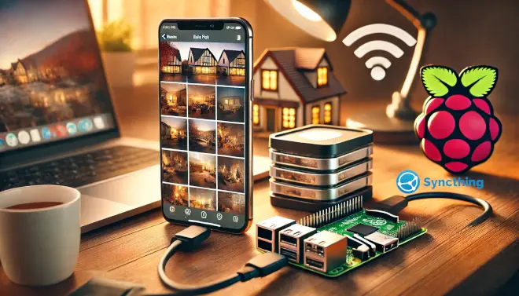
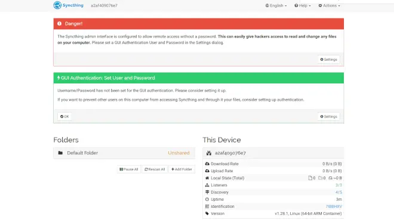
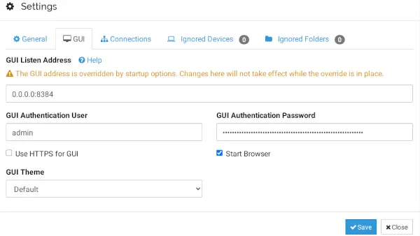
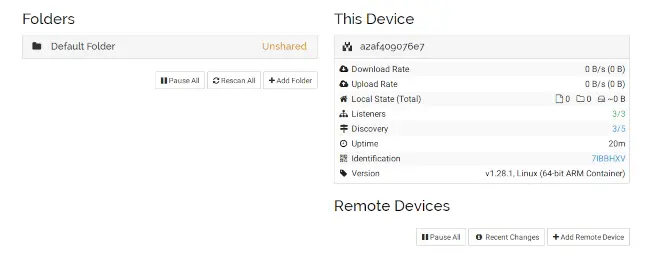
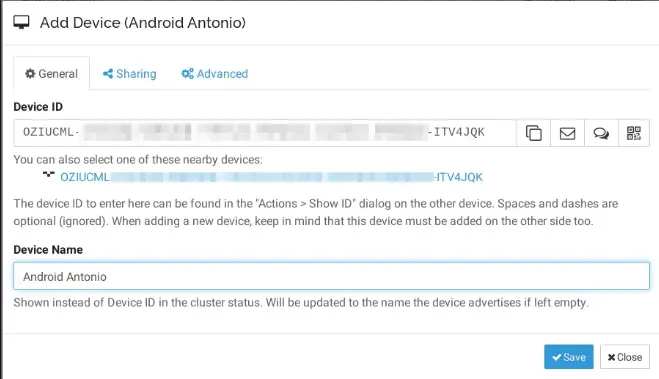
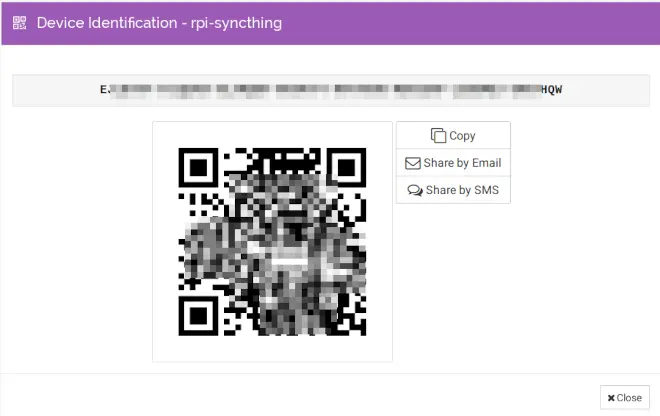
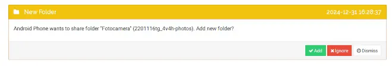
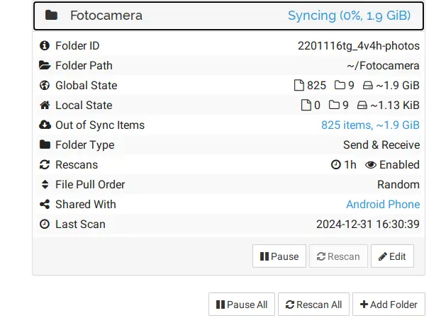

Ever since smartphones took over, the number of photos each of us takes has grown exponentially. Every day, our devices capture moments that matter — in our personal lives and our professional ones. Some photos have a short shelf life, like the ones shared on social media, while others deserve to be kept around, worth revisiting and remembering years down the line.

The problem is, a smartphone is a fragile thing: it can break, get lost, or even get stolen. And if we don't protect our photos, we risk losing them for good. Picture this: you throw an unforgettable birthday party, and just a few days later, your phone vanishes. Every photo from that special day is gone forever, along with some of your most cherished memories.

That's exactly why it's worth setting up a solid way to protect your photos from accidental loss. In this article, I'll walk you through building a simple, privacy-respecting solution step by step. You'll learn how to use a Raspberry Pi and Syncthing to automatically back up your smartphone's photos, with no third-party services involved. A solution that's secure, private, and helps you preserve your memories without the risk of unwanted leaks.

## Syncthing: What It Is and How It Works

Syncthing is a continuous file-syncing program built with security and privacy in mind. This open-source tool syncs files between two or more devices in real time — like a smartphone and a Raspberry Pi — keeping your data safe and away from prying eyes.

With Syncthing, you're in full control of your data: you decide where it's stored, who it's shared with, and how it travels across the network. Unlike most third-party cloud services, Syncthing never stores your files on remote servers — it syncs them directly between your own devices. That rules out accidental leaks or unauthorized access from third parties.

Thanks to its flexibility, Syncthing is a great fit for anyone after a private, secure, reliable way to manage their data — including backups of the photos taken on their smartphone.

### Why Syncthing

- **Total privacy**: no data is ever sent to third-party servers.
- **Security**: uses TLS encryption to protect data during sync.
- **Real time**: files sync immediately after being changed.
- **Flexibility**: works across Windows, macOS, Linux, and Android.

## Installing Syncthing on the Raspberry Pi

An easy and effective way to install Syncthing on your Raspberry Pi is through Docker containers. This keeps the installation isolated and independent from any other services running on the device, sidestepping potential library conflicts or compatibility headaches.

Using Docker brings several benefits:

- **Isolation**: Syncthing runs in its own separate environment, without interfering with other apps or configurations.
- **Easy updates**: updating Syncthing is straightforward, thanks to Docker commands.
- **Flexibility**: you can manage and configure Syncthing with ease, without touching the underlying OS.

### Prerequisites

Before you start, make sure you have:

- A Raspberry Pi set up with Docker and Docker Compose installed.
- A stable internet connection.
- A hard drive or USB storage connected to the Raspberry Pi, which will hold the synced photos.

### Commands to Install Syncthing with Docker

Here are the main steps for installation:

1. Pull the Syncthing image:

   ```bash
   docker pull syncthing/syncthing
   ```

2. Create and start the container. Run this command to start Syncthing in a container:

   ```bash
   docker run -d \
     --name=syncthing \
     --hostname=rpi-syncthing \
     --network=host \
     -v /path/to/disk:/var/syncthing \
     -e PUID=1000 \
     -e PGID=1000 \
     -e TZ=Europe/Rome \
     --restart unless-stopped \
     syncthing/syncthing
   ```

   **Note**: Replace /path/to/disk with the path to your connected hard drive's directory.

3. Access the web interface

   Once the container is running, you can reach Syncthing's web interface through your browser, at:

   ```bash
   http://<Raspberry-Pi-IP>:8384
   ```

   On first access, Syncthing will ask whether you want to opt in to sending anonymous usage information. This is entirely optional and doesn't affect how Syncthing works.

   If everything went smoothly, the Syncthing home page should look something like this:



### Setting Up Syncthing Login Credentials

The first time you open the Syncthing interface, you'll notice two notifications highlighted in red and green. Syncthing is letting you know that the control interface is currently open to anyone on your local network. For security's sake, it recommends setting up login credentials with a username and password.

#### How to Set Up Credentials

1. Open the settings by clicking the Settings button (bottom right, in the red box).

2. Edit the interface settings:
   In the Settings window that opens, select the GUI tab.

3. Set your credentials:
   Enter a username and a strong password in the relevant fields. It's worth using a robust password — at least 12 characters, mixing uppercase, lowercase, numbers, and symbols.

4. Save your changes:
   Once you've entered your credentials, click Save to apply them. Syncthing might restart to apply the new configuration.



Once you've set up your login credentials and authenticated with your new username and password, you'll land on Syncthing's final home page. This page gives you an overview of the system's current state, showing connected devices, synced folders, and other useful info.



## Setting Up a Remote Device

On the Syncthing home page on the Raspberry Pi, you'll notice only the local device (the Raspberry Pi itself) shows up right now. To start syncing your files, you need to add a remote device — your smartphone.

In this guide, we'll cover installing and configuring Syncthing on an Android phone. If you're on iPhone, the process is similar, and requires installing the [Möbius Sync app from the App Store](https://apps.apple.com/us/app/m%C3%B6bius-sync/id1539203216?ign-itscg=30200&ign-itsct=apps_box#?platform=iphone).

---

### Download and Install the Syncthing App

Due to policy reasons, the Syncthing app for Android is no longer available on the Google Play Store. You can still grab it easily from the [project's official GitHub repository](https://github.com/syncthing/syncthing-android/releases/download/1.28.1/app-release.apk), or by scanning this QR code:

<br>
<center>

</center>
<br>

Once installed, open the app. If everything went well, you should see a starting screen like this:

<br>
<center>

</center>
<br>

---

### Grant the Required Permissions

For Syncthing to work properly, the app needs a few specific permissions. Here's what to do:

- **Storage access**: allow the app to access the photos and files on your phone.
- **Background location**: this permission is optional. Syncthing recommends granting it for the best experience, but you can also deny it (as I did).
- **Notifications**: safe to allow — it's only used for sync status updates.
- **Disable battery optimization**: this one matters — it ensures Syncthing keeps working properly even when the app is in the background.

---

You're now ready to set up syncing between your smartphone and the Raspberry Pi! Next, we'll connect the two devices.

## Connecting a Remote Device to the Raspberry Pi

Now you need to connect the smartphone to the Raspberry Pi and vice versa, so automatic syncing can kick in.

### Setting Up the Connection in Syncthing

#### Adding a Remote Device to the Raspberry Pi

To connect your smartphone to the Raspberry Pi, follow these steps:

1. Open the **Syncthing home page** on the Raspberry Pi.
2. Click **Add Remote Device** in the bottom right.
3. On the screen that appears, select the remote device's ID (your smartphone), give the device a name, and click **Save**.

Here's what it looks like:



#### Connecting the Raspberry Pi to Your Smartphone

Now you need to set up the smartphone so it recognizes the Raspberry Pi. Here's how:

1. From the Syncthing home page on the Raspberry Pi, click **Identification**. A **QR code** containing the device's info will show up.



2. Open the **Syncthing** app on your smartphone and go to the `Devices` tab.
3. Tap the `+` button to add a new device.

<br>
<center>
   
</center>
<br>

4. On the **Add Device** screen, tap the QR code icon.

<br>
<center>
   
</center>
<br>

5. Scan the QR code shown on the Syncthing home page on the Raspberry Pi.
6. Give the device a name, for example: `rpi-syncthing`.

### Verify the Connection

If everything's set up correctly, your smartphone will now show up in the right-hand column of the Syncthing home page on the Raspberry Pi.

<center>
   
</center>

At this point, both devices are **properly connected** and ready to start syncing files automatically.

## Syncing Photos from Your Smartphone to the Raspberry Pi with Syncthing

Once Syncthing is set up on both devices, the last step is enabling sync for the photos folder, from your smartphone to the Raspberry Pi. Follow these steps to finish the setup:

### Steps to Set Up Syncing

1. **Open the "Camera" Folder on Your Smartphone**
   Open the **Syncthing** app on your smartphone, go to the `Folders` tab, and select the folder named `Camera`. This folder — usually preconfigured — contains every photo taken with the phone.

<br>
<center>
   
</center>
<br>

2. **Enable Folder Sharing with the Raspberry Pi**
   On the `Camera` folder's screen, find the **Share With Device** option (or similar) and select the Raspberry Pi from the list of available devices. Confirm the setup as shown below.

<br>
<center>
   
</center>
<br>

3. **Accept the Share on the Raspberry Pi**
   After a moment, a notification will show up on the Syncthing home page on the Raspberry Pi, letting you know about the share request from your smartphone. The notification will show the folder name and the requesting device.

   

   Click `Add` to accept the share and set up the folder on the Raspberry Pi.

4. **Start Syncing**
   At this point, Syncthing will immediately start syncing the `Camera` folder from your smartphone to the Raspberry Pi. Your photos will be stored locally on the Raspberry Pi, keeping your memories safe.

   

---

### Automating the Sync

From here on, every time your smartphone connects to your home WiFi, syncing will happen automatically, keeping your photos protected.

## Conclusion: Keep Your Memories Safe

By setting up Syncthing and a Raspberry Pi, you've built yourself an automatic, secure, privacy-respecting backup system for your photos. This approach lets you archive your memories reliably without relying on third-party cloud services, protecting them from accidental loss or unauthorized access.

### Why Go With This Solution?

- **Privacy**: your data is never shared with outside providers.
- **Security**: files are always encrypted in transit.
- **Convenience**: automatic syncing takes the hassle out of managing backups.
- **Full control**: your data stays exclusively under your control.

Now you can relax knowing your photos are safe every time you're home.

If all you need is the occasional one-off file transfer (without continuous automatic syncing), you might also like the guide on [Warpinator for sharing files on your local network](/posts/guida-warpinator-trasferimento-file-linux-smartphone/).

### Take the Next Step!

Found this guide useful? Share it with friends and family who could use a similar backup solution! If you have questions, suggestions, or want to share your own experience, drop a comment below.

**Got other ideas for improving personal data security? Write to me! I'd love to hear your thoughts and talk through new solutions together.**

Thanks for reading this guide — happy backing up your memories!
