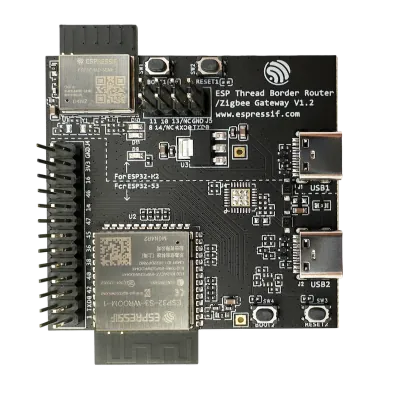
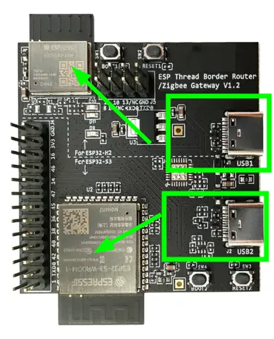
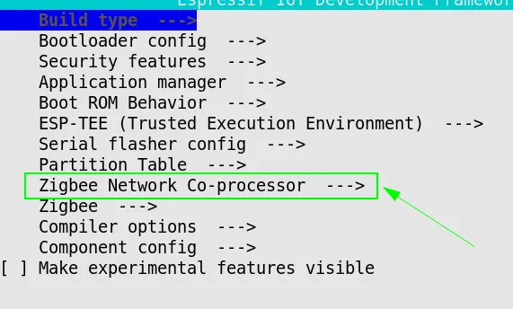
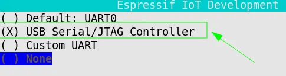
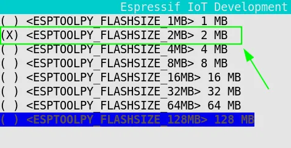
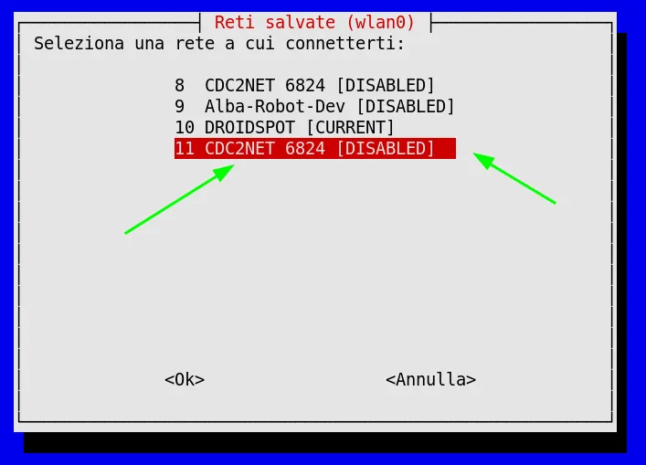
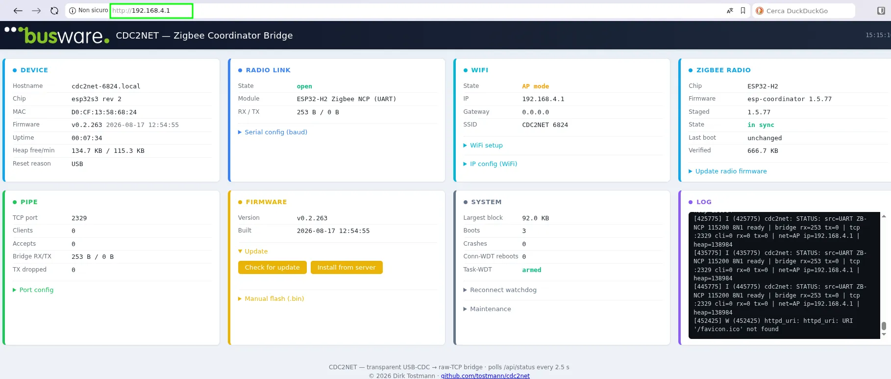
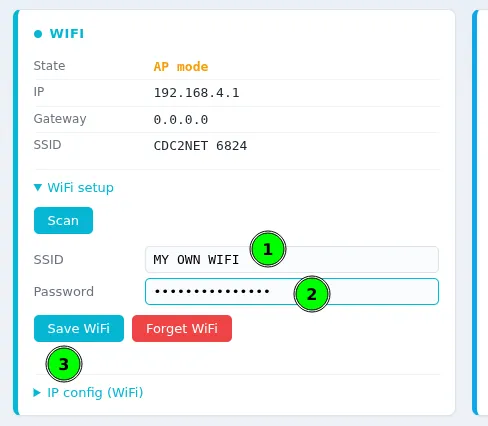
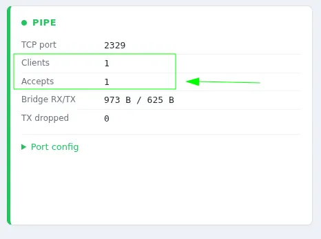
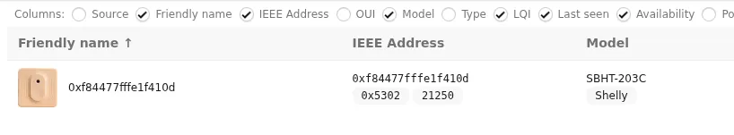

## Introduction
In the home automation world, Home Assistant plays a really important role. It's an open-source solution that's extremely flexible, backed by a large community online.

I recently bought a digital thermometer, the [Shelly BLU H&T ZB](https://www.amazon.it/dp/B0G4W6XFDH?tag=antmansblo0e-21), which measures ambient temperature and humidity and transmits the readings over Bluetooth or Zigbee.

To connect this sensor to my Home Assistant setup, I need a Zigbee coordinator to create the network and let the thermometer join it. This coordinator then has to talk to Home Assistant over WiFi.

This post is a guide on how to configure the board [Espressif "ESP Thread Border Router / Zigbee Gateway v1.2" (ESP32-S3 + ESP32-H2)](https://www.amazon.it/Thread-Border-Router-Zigbee-Gateway/dp/B0C89H9MJ8/?tag=antmansblo0e-21) as Zigbee coordinator for Home Assistant, through Zigbee2MQTT and other open source projects.

## Prerequisites 
- Board ESP Thread BR/Zigbee Gateway v1.2 
- USB-C data cable 
- Docker installed on the host 
- Home Assistant with MQTT reachable on the same network

## The ESP Thread Border Router/Zigbee Gateway Board
        
This board (v1.2) is made up of two main sections:

1. **ESP-H2**, which implements the IEEE 802.15.4 standard, common to both Zigbee and Thread
2. **ESP-S3**, which supports Bluetooth and WiFi

By combining these two components, we can build a gateway (more accurately, a bridge) that carries Zigbee packets to a WiFi host and back.

Specifically:
- ESP-H2 runs a complete, self-contained Zigbee NCP coordinator (esp-coordinator) that handles the radio communication with Zigbee devices (in my case, the Shelly thermometer).
- ESP-S3 acts as a transparent TCP ↔ UART bridge (cdc2net) to the Wi-Fi network and is responsible for carrying Zigbee traffic to and from Home Assistant over WiFi. 
- Zigbee2MQTT connects via TCP to the bridge

## Build environment

Let's set up the build environment for producing the two binaries we'll flash onto the board's chips.

As I usually do, I'll work inside Docker to keep my system clean instead of cluttering it with libraries and tools that only matter for a single project.

Start by creating a main working directory for the rest of this post.

```bash
cd ~
mkdir -p zb2wifi-gateway/espressif-data
```

### Building the Docker container 

Now let's build a Docker image with the libraries and tools we need for the rest of the work.

Here's the Dockerfile and the docker-compose.yml to launch the container — create both inside the **zb2wifi-gateway** directory.

**Dockerfile**

```bash
FROM ubuntu:24.04

ENV DEBIAN_FRONTEND=noninteractive

RUN apt-get update && apt-get install -y --no-install-recommends \
    git wget flex bison gperf python3 python3-pip python3-venv python3-dev \
    cmake ninja-build ccache libffi-dev libssl-dev dfu-util libusb-1.0-0 \
    gcc g++ pkg-config curl libdbus-1-dev \
    libglib2.0-dev libavahi-client-dev unzip \
    libgirepository1.0-dev libcairo2-dev libreadline-dev \
    libevent-dev default-jre \
    ca-certificates \
    && rm -rf /var/lib/apt/lists/*

USER ubuntu
WORKDIR /home/ubuntu
```

**docker-compose.yml**
```yml
services:
  z2w-builder:
    image: zb2wifi-builder:latest
    container_name: zb2wifi-builder
    user: "1000:1000"
    group_add:
      - "11"
    volumes:
      - ./esp-idf:/home/ubuntu/esp-idf
      - ./esp-coordinator:/home/ubuntu/esp-coordinator
      - ./cdc2net:/home/ubuntu/cdc2net
      - ./espressif-data:/home/ubuntu/.espressif
    working_dir: /home/ubuntu
    stdin_open: true
    tty: true
    devices:
      - /dev/ttyACM0:/dev/ttyACM0
    command: bash
```

Heads up: this docker-compose assumes your user's uid and gid are 1000 and 1000, and that the serial device shows up as ttyACM0 when you plug in the board.
If your numbers differ, update the docker-compose file accordingly.

Now build the container image:
```bash
docker build --no-cache -t zb2wifi-builder .


[+] Building 1.7s (7/7) FINISHED                                                                                                                              docker:default
 => [internal] load build definition from Dockerfile                                                                                                                    0.0s
 ....
 ....
 => exporting to image                                                                                                                                                  0.1s
 => => exporting layers                                                                                                                                                 0.0s
 => => naming to docker.io/library/zb2wifi-builder:latest                                                                                                               0.0s
 => => unpacking to docker.io/library/zb2wifi-builder:latest    
```

### Starting the builder container 

We're ready to launch the container and build the project.

Plug your ESP board into the USB port, then run:

```bash
cd zb2wifi-gateway

docker compose run --rm z2w-builder
```

### Cloning and preparing the firmware sources

Now let's clone the firmware sources for our board. Run these commands:

```bash
git clone -b v5.5.5 --recursive https://github.com/espressif/esp-idf.git

cd esp-idf

./install.sh esp32h2,esp32s3

. ./export.sh
```

For this project I'm using Espressif SDK release v5.5.

*./install.sh* downloads the build toolchain (compilers for esp32h2 and esp32s3, plus the required Python packages) and installs it inside ~/.espressif — which, thanks to the volume mounted in docker-compose.yml, physically lives in espressif-data/ on the host. That keeps every package and tool for this project confined to zb2wifi-gateway, without touching our host system.

*. ./export.sh* needs to run every time we enter the container — it sets up the build environment correctly.

Now let's clone:
- **esp-coordinator**, the firmware that runs on ESP-H2 and implements the Zigbee coordinator
- **cdc2net**, the firmware for ESP-S3 that implements the UART-to-WiFi bridge

```bash
cd ~
git clone https://github.com/tostmann/esp-coordinator.git
git clone https://github.com/tostmann/cdc2net.git
```

### Identifying the USB ports

The Espressif "ESP Thread Border Router / Zigbee Gateway v1.2" board has two USB-C ports — one for ESP-S3, one for ESP-H2.



Keep this in mind: USB port 1 is wired to the ESP-H2 chip, USB port 2 is wired to the ESP-S3 chip.
That matters when we flash the esp-coordinator image and the UART-to-WiFi bridge image.

## Building esp-coordinator
Time to build the esp-coordinator firmware.

### Setting the correct target
Set the correct target — esp32h2:

```bash
cd ~/esp-coordinator
idf.py set-target esp32h2

Adding "set-target"'s dependency "fullclean" to list of commands with default set of options.
Executing action: fullclean
Build directory '/home/ubuntu/esp-coordinator/build' not found. Nothing to clean.
Executing action: set-target
Set Target to: esp32h2, new sdkconfig will be created.
Running cmake in directory /home/ubuntu/esp-coordinator/build
....
....
-- Configuring done (21.8s)
-- Generating done (0.5s)
-- Build files have been written to: /home/ubuntu/esp-coordinator/build
```

### Checking the ESP32-H2 flash size
Let's check the ESP32-H2's flash size (2MB, in my case):

```bash
python3 -m esptool --port /dev/ttyACM0 flash_id

esptool.py v4.12.0
Serial port /dev/ttyACM0
Connecting...
Detecting chip type... ESP32-H2
Chip is ESP32-H2 (revision v0.1)
Features: BLE, IEEE802.15.4
Crystal is 32MHz
USB mode: USB-Serial/JTAG
MAC: 48:31:b7:ff:fe:cb:1a:18
BASE MAC: 48:31:b7:cb:1a:18
MAC_EXT: ff:fe
Uploading stub...
Running stub...
Stub running...
Manufacturer: a1
Device: 4015
Detected flash size: 2MB
Hard resetting via RTS pin...
```

**Detected flash size: 2MB** confirms my chip revision has 2MB of flash for the firmware.

### Configuring ESP32-H2

esp-coordinator's default configuration isn't a fit for our board, so we need a few small tweaks.
Specifically: the UART (serial) communication needs to run on pins 23 and 24, and the debug console needs to sit on USB — otherwise it clashes with the serial port used to talk to the ESP32-S3 chip.

Launch the config menu:

```bash
idf.py menuconfig
```

and set:

- NCP_UART_TX_GPIO = 24
- NCP_UART_RX_GPIO = 23
- ESP_CONSOLE_UART → USB Serial/JTAG Controller
- SPI_FLASH_SIZE_OVERRIDE = y
- ESPTOOLPY_FLASHSIZE = 2MB 
- Flash size → 2 MB

***Tip: press / to search directly for a key inside the config menu***




To set ESP_CONSOLE_UART: go to *Component config*, then *ESP System Settings*, then *Channel for console output*, and pick **USB Serial/JTAG Controller**.



Now set the flash size to 2MB (adjust if your chip has a different size).

Go to *Component config*, then *SPI Flash driver*, then *SPI_FLASH_SIZE_OVERRIDE*, and select it with the *y key*.

Then, from *Serial flasher config*, pick **ESPTOOLPY_FLASHSIZE** and select 2MB.



Save with the *s key*, then *ENTER*, then *q* to exit the config menu.

### Configuring the flash partition table
Since we're on 2MB flash, the partition table in *partitions.csv* needs adjusting. 
Edit the file so it matches this exactly:


```bash
# Name,   Type, SubType, Offset,  Size, Flags
nvs,        data, nvs,      ,        0x6000,
otadata,    data, ota,      ,        0x2000,
phy_init,   data, phy,      ,        0x1000,
ota_0,      app,  ota_0,    ,        900K,
zb_storage, data, fat,      ,        16K,
zb_fct,     data, fat,      ,        1K,
```

### Building the firmware
The esp-coordinator project is properly configured now — time to build it. Run:

```bash
idf.py fullclean
idf.py build

Executing action: fullclean
Executing action: remove_managed_components
Done

Executing action: all (aliases: build)
Running ninja in directory /home/ubuntu/esp-coordinator/build
Executing "ninja all"...
[0/1] Re-running CMake...
....
....
Merged 3 ELF sections
Successfully created esp32h2 image.
Generated /home/ubuntu/esp-coordinator/build/esp-coordinator.bin
```

No errors? Good — the firmware binary is now sitting at *bin/esp-coordinator.bin*.

### Flashing esp-coordinator onto ESP32-H2

All that's left is flashing this firmware onto the ESP32-H2 chip.
Make sure the USB cable is plugged into port **USB1** on the ESP board for this step.

```bash
idf.py -p /dev/ttyACM0 erase-flash
idf.py -p /dev/ttyACM0 flash

Erasing flash (this may take a while)...
Chip erase completed successfully in 0.7 seconds.
....
....

Compressed 8192 bytes to 31...
Writing at 0x0000f000... (100 %)
Wrote 8192 bytes (31 compressed) at 0x0000f000 in 0.0 seconds (effective 3177.4 kbit/s)...
Hash of data verified.

Leaving...
Hard resetting via RTS pin...
Done
```

Check the firmware is running correctly with:

```bash
idf.py -p /dev/ttyACM0 monitor

Executing action: monitor
Running idf_monitor in directory /home/ubuntu/esp-coordinator
--- esp-idf-monitor 1.9.0 on /dev/ttyACM0 115200
--- Quit: Ctrl+] | Menu: Ctrl+T | Help: Ctrl+T followed by Ctrl+H
ESP-ROM:esp32h2-20221101
Build:Nov  1 2022
rst:0x15 (USB_UART_HPSYS),boot:0xc (SPI_FAST_FLASH_BOOT)
Saved PC:0x40803a52
--- 0x40803a52: rv_utils_wait_for_intr at /home/ubuntu/esp-idf/components/riscv/include/riscv/rv_utils.h:79
--- (inlined by) esp_cpu_wait_for_intr at /home/ubuntu/esp-idf/components/esp_hw_support/cpu.c:62
SPIWP:0xee
mode:DIO, clock div:1
load:0x408460f0,len:0x59c
load:0x4083c2d0,len:0xb60
--- 0x4083c2d0: call_start_cpu0 at /home/ubuntu/esp-idf/components/bootloader/subproject/main/bootloader_start.c:27
load:0x4083efd0,len:0x25e0
--- 0x4083efd0: esp_flash_encryption_enabled at /home/ubuntu/esp-idf/components/bootloader_support/src/flash_encrypt.c:89
entry 0x4083c2d0
--- 0x4083c2d0: call_start_cpu0 at /home/ubuntu/esp-idf/components/bootloader/subproject/main/bootloader_start.c:27
�ޭ�]P�
```

Good — the firmware booted and is waiting to send and receive Zigbee packets to and from the ESP32-S3.

### Preparing a unified image for ESP32-H2
When we build the ESP32-S3 firmware, we'll need to embed the whole H2 firmware inside the S3 firmware (which uses it to automatically reflash the H2 whenever needed). That requires a single contiguous block of data — not four separate files. Hence: a unified binary.

Run:

```bash
python3 -m esptool --chip esp32h2 merge_bin -o radio_h2_merged.bin \
  --flash_mode dio --flash_freq 48m --flash_size 2MB \
  0x0 build/bootloader/bootloader.bin \
  0x8000 build/partition_table/partition-table.bin \
  0xf000 build/ota_data_initial.bin \
  0x20000 build/esp-coordinator.bin


  esptool.py v4.12.0
SHA digest in image updated
Wrote 0xb3730 bytes to file radio_h2_merged.bin, ready to flash to offset 0x0
```

This generates *radio_h2_merged.bin* inside esp-coordinator. We'll use it in a moment.

That wraps up the ESP32-H2 firmware build. Now let's build the UART-to-WiFi bridge for ESP32-S3.

## Building the cdc2net firmware for ESP32-S3
This firmware doesn't use the Espressif SDK — it uses PlatformIO, so we need to install that first.

```bash
cd ~
pip install platformio --break-system-packages
```

### Swapping in the unified ESP32-H2 firmware

As mentioned above, we need to use the correct binary image for ESP32-H2 — so we replace the existing one:

```bash
cd cdc2net
cp ~/esp-coordinator/radio_h2_merged.bin firmware/radio_fw/radio_h2.bin
```

Now we need to adjust the ESP32-S3 partition table so it can properly host radio_h2.bin.

Edit *~/cdc2net/firmware/partitions_ota.csv* so it looks exactly like this (usually you'll only need to change the last line):

```bash
# Name,   Type, SubType, Offset,   Size,    Flags
# 16 MB flash with two 3 MB OTA slots.  No factory partition — first
# boot lives in ota_0.  esp_ota_get_next_update_partition() flips
# between ota_0/ota_1 driven by ota_data.
# coredump (64 KB) liegt hinter ota_1; ESP_COREDUMP_ENABLE_TO_FLASH=y
# schreibt dort ein ELF nach Panic; auslesbar via espcoredump.py oder
# /api/coredump.
nvs,      data, nvs,     0x9000,   0x4000
otadata,  data, ota,     0xd000,   0x2000
phy_init, data, phy,     0xf000,   0x1000
ota_0,    app,  ota_0,   0x10000,  0x300000
ota_1,    app,  ota_1,   0x310000, 0x300000
coredump, data, coredump,0x610000, 0x10000
# radio_fw (768 KB, appended — existing layouts are unchanged, so OTA to a
# device flashed before this partition existed still works): holds the merged
# factory image of the companion radio SoC on boards that have one (S3+H2
# gateway).  main/radio_flash.c reads it and writes it to the radio over the
# inter-chip UART.  Espressif's own border-router firmware carries its ot_rcp
# the same way (its rcp_fw partition).
#
# Deliberately a partition rather than EMBED_FILES in the app: PlatformIO builds
# `main` with SCons and never expands EMBED_FILES (the .S is not generated), and
# a partition also keeps the ~720 KB out of BOTH OTA slots and lets the two
# chips be updated independently — an app OTA leaves the radio image alone.
radio_fw, data, spiffs,  0x620000, 0x100000
```

**NOTE: this partition table assumes an ESP32-S3 with 8MB of flash. If yours is different, recalculate the offsets accordingly.**

### Building the firmware with PlatformIO
Now let's build the firmware:

```bash
cd ~/cdc2net/firmware
export PLATFORMIO_BUILD_DIR=~/pio-build/cdc2net-build
pio run -e zbgw-s3

*****************************************************************************************************************************************************************************
If you like PlatformIO, please:
- star it on GitHub > https://github.com/platformio/platformio-core
- follow us on LinkedIn to stay up-to-date on the latest project news > https://www.linkedin.com/company/platformio/
- try PlatformIO IDE for embedded development > https://platformio.org/platformio-ide
*****************************************************************************************************************************************************************************

Processing zbgw-s3 (platform: espressif32@6.13.0; board: esp32-s3-devkitc-1; framework: espidf)
-----------------------------------------------------------------------------------------------------------------------------------------------------------------------------
Platform Manager: Installing espressif32 @ 6.13.0
Downloading  [####################################]  100%
Unpacking  [####################################]  100%
Platform Manager: espressif32@6.13.0 has been installed!
....
....
Successfully created esp32s3 image.
Linking /home/ubuntu/pio-build/cdc2net-build/zbgw-s3/firmware.elf
Retrieving maximum program size /home/ubuntu/pio-build/cdc2net-build/zbgw-s3/firmware.elf
Checking size /home/ubuntu/pio-build/cdc2net-build/zbgw-s3/firmware.elf
Advanced Memory Usage is available via "PlatformIO Home > Project Inspect"
RAM:   [===       ]  32.0% (used 104760 bytes from 327680 bytes)
Flash: [====      ]  39.3% (used 1235789 bytes from 3145728 bytes)
Building /home/ubuntu/pio-build/cdc2net-build/zbgw-s3/firmware.bin
esptool.py v4.11.0
Creating esp32s3 image...
Merged 2 ELF sections
Successfully created esp32s3 image.
======================================================================= [SUCCESS] Took 877.98 seconds =======================================================================

Environment    Status    Duration
-------------  --------  ------------
zbgw-s3        SUCCESS   00:14:37.976
```

No errors? The *firmware.bin* file is now sitting in *~/pio-build/cdc2net-build/zbgw-s3*.


### Generating the unified ESP32-S3 image

With the UART-to-WiFi bridge firmware ready, we can generate the final image to load onto ESP32-S3. This bundles in the H2 image we built earlier.

Run:

```bash
cd ~/pio-build/cdc2net-build/zbgw-s3
python3 -m esptool --chip esp32s3 merge_bin -o zb2wifi_gw.bin \
  --flash_mode dio --flash_freq 80m --flash_size 8MB \
  0x0 bootloader.bin \
  0x8000 partitions.bin \
  0xd000 ota_data_initial.bin \
  0x10000 firmware.bin \
  0x620000 ~/cdc2net/firmware/radio_fw/radio_h2.bin

  SHA digest in image updated
Wrote 0x6d3730 bytes to file zb2wifi_gw.bin, ready to flash to offset 0x0

```

No errors? The *zb2wifi_gw.bin* file is now sitting in *~/pio-build/cdc2net-build/zbgw-s3*.


### Flashing the ESP32-S3 image
Now flash the UART-to-WiFi bridge firmware:

**Really important: plug the USB cable into port USB2 now, the one wired to ESP32-S3**

```bash
cd ~/pio-build/cdc2net-build/zbgw-s3
python3 -m esptool --chip esp32s3 -p /dev/ttyACM0 write_flash 0x0 zb2wifi_gw.bin 

esptool.py v4.12.0
Serial port /dev/ttyACM0
Connecting...
Chip is ESP32-S3 (QFN56) (revision v0.2)
....
....
Wrote 7157552 bytes (1165590 compressed) at 0x00000000 in 25.2 seconds (effective 2273.0 kbit/s)...
Hash of data verified.
```

Great — our Zigbee-to-WiFi bridge board is now fully configured and ready to handle our Zigbee devices.

## Configuring the Zigbee-to-WiFi Gateway

Since our gateway talks to Home Assistant over WiFi, we need to get the ESP board onto a WiFi network — typically the same one Home Assistant sits on.

The cdc2net firmware is really well built, and it ships with a web interface for configuration.
Since the gateway isn't connected to any WiFi network on first boot, it opens up an Access Point named **CDC2NET NNNN** — mine showed up as CDC2NET_6824.



Connect your PC to that network and hit the configuration interface at **http://192.168.4.1** in your browser.



Expand the *WiFi setup* menu in the WiFi panel and enter your network's SSID and password.
The Zigbee-to-WiFi gateway will then connect to your WiFi network automatically and become reachable from Home Assistant.



Once WiFi is configured, reboot the Zigbee-to-WiFi gateway.

The gateway no longer exposes the Access Point — it's now on your WiFi network. 

To find its IP address, run:

```bash
cd ~/cdc2net
pio device monitor -p /dev/ttyACM0 -b 115200
....
....
I (7614) wifi:AP's beacon interval = 102400 us, DTIM period = 2
␛[0;32mI (8574) esp_netif_handlers: sta ip: 10.193.128.150, mask: 255.255.255.0, gw: 10.193.128.174␛[0m
␛[0;32mI (8574) net: STA got IP 10.193.128.150 gw 10.193.128.174␛[0m
␛[0;32mI (8744) sink-tcp: raw-TCP listener on :2329␛[0m
....
....
```

You can read the assigned IP address straight out of that output.
The configuration web portal is now reachable at **http://[IP-ADDRESS-ASSIGNED]**

## Configuring Zigbee2MQTT 

Let's set up Zigbee2MQTT in Home Assistant so it connects to our Zigbee-to-WiFi gateway.
For everything else on Home Assistant and Zigbee2MQTT, I'll point you to the official Home Assistant docs rather than repeat them here.

configuration.yaml 
```yml
homeassistant:
  enabled: true
mqtt:
  base_topic: zigbee2mqtt
  server: mqtt://localhost:1883
serial:
  adapter: zboss
  port: tcp://<GATEWAY-IP-ADDRESS>:2329
frontend:
  enabled: true
  port: 8080
advanced:
  log_level: info
```

Now start Zigbee2MQTT and reboot the Zigbee-to-WiFi gateway. Within a few moments you should see a new connection show up in the gateway's console — that's Zigbee2MQTT connecting to the gateway.



That's your confirmation the whole thing worked: the Zigbee-to-WiFi gateway is now active and properly talking to Home Assistant through Zigbee2MQTT.

Time to power on my thermometer — a few moments later, it shows up, available and working.




## Conclusion

Getting here took a bit of trial and error — dead ends, a couple of wrong assumptions about hardware, some log lines that looked scarier than they actually were. But the end result is a Zigbee-to-WiFi gateway that's solid, self-contained, and fully under your control: no cloud dependency, no proprietary hub, just two ESP32 chips and open-source firmware talking to Home Assistant the way you want them to.

If you've got one of these Espressif boards sitting in a drawer, or you're looking for a cheap and reliable way to bring Zigbee devices into Home Assistant without buying a dedicated USB dongle, this setup is worth the afternoon it takes to build.

**Give it a try**, and let me know how it goes in the comments — especially if you hit a snag I didn't cover here, or if you're running a different board/flash-size combination. And if this post saved you some debugging time, share it with anyone else fighting the same battle with their smart home setup.

