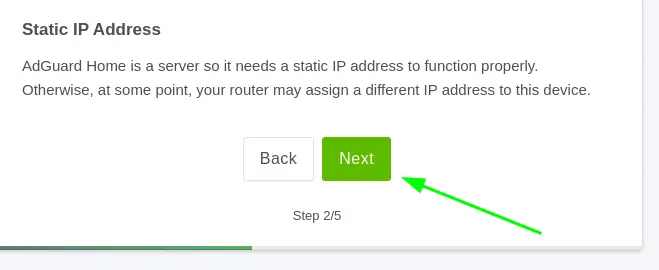

## Introduzione

In questo post mostro come ho implementato un Adblocker e un filtro DNS a livello di rete, che mi permette di eliminare la pubblicità da tutti i miei dispositivi e di aumentare la sicurezza della mia rete.  
Per ottenere tutto questo in modo flessibile e sicuro, utilizzo **Tailscale** per creare una **tailnet** che include tutti i miei dispositivi.  
Per implementare il filtro web a livello DNS, mi affido all’ottimo **AdGuard Home**.


## Tailscale

Tailscale è un Software Defined Network (SDN) di nuova generazione che consente di collegare in modo semplice e sicuro (**VPN peer-to-peer**) tutti i tuoi dispositivi, creando una rete privata tra di essi senza necessità di configurazioni complesse o hardware dedicato.  
È importante notare che, generalmente, tutto il traffico tra i peer VPN non passa attraverso dispositivi di terze parti, garantendo così una maggiore sicurezza.

Tailscale utilizza il protocollo open source WireGuard per stabilire connessioni cifrate punto-a-punto tra i dispositivi, assicurando che solo quelli appartenenti alla tua rete privata, chiamata **tailnet**, possano comunicare tra loro.

Il funzionamento si basa su un modello ibrido centralizzato-distribuito: un server di coordinamento gestisce lo scambio delle chiavi pubbliche e degli indirizzi, permettendo a ogni nodo di configurare autonomamente i propri tunnel cifrati con gli altri dispositivi, anche attraverso firewall e NAT, senza dover aprire porte o modificare policy di rete.

> In questo modo, Tailscale crea una rete mesh peer-to-peer che riduce la latenza e aumenta il throughput, rendendo la comunicazione tra dispositivi diretta e sicura.

## Adguard Home

**AdGuard Home** è un software che funziona come un server DNS a livello di rete, progettato per bloccare annunci pubblicitari, tracker e contenuti dannosi su tutti i dispositivi connessi alla tua rete domestica.  
Opera filtrando le richieste DNS, cioè le richieste di traduzione dei nomi di dominio in indirizzi IP, bloccando quelle dirette a domini noti per pubblicità, tracciamento e malware prima che la connessione venga stabilita.

In pratica, quando un dispositivo della rete richiede di risolvere un dominio, AdGuard Home verifica se quel dominio è presente nelle sue liste di blocco e, in caso affermativo, impedisce la connessione restituendo un indirizzo IP non raggiungibile (un "buco nero").  
Questo metodo impedisce ai dispositivi di caricare contenuti indesiderati o potenzialmente pericolosi, migliorando la privacy e la sicurezza online su tutta la rete.

AdGuard Home consente anche di personalizzare le regole di filtraggio, aggiungere liste di blocco personalizzate e monitorare l’attività DNS della rete. Può essere configurato per applicare controlli parentali e bloccare interi siti web su specifici dispositivi.

Inoltre, AdGuard Home utilizza server DNS "upstream" per risolvere le richieste non bloccate, supportando protocolli di sicurezza come DNS-over-HTTPS e DNS-over-TLS per garantire la privacy delle query DNS.

> Questa soluzione è ideale per chi vuole un controllo centralizzato e personalizzabile del filtro pubblicitario e della sicurezza DNS su tutti i dispositivi di casa o dell’ufficio, senza dover installare software su ogni singolo dispositivo.

## Architettura 


Il funzionamento complessivo prevede, tramite Tailscale, la creazione di una **tailnet privata** che comprende tutti i dispositivi della tua rete (PC Windows, Linux, TV, smartphone Android e iPhone, ecc.).  
Questi dispositivi verranno configurati per utilizzare come server DNS il nostro AdGuard Home, dove avverrà il filtraggio e l’eventuale risoluzione DNS.

In questo modo, i tuoi dispositivi saranno protetti in modo trasparente, senza la necessità di installare software aggiuntivo su ciascuno di essi.

Chiaramente, anche AdGuard Home deve essere eseguito su un dispositivo che faccia parte della tailnet. Può girare su un **Raspberry Pi**, su un NAS locale, su una macchina virtuale nel cloud o, in generale, su qualsiasi sistema connesso a Internet e raggiungibile tramite Tailscale.

È importantissimo sottolineare che con questo meccanismo non si espone un server DNS direttamente su Internet.  
Esporre un DNS pubblico senza adeguate protezioni è un’operazione rischiosa e non consigliata, in quanto può esporre te e gli altri utenti a pericolosi rischi di sicurezza.

Grazie a Tailscale, infatti, il traffico DNS rimane confinato all’interno della rete privata virtuale (tailnet), garantendo un accesso sicuro e riservato al server AdGuard Home, senza aprire porte o esporre servizi al pubblico esterno.

> Questo approccio unisce la comodità di un filtro DNS centralizzato e personalizzabile con la sicurezza di una VPN peer-to-peer moderna, senza compromettere la privacy o la sicurezza della rete.

## Installazione e configurazione

### Raspberry Pi OS e Docker

In questo articolo do per scontato che tu abbia già un Raspberry Pi con Docker installato. Se così non fosse, puoi seguire la guida che preferisci per installare Raspberry Pi OS e Docker.

### Tailscale

Il client di Tailscale, che permette di connettere i tuoi dispositivi alla tua tailnet, può essere installato facilmente in questo modo:

#### Windows

Richiede Windows 10 o successivi.

- Scarica e installa il client da questo [link ufficiale](https://pkgs.tailscale.com/stable/tailscale-setup-latest.exe)

#### macOS

Richiede macOS Big Sur 11.0 o successivo.

- Scarica e installa il client da questo [link ufficiale](https://pkgs.tailscale.com/stable/Tailscale-latest-macos.pkg)
- Oppure scarica direttamente dal [Mac App Store](https://apps.apple.com/ca/app/tailscale/id1475387142?mt=12)

#### Linux

- Da terminale esegui:

```bash
curl -fsSL https://tailscale.com/install.sh | sh
```

#### iOS

Richiede iOS 15 o successivo.

- Scarica direttamente dall'[App Store](https://apps.apple.com/us/app/tailscale/id1470499037?ls=1)

#### Android

Richiede Android 8 o successivo.

- Scarica direttamente dal [Play Store](https://play.google.com/store/apps/details?id=com.tailscale.ipn)

Per tutti i tipi di installazione, è necessario creare un account (gratuito fino a 100 dispositivi) e collegare i propri dispositivi alla stessa tailnet.

Al termine dell’installazione, collegandoti alla dashboard Tailscale dovresti vedere tutti i tuoi dispositivi attivi e connessi.

### Configurazione DNS

L’obiettivo è fare in modo che tutte le richieste DNS dei client della tailnet vengano processate dal nostro AdGuard Home, che è installato sul Raspberry Pi.  
Nel mio caso, AdGuard Home è installato sul Raspberry Pi chiamato "factotum".

Per configurare correttamente il DNS, annota l’indirizzo IP assegnato al Raspberry Pi (ad esempio: `100.101.102.103`).

Ora vai nella tab relativa alla configurazione del DNS nella dashboard Tailscale e configura nel seguente modo:


1. Modifica le impostazioni del DNS  
2. Inserisci l’indirizzo IP del tuo Raspberry Pi (dove gira AdGuard Home)  
3. Seleziona *Override DNS Server* per fare in modo che i tuoi client usino effettivamente il DNS da te specificato


> In questo modo i tuoi client, senza nessun’altra configurazione, utilizzeranno come server DNS il tuo AdGuard Home che gira sul Raspberry Pi. Questa configurazione garantisce alti livelli di privacy ed è totalmente sotto il tuo controllo.

### AdGuard Home

Poiché il Raspberry Pi può essere utilizzato come piattaforma per molti servizi (immich, jellyfin, ecc.), l’installazione di AdGuard Home viene fatta in modo isolato e indipendente dagli altri servizi, tramite container Docker.

Per farlo, ho creato una directory `services` nella home del Raspberry Pi. Questa directory ospiterà tutti i servizi che voglio rendere disponibili ai client della mia tailnet.

Dentro `services` creo una directory dedicata a AdGuard Home, chiamata `adguardhome`. In quest’ultima creo due directory, utili per il runtime di AdGuard Home, chiamate `config` e `work`.

```bash
cd ~

mkdir -p services/adguardhome/{work,config}
```

Dovresti vedere una struttura di directory come questa:

```bash
services/
├── adguardhome
│   ├── config
│   └── work
```

Ora, nella directory `adguardhome`, crea un file chiamato `docker-compose.yml` con questo contenuto:

```bash
name: adguardhome

services:
  adguardhome:
    container_name: adguardhome
    image: adguard/adguardhome
    platform: linux/arm64
    volumes:
      - ./work:/opt/adguardhome/work
      - ./config:/opt/adguardhome/conf
    network_mode: host
    restart: always
```

Avvia il container con AdGuard Home così:

```bash
cd ~/services/adguardhome

docker compose up -d
```

Dopo qualche secondo, il container sarà operativo e potrai accedere alla console web di gestione di AdGuard Home.


Imposta le porte su cui è accessibile la dashboard di amministrazione e la porta DNS (i valori di default vanno benissimo).


Procedi senza modifiche


Crea l'account di amministrazione


Procedi senza modifiche


Procedi senza modifiche


Bene, ora puoi fare il login come amministratore di Adguard Home


Se tutto va bene, vedrai la dashboard inizale con le informazioni statistiche


*Settings->General Settings*

Qui ti mostro le mie impostazioni, ma ovviamente ti consiglio di adattare queste configurazioni alle tue esigenze.  
Se non sei sicuro del significato di ogni voce, puoi seguire la mia configurazione, che è provata e funzionante al 100%.


*Settings->DNS Settings*

Io come upstream DNS resolver uso *Quad9*, ma puoi scegliere il DNS resolver che preferisci, basta modificare l’indirizzo IP.


*Filters->DNS blocklist*

Qui puoi specificare una serie di liste di domini che verranno filtrati da AdGuard Home.  
Ci sono già alcune liste preconfigurate, ma ti suggerisco di aggiungere anche queste:

- Steven Black: https://raw.githubusercontent.com/StevenBlack/hosts/master/alternates/fakenews-gambling-porn-social/hosts  
- ppfeufer list: https://github.com/ppfeufer/adguard-filter-list/blob/master/blocklist?raw=true

Puoi anche aggiungere una tua lista personalizzata di domini da filtrare. Io, ad esempio, uso i gist di Github: creo un gist con i domini da filtrare e aggiungo il riferimento qui, così AdGuard Home caricherà la mia lista senza problemi.

L’URL del gist sarà simile a:  
`https://gist.githubusercontent.com/***il tuo account***/38e9dg4c1bebfb15a654062495c711fa/raw`

Il formato della blocklist è molto semplice:

```bash
||config.edge.skype.com^
||avatars.githubusercontent.com^
||github-cloud.s3.amazonaws.com^
```


*Filters->DNS allowlist*

Allo stesso modo puoi configurare una allowlist (una lista di eccezioni che non vuoi filtrare). Puoi usare il meccanismo del gist come sopra.


*Filters->Blocked services*

Qui puoi filtrare servizi specifici, abilitando l’apposita configurazione.


*Filters->Custom filtering rules*

Qui puoi specificare delle regole di filtraggio aggiuntive a quelle precedenti

Qui puoi specificare regole di filtraggio aggiuntive rispetto a quelle precedenti.  
Il formato è:

- `||dominio.it^` per filtrare dominio.it e tutti i suoi sottodomini  
- `@@||dominio.com^` per escludere dal filtraggio dominio.com e i suoi sottodomini


## Conclusioni

Complimenti per essere arrivato fino a qui! Ora hai un potente filtro DNS che blocca la maggior parte della pubblicità e ti protegge da tracker e siti malevoli.  
Tutto in totale sicurezza: grazie a Tailscale, questo servizio è disponibile per tutti i tuoi dispositivi senza la necessità di installare applicazioni particolari o di dubbia provenienza.

Se hai dubbi o domande, lascia un commento qui sotto. Se hai trovato utile questo articolo, condividilo con la tua rete!

Buon adblocking!