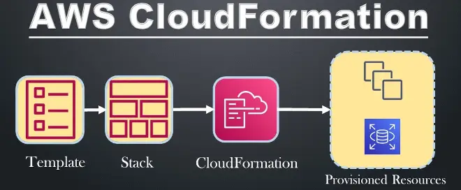

## Come Dare un Nome a un'Istanze EC2 in AWS CloudFormation

AWS CloudFormation è un potente servizio che consente di **modellare e configurare risorse AWS** utilizzando template testuali. Questo approccio implementa il paradigma dell'**Infrastructure as Code (IaC)**, rendendo la gestione delle risorse più efficiente e ripetibile.

In questo articolo, ti mostrerò come assegnare un nome specifico a un'istanza EC2 utilizzando AWS CloudFormation, migliorando la tua esperienza nella console AWS.

---

## **Cosa fa AWS CloudFormation?**

AWS CloudFormation ti consente di definire le risorse AWS utilizzando template scritti in YAML o JSON. Puoi specificare configurazioni come istanze EC2, gruppi di sicurezza, e molto altro, il tutto in modo dichiarativo.

Ecco un esempio base di template per creare un'istanza EC2 con un security group:

```yaml
---
AWSTemplateFormatVersion: "2010-09-09"
Description: AWS CloudFormation EC2 Template
Resources:
  SG-Mia-EC2:
    Type: AWS::EC2::SecurityGroup
    Properties:
      GroupDescription: Apre la porta HTTPS 443
      GroupName: SG-Mia-EC2
      SecurityGroupIngress:
        - IpProtocol: tcp
          FromPort: "443"
          ToPort: "443"
          CidrIp: 0.0.0.0/0
  EC2-Mia-EC2:
    Type: AWS::EC2::Instance
    Properties:
      ImageId: ami-0c318278dac68c29a
      InstanceType: t3.micro
      SecurityGroups:
        - Ref: SG-Mia-EC2
```

Questo template crea un'istanza EC2 e un security group associato, ma nella console AWS, la colonna Nome dell'istanza EC2 rimarrà vuota. Questo può complicare l'identificazione delle risorse, soprattutto se hai più istanze nella stessa regione.

## Perché Assegnare un Nome a un'Istanze EC2 è Importante?

Assegnare un nome alle tue risorse AWS offre diversi vantaggi:

- **Maggiore chiarezza nella console AWS**: È più facile identificare rapidamente un'istanza.
- **Standardizzazione**: Seguire un pattern di naming coerente facilita la gestione.
- **Documentazione interna**: I nomi descrittivi possono fornire contesto sui ruoli delle istanze.

## Come Assegnare un Nome a un'Istanze EC2

Non esiste una proprietà "Name" diretta per le istanze EC2 in CloudFormation. Tuttavia, puoi utilizzare i Tag per definire un nome visibile nella console AWS.

### Utilizzare il Tag "Name"

Il tag Name è supportato da AWS per identificare le risorse EC2. Basta aggiungere un tag con chiave "Name" e un valore rappresentante il nome desiderato.

Ecco un esempio aggiornato del template:

```yaml
---
AWSTemplateFormatVersion: "2010-09-09"
Description: AWS CloudFormation EC2 Template
Resources:
  SG-Mia-EC2:
    Type: AWS::EC2::SecurityGroup
    Properties:
      GroupDescription: Apre la porta HTTPS 443
      GroupName: SG-Mia-EC2
      SecurityGroupIngress:
        - IpProtocol: tcp
          FromPort: "443"
          ToPort: "443"
          CidrIp: 0.0.0.0/0
  EC2-Mia-EC2:
    Type: AWS::EC2::Instance
    Properties:
      ImageId: ami-0c318278dac68c29a
      InstanceType: t3.micro
      SecurityGroups:
        - Ref: SG-Mia-EC2
      Tags:
        - Key: "Name"
          Value: "Mia-EC2"
```

## Vantaggi dell'Utilizzo del Tag "Name"

1. **Identificazione semplice**: Quando accedi alla console AWS, puoi vedere immediatamente il nome delle tue istanze EC2.
2. **Miglior gestione**: Utile quando gestisci ambienti complessi con molte risorse.
3. **Adattabilità**: Puoi definire nomi dinamici utilizzando i parametri del template.

### Esempio di Nome Dinamico con Parametri

Per rendere il nome dell'istanza personalizzabile, puoi utilizzare i Parametri in CloudFormation:

```yaml
Parameters:
  InstanceName:
    Type: String
    Description: "Il nome dell'istanza EC2"

Resources:
  EC2-Mia-EC2:
    Type: AWS::EC2::Instance
    Properties:
      ImageId: ami-0c318278dac68c29a
      InstanceType: t3.micro
      Tags:
        - Key: "Name"
          Value: !Ref InstanceName
```

Quando crei lo stack, puoi specificare il nome desiderato tramite l'interfaccia della console AWS o la CLI.

## Conclusione

Dare un nome a un'istanza EC2 in AWS CloudFormation è un processo semplice e veloce grazie ai Tag. Utilizzando il tag Name, puoi migliorare la chiarezza e la gestibilità delle tue risorse nella console AWS. Questo approccio è fondamentale per mantenere ordine e standardizzazione, specialmente in ambienti complessi.

Hai trovato utile questo articolo? Prova a implementare questa configurazione nel tuo prossimo progetto e condividi le tue esperienze o domande nei commenti.
