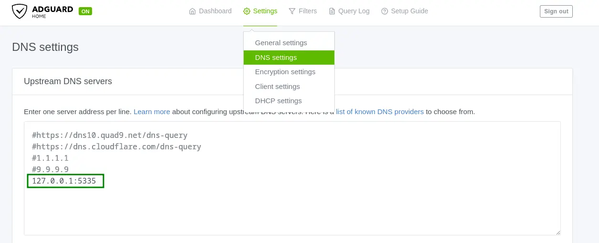

## Introduzione

In un mio precedente articolo ([Come creare un AdBlocker di rete con Tailscale e AdGuard Home](https://mancusoa.it/posts/adblocker-rete-tailscale-adguardhome/)) abbiamo visto come creare un Ad Blocker di rete che protegge efficacemente tutti i tuoi dispositivi (PC, laptop, smartphone, ecc.) usando AdGuard Home installato su Raspberry Pi e una rete privata tramite Tailscale.

In questa architettura, tuttavia, c’è ancora un aspetto da considerare: AdGuard Home utilizza come DNS upstream un resolver pubblico (ad esempio 1.1.1.1, 8.8.8.8 o quello del tuo ISP).

Questo comporta alcuni limiti importanti per la privacy:

- **Tracciamento e profilazione**  
  I DNS resolver pubblici possono registrare tutte le richieste DNS che invii, associandole al tuo indirizzo IP. Questi dati possono essere usati per profilare le tue abitudini di navigazione.

- **Mancanza di anonimato**  
  I provider DNS pubblici possono conservare i log delle richieste per periodi variabili, esponendo potenzialmente la tua cronologia DNS.

- **Regole non in linea con il GDPR europeo**  
  Molti DNS pubblici sono gestiti da aziende fuori dall’Unione Europea, con trasferimenti di dati verso paesi con normative sulla privacy meno restrittive rispetto al GDPR.

- **Filtraggio e censura**  
  Alcuni DNS pubblici possono applicare filtri su determinati domini, limitando la libertà di accesso senza che l’utente ne sia pienamente consapevole.

Quindi, usare DNS pubblici non elimina i rischi di tracciamento, profilazione e conservazione dei dati. Solo un resolver DNS privato, gestito direttamente da te, può garantire il massimo controllo sulle tue richieste DNS e sulla loro privacy.

In questo articolo vedremo come estendere il sistema di ad blocking di rete per mitigare questi problemi, installando e configurando un DNS resolver privato tramite il software open-source **Unbound**.

## Unbound

**Unbound** è un DNS resolver ricorsivo con cache, open-source, progettato per essere veloce, leggero e sicuro. Supporta funzionalità moderne basate su standard aperti per aumentare la privacy online, come DNS-over-TLS e DNS-over-HTTPS, che permettono di criptare la comunicazione tra client e resolver.

Inoltre, implementa tecniche avanzate per limitare la quantità di dati scambiati con i server autoritativi, migliorando privacy e robustezza, tra cui:

- Minimizzazione del nome della query (QNAME Minimization)
- Uso aggressivo della cache validata tramite DNSSEC
- Supporto per zone di autorità, utili a caricare copie locali della zona root

## Architettura della soluzione

Schema del flusso DNS: dispositivi → AdGuard Home → Unbound → Internet


Come si vede dal diagramma, **Unbound** si integra perfettamente nell’architettura dell’AdBlocker di rete. Le funzionalità di filtraggio di AdGuard Home rimangono invariate, mentre cambia il modo in cui vengono risolti i nomi di dominio non filtrati.

Invece di usare un DNS pubblico, AdGuard Home utilizza Unbound come resolver ricorsivo locale. Grazie a una configurazione dedicata, Unbound minimizza le query inviate ai server pubblici, evitando di trasmettere il nome di dominio completo a terzi e aumentando così notevolmente la privacy durante la navigazione.

## Creazione dell'immagine Docker di Unbound

Per eseguire Unbound in un container Docker, è necessario creare un’immagine personalizzata.

Lavoriamo nella directory `services` sul Raspberry Pi e creiamo una cartella dedicata:

```bash
cd ~

mkdir -p services/unbound
```

Nella cartella `services/unbound` creiamo il file `entrypoint.sh` con questo contenuto:

```bash
#!/bin/sh
# Crea la directory se non esiste e assegna permessi
mkdir -p /var/lib/unbound
chown unbound:unbound /var/lib/unbound

# Genera o aggiorna la root key
if [ ! -s /var/lib/unbound/root.key ]; then
    echo "Generating root trust anchor..."
    unbound-anchor -a /var/lib/unbound/root.key
    chown unbound:unbound /var/lib/unbound/root.key
fi

echo "Running unbound........."

# Avvia Unbound come utente unbound
exec su-exec unbound unbound -d -c /etc/unbound/unbound.conf
```

Creiamo anche il `Dockerfile` nella stessa directory:

```bash
FROM alpine:latest

# Installa Unbound
RUN apk add --no-cache unbound su-exec

RUN echo 'server:' >  /etc/unbound/unbound.conf && \
    echo 'include-toplevel: "/etc/unbound/unbound.conf.d/*.conf"' > /etc/unbound/unbound.conf

COPY entrypoint.sh /entrypoint.sh
RUN chmod +x /entrypoint.sh

ENTRYPOINT ["/entrypoint.sh"]
```


La struttura della directory sarà:

```bash
unbound/
├── Dockerfile
└── entrypoint.sh
```

Come si può vedere, l'immagine finale del nostro DNS resolver è basata su Linux Alpine, in modo da ottenere un'immagine compatta che pesa poco.

Costruiamo l’immagine Docker con:

```bash
docker build -t unbound .
```


Lo script `entrypoint.sh` si occupa di creare e aggiornare il file *root.key* necessario a Unbound ad ogni avvio del container.

Verifica la presenza dell’immagine con:

```bash
docker image ls
REPOSITORY                                   TAG       IMAGE ID       CREATED        SIZE
unbound                                      latest    65f2afce99d1   2 days ago     13.2MB
adguard/adguardhome                          latest    a5f2eed84b99   5 weeks ago    71MB
```


## Configurazione di Unbound

Creiamo una directory `config` e inseriamo la configurazione personalizzata in `unbound-custom.conf`:

```bbash
unbound/
├── config
│   └── unbound-custom.conf
├── docker-compose.yml
├── Dockerfile
└── entrypoint.sh
```


Ecco un esempio di configurazione base per `unbound-custom.conf`:

```bash
server:
    #general
 
    # File with trusted keys, kept uptodate using RFC5011 probes,
    auto-trust-anchor-file: "/var/lib/unbound/root.key"

    #logging
    # verbosity number, 0 is least verbose. 1 is default.
    verbosity: 2

    #log to stderr
    use-syslog: no
    logfile: ""

    # print UTC timestamp in ascii to logfile, default is epoch in seconds.
    log-time-ascii: yes

    # log timestamp in ISO8601 format if also log-time-ascii is enabled.
    # (y-m-dTh:m:s.msec[+-]tzhours:tzminutes)
    log-time-iso: yes

    # print one line with time, IP, name, type, class for every query.
    log-queries: yes

    # log with tag 'query' and 'reply' instead of 'info' for
    # filtering log-queries and log-replies from the log.
    log-tag-queryreply: yes

    #binding interface and port
    # specify the interfaces and port to answer queries from by ip-address.
    interface: 0.0.0.0
    port: 5335
    # control which clients are allowed to make (recursive) queries
    access-control: 127.0.0.0/8 allow

    #disable IPv6 if not needed
    do-ip4: yes
    do-udp: yes
    do-tcp: yes
    do-ip6: no

    #hardening
    # Harden against out of zone rrsets, to avoid spoofing attempts.
    harden-glue: yes

    # Harden against receiving dnssec-stripped data
    harden-dnssec-stripped: yes

    # Use 0x20-encoded random bits in the query to foil spoof attempts.
    use-caps-for-id: yes

    # enable to not answer id.server and hostname.bind queries.
    hide-identity: yes

    # enable to not answer version.server and version.bind queries.
    hide-version: yes

    # Sent minimum amount of information to upstream servers to enhance privacy.
    qname-minimisation: yes
    
    # Aggressive NSEC uses the DNSSEC NSEC chain to synthesize NXDOMAI
    aggressive-nsec: yes

    # If nonzero, unwanted replies are not only reported in statistics,
    # but also a running total is kept per thread. If it reaches the
    # threshold, a warning is printed and a defensive action is taken,
    # the cache is cleared to flush potential poison out of it.
    # A suggested value is 10000000, the default is 0 (turned off).
    unwanted-reply-threshold: 10000000

    #efficency
    prefetch: yes

    # Serve expired responses from cache, with serve-expired-reply-ttl in
    # the response, and then attempt to fetch the data afresh.
    serve-expired: yes
    
    # Limit serving of expired responses to configured seconds after
    # expiration.
    serve-expired-ttl: 86400

    # EDNS reassembly buffer to advertise to UDP peers (the actual buffer
    # is set with msg-buffer-size).
    edns-buffer-size: 1232
	
    # the time to live (TTL) value lower bound, in seconds. Default 0.
    # If more than an hour could easily give trouble due to stale data.
    cache-min-ttl: 3600

    # the time to live (TTL) value cap for RRsets and messages in the
    # cache. Items are not cached for longer. In seconds.
    cache-max-ttl: 86400

    # the amount of memory to use for the RRset cache.
    rrset-cache-size: 8m

    # the amount of memory to use for the message cache.
    msg-cache-size: 4m

    # number of threads to create. 1 disables threading.
    num-threads: 4
    
    # the number of slabs to use for the RRset cache.
    rrset-cache-slabs: 4
    
    # the number of slabs to use for the message cache.
    msg-cache-slabs: 4	
```


### Spiegazione di alcuni parametri chiave

- **harden-glue: yes**

    Unbound verifica che i record glue siano coerenti e affidabili.
    Riduce il rischio di accettare risposte DNS contraffatte che potrebbero compromettere la sicurezza della risoluzione.
    Questo parametro è consigliato per aumentare la sicurezza del resolver

- **harden-dnssec-stripped: yes**
    
    Serve a rafforzare la sicurezza della validazione DNSSEC. 
    Protegge da attacchi in cui un server DNS upstream o un intermediario rimuove intenzionalmente le informazioni DNSSEC

- **use-caps-for-id: yes**
    
    Invia le query DNS alterando casualmente maiuscole e minuscole nei nomi di dominio.
    Questo meccanismo aggiunge un ulteriore livello di difficoltà per chi tenta di effettuare attacchi di DNS spoofing o cache poisoning 

- **edns-buffer-size: 1232**

    Definisce la dimensione massima del buffer (in byte) che il resolver annuncia nelle query DNS tramite EDNS0 (Extension mechanisms for DNS).
    Il valore consigliato attualmente è 1232 byte, un buon compromesso tra dimensione e frammentazione

- **prefetch: yes**

    Permette al server DNS di rinnovare automaticamente le voci della cache prima che scadano.
    Questo migliora la rapidità del servizio DNS.
    
- **serve-expired: yes** e **serve-expired-ttl: 86400**

    Migliora la disponibilità e la velocità di risposta del resolver DNS in caso di problemi temporanei con i server autoritativi.
    
- **cache-min-ttl: 3600**

    Definisce il tempo minimo (in secondi) per cui una risposta DNS viene mantenuta in cache, indipendentemente dal valore TTL originale fornito dal record DNS.

- **cache-max-ttl: 86400**

    Il tempo massimo (in secondi) per cui una risposta DNS viene mantenuta in cache, indipendentemente dal valore TTL originale fornito dal record DNS.


- **rrset-cache-size: 8m**

    La dimensione della cache dedicata ai record DNS (RRset), cioè ai dati delle risposte DNS memorizzati per velocizzare le successive risoluzioni.

- **msg-cache-size: 4m**
    
    La dimensione della cache per i messaggi DNS completi (cioè le risposte DNS memorizzate così come sono ricevute)

- **num-threads: 4**

    Specifica il numero di thread software che il server DNS creerà per gestire le richieste.

- **rrset-cache-slabs: 4**

    Definisce il numero di "slabs" (segmenti) in cui viene suddivisa la cache RRset     
    
- **hide-identity: yes**

    Serve a nascondere l’identità del server DNS quando vengono effettuate query specifiche che chiedono informazioni sul server stesso.

- **qname-minimisation: yes**
    
    Abilita una funzionalità di privacy e sicurezza chiamata **QNAME Minimization** (minimizzazione del nome di query).
    QNAME Minimization riduce la quantità di informazioni inviate ai server DNS intermedi, inviando solo la parte minima del nome necessaria per ottenere la delega successiva.
    
    **Migliora la privacy**: i server DNS intermedi vedono solo la porzione di dominio che devono conoscere, non l’intero nome.
    
    **Incrementa la sicurezza**: riduce la superficie di attacco per attacchi di tipo DNS spoofing o raccolta dati.

- **aggressive-nsec: yes**

    Riduzione del traffico DNS a tutti i livelli della gerarchia DNS.
    Miglioramento delle prestazioni del resolver, soprattutto in presenza di molte query per nomi inesistenti.

- **unwanted-reply-threshold: 1000000**
    
    Conta le risposte DNS sospette per thread e, superata la soglia, esegue una pulizia della cache per proteggere il resolver da attacchi di cache poisoning.


## Avvio di Unbound in Docker

Creiamo il file `docker-compose.yml` per avviare il container:

```bash
services:
  unbound:
    image: unbound
    container_name: unbound
    volumes:
      - ./config:/etc/unbound/unbound.conf.d
    network_mode: host
    restart: always
```


Avviamo il container in background:


```bash
docker compose up -d
```


## Configurazione di AdGuard Home per usare Unbound come DNS upstream

Per completare la configurazione, modifichiamo AdGuard Home per usare come DNS upstream il resolver locale Unbound all’indirizzo `127.0.0.1` sulla porta `5335`.



Procedura:

1. Vai in `Settings` → `DNS settings`
2. Commenta o rimuovi eventuali DNS resolver pubblici presenti
3. Inserisci `127.0.0.1:5335` come DNS upstream
4. Premi `Apply` per salvare

## Verifica del funzionamento

Per verificare che le query DNS vengano risolte localmente da Unbound, controlla i log del container:

```bash
cd ~/services/unbound

docker compose logs -f

nbound  | 2025-07-04T09:58:37.234+00:00 unbound[1:1] info: response for github.com. DS IN
unbound  | 2025-07-04T09:58:37.234+00:00 unbound[1:1] info: reply from <com.> 192.33.14.30#53
unbound  | 2025-07-04T09:58:37.234+00:00 unbound[1:1] info: query response was nodata ANSWER
unbound  | 2025-07-04T09:58:37.235+00:00 unbound[1:1] info: NSEC3s for the referral proved no DS.
unbound  | 2025-07-04T09:58:37.235+00:00 unbound[1:1] info: NSEC3s for the referral proved no DS.
unbound  | 2025-07-04T09:58:37.235+00:00 unbound[1:1] info: Verified that unsigned response is INSECURE
unbound  | 2025-07-04T09:58:37.235+00:00 unbound[1:1] info: Verified that unsigned response is INSECURE
```


Quando navighi, ad esempio aprendo https://mancusoa.it, vedrai nei log le query DNS risolte da Unbound, con dettagli sulle risposte e i server autoritativi contattati.

Esempio di log:

```bash
unbound  | 2025-07-04T10:14:31.616+00:00 unbound[1:1] query: 127.0.0.1 mancusoa.it. A IN
unbound  | 2025-07-04T10:14:31.616+00:00 unbound[1:1] info: resolving mancusoa.it. A IN
unbound  | 2025-07-04T10:14:31.616+00:00 unbound[1:1] query: 127.0.0.1 mancusoa.it. HTTPS IN
unbound  | 2025-07-04T10:14:31.617+00:00 unbound[1:1] info: resolving mancusoa.it. HTTPS IN
unbound  | 2025-07-04T10:14:31.626+00:00 unbound[1:1] info: response for mancusoa.it. HTTPS IN
unbound  | 2025-07-04T10:14:31.626+00:00 unbound[1:1] info: reply from <.> 193.0.14.129#53
unbound  | 2025-07-04T10:14:31.626+00:00 unbound[1:1] info: query response was REFERRAL
unbound  | 2025-07-04T10:14:31.643+00:00 unbound[1:1] info: response for mancusoa.it. HTTPS IN
unbound  | 2025-07-04T10:14:31.643+00:00 unbound[1:1] info: reply from <it.> 194.0.25.44#53
unbound  | 2025-07-04T10:14:31.643+00:00 unbound[1:1] info: query response was REFERRAL
unbound  | 2025-07-04T10:14:31.643+00:00 unbound[1:1] info: resolving ns1080.ui-dns.de. A IN
unbound  | 2025-07-04T10:14:31.643+00:00 unbound[1:1] info: resolving ns1114.ui-dns.biz. A IN
unbound  | 2025-07-04T10:14:31.644+00:00 unbound[1:1] info: resolving ns1059.ui-dns.com. A IN
unbound  | 2025-07-04T10:14:31.644+00:00 unbound[1:1] info: response for mancusoa.it. A IN
unbound  | 2025-07-04T10:14:31.644+00:00 unbound[1:1] info: reply from <.> 192.36.148.17#53
unbound  | 2025-07-04T10:14:31.644+00:00 unbound[1:1] info: query response was REFERRAL
unbound  | 2025-07-04T10:14:31.653+00:00 unbound[1:1] info: response for ns1080.ui-dns.de. A IN
unbound  | 2025-07-04T10:14:31.653+00:00 unbound[1:1] info: reply from <.> 193.0.14.129#53
unbound  | 2025-07-04T10:14:31.653+00:00 unbound[1:1] info: query response was REFERRAL
unbound  | 2025-07-04T10:14:31.665+00:00 unbound[1:1] info: response for ns1059.ui-dns.com. A IN
unbound  | 2025-07-04T10:14:31.665+00:00 unbound[1:1] info: reply from <com.> 192.54.112.30#53
unbound  | 2025-07-04T10:14:31.665+00:00 unbound[1:1] info: query response was REFERRAL
unbound  | 2025-07-04T10:14:31.665+00:00 unbound[1:1] info: resolving ns-com.ui-dns.org. A IN
unbound  | 2025-07-04T10:14:31.665+00:00 unbound[1:1] info: resolving ns-com.ui-dns.biz. A IN
unbound  | 2025-07-04T10:14:31.670+00:00 unbound[1:1] info: response for mancusoa.it. A IN
unbound  | 2025-07-04T10:14:31.670+00:00 unbound[1:1] info: reply from <it.> 194.119.192.34#53
...
...
...
```

Questo ci conferma che il sistema sta funzionando correttamente.


## Conclusioni

Aumentare la privacy DNS con un resolver privato come Unbound è semplice e vantaggioso. Oltre a proteggere la tua navigazione da profilazioni e tracciamenti, potrai spesso ottenere risposte DNS più rapide grazie alla cache locale.

In questo articolo abbiamo visto una configurazione base, senza abilitare protocolli come **DNS-over-TLS (DoT)** o **DNS-over-HTTPS (DoH)**, che possono ulteriormente criptare le richieste DNS per migliorare la privacy.

Ti invito a sperimentare questi protocolli e a condividere la tua esperienza e configurazione nei commenti.


