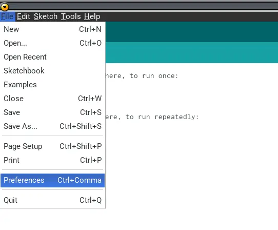

## Introduzione

Una raccomandazione importantissima nel campo della **sicurezza informatica** riguarda la solidità delle password.  
Una buona password deve essere complessa a sufficienza per non essere soggetta ad attacchi brute-force (e altri tipi di attacco) in un tempo ragionevole.  
Tuttavia, per noi esseri umani è normalmente difficile ricordare password lunghe e complesse, quindi tendiamo ad utilizzare password che ci ricordiamo con facilità.

Il mio motto è `se tu la ricordi, io la indovino`. Questa è una provocazione per dire che non dovrebbe essere necessario ricordare una password sicura.

Nell'uso quotidiano di un sistema operativo è altamente consigliabile utilizzare un password manager.  
Tuttavia, ci sono situazioni in cui ciò non è possibile. Per esempio, se il tuo sistema Linux ha il filesystem protetto e cifrato da LUKS, durante la fase di boot ti verrà chiesto di inserire una password, ed ovviamente il password manager non è disponibile.

Per ovviare al problema di ricordare una password **sicura** ho deciso di utilizzare un sistema che, basandosi sull'uso di un piccolo dispositivo USB (**Digispark**), digiti la password automaticamente.

Vediamo tutti i passi per configurare l'ambiente di sviluppo e programmare il Digispark in modo che, una volta inserito nella porta USB del PC, digiti la password al posto tuo.


## Digispark o clone

Il Digispark è una scheda di sviluppo estremamente compatta basata sul microcontrollore **ATtiny85**. Esistono vari cloni a bassissimo costo (1 Euro o poco più).  
Offre una soluzione economica e di piccole dimensioni per progetti di elettronica e automazione, simile alle schede Arduino ma più ridotta e meno potente.

Le caratteristiche fondamentali sono:

- **Dimensioni**: circa 18×18 mm, rendendola una delle schede più piccole disponibili


- **Microcontrollore**: ATtiny85 a 16 MHz, 8kB di memoria Flash (circa 6kB utilizzabili dopo il bootloader)

- **Alimentazione**: tramite USB o sorgente esterna

- **Connessioni**: 6 pin I/O multiuso (analogici e digitali; 2 condivisi con la USB se il programma comunica attivamente tramite USB)

- **Interfaccia USB**: il PCB è sagomato per essere inserito direttamente in una porta USB tipo A

- **Costo**: estremamente contenuto e di facile reperibilità

---


## Installazione e Configurazione dell’IDE Arduino

Se hai già l'IDE di Arduino installato, procedi pure. In ogni caso, mostro i passi per installare la versione *portable*.

### Download Arduino Portable

```bash
wget https://downloads.arduino.cc/arduino-1.8.19-linux64.tar.xz
```

### Installazione arduino portable

```bash
tar xvf arduino-1.8.19-linux64.tar.xz
```

Verrà creata una directory chiamata `arduino-1.8.19`. Creiamo la directory *portable*:


```bash
cd arduino-1.8.19
mkdir portable
```

### Installazione supporto per Digispark

Lancia Arduino IDE:

```bash
./arduino
```

- Vai in **File -> Preferences**  
- Alla voce **Additional Board Manager URLs** inserisci:

```bash
http://drazzy.com/package_drazzy.com_index.json
```

- Premi OK




- Ora vai in **Tools -> Board -> Board Manager**  
- Installa **ATTinyCore version 1.5.2**


<br>

---


## Installazione librerie Digispark

- Scarica le librerie per programmare il Digispark  
- Copia le librerie nel percorso all'interno di `arduino-1.8.19/libraries`

```bash
cd arduino-1.8.19

wget https://github.com/digistump/DigistumpArduino/releases/download/1.6.7/digistump-avr-1.6.7.zip

unzip digistump-avr-1.6.7.zip

cd 1.6.7/libraries

cp -vr * ../../libraries
```

---


## Burn del Bootloader

- Installiamo il bootloader adatto ai nostri scopi, che ha un tempo di attesa iniziale ridotto:

```bash
cd arduino-1.8.19

git clone https://github.com/ArminJo/micronucleus-firmware.git
```

- Ora facciamo il flashing:

```bash
portable/packages/ATTinyCore/tools/micronucleus/2.5-azd1b/micronucleus --no-ansi --run --timeout 60 micronucleus-firmware/firmware/upgrades/upgrade-t85_entry_on_powerOn_activePullup_fastExit.hex
```

- Entro 60 secondi inserisci il Digispark in una porta USB  
- Il flashing del bootloader avverrà in modo automatico

```bash
> Please plug in the device (will time out in 60 seconds) ... 
> Device is found!
connecting: 16% complete
connecting: 22% complete
connecting: 28% complete
connecting: 33% complete
> Device has firmware version 2.6
> Device signature: 0x1e930b 
> Available space for user applications: 6586 bytes
> Suggested sleep time between sending pages: 7ms
> Whole page count: 103  page size: 64
> Erase function sleep duration: 721ms
parsing: 50% complete
> Erasing the memory ...
erasing: 55% complete
erasing: 60% complete
erasing: 65% complete
> Starting to upload ...
writing: 70% complete
writing: 75% complete
writing: 80% complete
> Starting the user app ...
running: 100% complete
>> Micronucleus done. Thank you!
```
---


## Scrittura del Codice per l’Inserimento Automatico della Password

- Lancia Arduino IDE  
- In **Tools -> Board -> ATTinyCore** seleziona **ATTiny85 (micronucleus/digispark)**


- Ora copia questo codice (modificalo a piacimento, questo è un esempio minimale):

```c
#include "DigiKeyboard.h"

void setup() {
  //Attendo 1 secondo per essere sicuri che la tastiera sia operativa
  DigiKeyboard.delay(1000);
  
  //normalmente non necessario, ma in alcuni casi garantisce 
  //che il primo carattere sia correttamente digitato dopo un delay
  DigiKeyboard.sendKeyStroke(0);
  
  // inserisce la tua password
  DigiKeyboard.println("Password Luks complessa!!!"); 
}


void loop() {
  ;;
}
```

---


## Caricamento del Codice sulla Scheda Digispark

- Fai l'upload dello sketch (premi l'icona freccia a destra o CTRL+U)  
- Entro 60 secondi inserisci il Digispark e inizierà il caricamento dello sketch


- Quando inserisci il Digispark in una porta USB, dopo circa 3 secondi la tua password viene digitata automaticamente una sola volta  
- Fai attenzione che non tutti i caratteri sono digitati correttamente (specialmente i simboli)  
- Verifica attentamente che la password digitata sia corretta

---


## Considerazioni sulla Sicurezza

Ci sono alcune considerazioni importanti da fare dal punto di vista della sicurezza:

- Questa soluzione può essere considerata poco sicura da alcuni, poiché la password è memorizzata in chiaro nel firmware del Digispark  
- Se un attaccante venisse in possesso sia del PC che del Digispark, potrebbe risalire alla password, anche se con alcune difficoltà

Il mio use case è:

- PC e Digispark stanno in posti diversi (zaino e portachiavi)  
- Se mi rubano o smarrisco il PC ma non il Digispark, il ladro **NON** accede ai miei dati  
- Se mi rubano o smarrisco il Digispark ma non il PC, il ladro potrebbe accedere alla chiave, che nel frattempo posso cambiare  
- Se mi rubano o smarrisco contemporaneamente PC e Digispark, il ladro accede ai dati  
- Senza Digispark, la password di sblocco sarebbe più debole  
- Con Digispark posso usare una password molto più forte

Bilanciando questi aspetti, ritengo che questa soluzione fornisca un livello di sicurezza *adeguat*o al mio caso d’uso, esponendomi al furto di dati solo in uno scenario a bassa probabilità.

---


## Suggerimenti

Attenzione: se imposti come unica chiave di LUKS la password memorizzata nel Digispark, crei un **single point of failure**.  
Se perdi il Digispark o si guasta, non potrai più accedere ai tuoi dati.

Suggerisco:

- Scrivi la password in un posto sicuro, protetto e ben custodito  
- Imposta una seconda chiave di LUKS da usare come backup

---

## Conclusioni

Con questo metodo, al boot del mio sistema Linux, anziché digitare la password di sblocco di LUKS, inserisco il Digispark e lui la digiterà per me.  
Questo mi permette di utilizzare una password lunga e complessa, aumentando la sicurezza del mio disco.

Ovviamente puoi utilizzare questo metodo per qualsiasi altra password e non solo per lo sblocco di LUKS.  
Lascio a te pensare usi creativi di questo metodo e, se ti va, fammi sapere nei commenti qui sotto.
