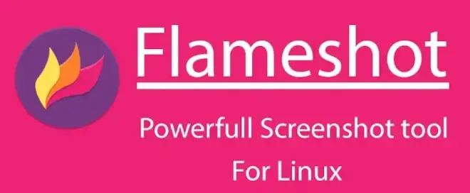

# **Cos'è Flameshot?**

> _Flameshot è un software gratuito e open-source, multipiattaforma, che permette di catturare schermate con molte funzionalità integrate, ideali per risparmiare tempo._

Durante il nostro lavoro quotidiano, catturare schermate (`screenshot`) è spesso indispensabile: che sia per presentazioni, tutorial, video o semplice condivisione di informazioni. Flameshot è uno strumento ideale per questo scopo, grazie alla sua facilità d’uso e alle numerose funzionalità. È disponibile su tutte le piattaforme principali, incluso Linux.

## **Funzionalità principali di Flameshot**

Flameshot offre un'interfaccia grafica (GUI) intuitiva e versatile. Ecco alcune delle sue caratteristiche principali:

- **Cattura flessibile:** Puoi scegliere se catturare l’intero schermo, una finestra specifica o una porzione selezionata manualmente.
- **Annotazioni immediate:** Aggiungi elementi come frecce, cerchi, testo o evidenziazioni direttamente sull’immagine catturata.
- **Personalizzazione:** Personalizza i tuoi screenshot per renderli più chiari e dettagliati.

<br>

---

## **Come installare Flameshot su Linux**

L’installazione di Flameshot su Linux è semplice, grazie alla sua inclusione nei repository ufficiali delle principali distribuzioni. Ecco i comandi per le più comuni:

```bash
# Debian/Ubuntu
sudo apt install flameshot

# Arch Linux
pacman --sync flameshot

# Fedora
dnf install flameshot
```

**NOTA**: Su altre distribuzioni il comando sarà molto simile.

---

## Utilizzo da linea di comando (CLI)

Una delle funzionalità più potenti di Flameshot è la possibilità di utilizzarlo tramite riga di comando. Questo risulta particolarmente utile per:

- Automazioni tramite script.
- Operazioni rapide senza aprire l’interfaccia grafica.

Ecco un esempio pratico di utilizzo:

```bash
$ flameshot full -d 200 --region 1024x769+358+189 -p dir_images
```

Spiegazione del comando

- `-d 200`: Imposta un ritardo di 200 ms prima dello screenshot, utile per preparare l’area da catturare.
- `--region 1024x769+358+189`: Specifica un'area personalizzata da catturare con il formato Larghezza x Altezza + X + Y. In questo esempio, la cattura parte dalle coordinate x=358, y=189 con dimensioni di 1024x769 px.
- `-p dir_images`: Salva automaticamente lo screenshot nella directory dir_images.

<br>

---

## Conclusioni

Flameshot è uno strumento essenziale per chiunque lavori spesso con gli screenshot. Personalmente, lo utilizzo da anni e trovo che le sue funzionalità avanzate, soprattutto quelle disponibili da riga di comando, siano un vero risparmio di tempo.

Tu cosa ne pensi? Hai provato Flameshot?

Condividi nei commenti le tue esperienze o eventuali utilizzi alternativi che hai scoperto. Sarebbe interessante conoscere altri modi creativi per sfruttarlo al meglio!
