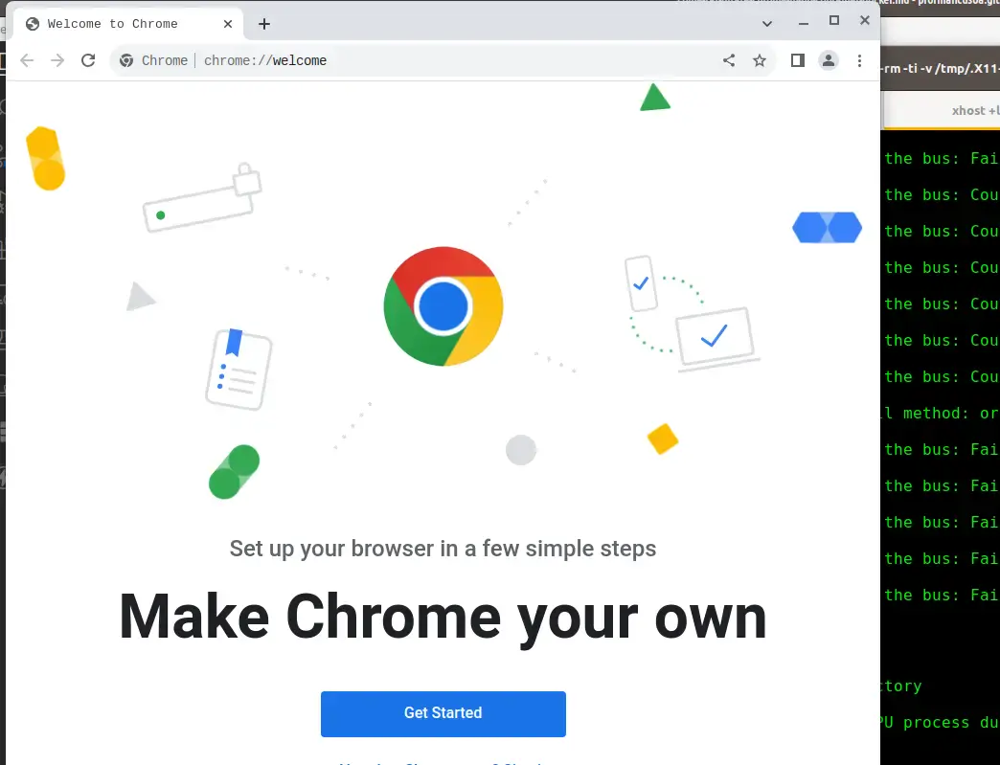

## Navighiamo in sicurezza

Google Chrome è uno dei browser più utilizzati al mondo, apprezzato per la sua velocità e facilità d'uso. Tuttavia, per migliorare la sicurezza durante la navigazione online, è possibile eseguire Chrome all'interno di un container Docker, ottenendo un ambiente isolato e protetto.

Navigare sul Web nasconde molte insidie, spesso ben camuffate.
Infatti tutti noi possiamo essere vittime di personaggi malevoli che popolano il Web. Un innocuo link ad un sito può nascondere diverse insidie, alcune anche serie e pericolose per il nostro computer.

Per limitare una serie di possibili problemi Chrome implementa un meccanismo di `sandbox` che cerca di isolare il browser dal sistema sottostante.
Tuttavia per quanto efficace questo meccanismo può essere migliorato isolando completamente il browser dal sistema operativo e dalla nostra home directory.

## Confiniamo Chrome in un container Docker

Per aggiungere questa sicurezza aggiuntiva possiamo confinare l'esecuzione di Google Chrome in un container Docker. In questo modo il browser verrà eseguito solo ed esclusivamente all'interno del container e quindi completamente isolato dal sistema Linux sottostante.
Chrome non potrà accedere al filesystem del PC né interagire con altri processi in esecuzione.

In questo modo avremo a disposizione un browser completamente isolato dal resto del sistema che potremo utilizzare per navigare in maniera più rilassata, potremo permetterci di visitare anche siti che ci paiono poco trasparenti. In caso succedesse qualcosa di anomalo, ciò avverrebbe solo ed esclusivamente all'interno del container e nessun dato nel nostro file system potrà essere compromesso.

Una volta terminata la sessione di navigazione il container Docker verrà completamente distrutto e non rimarrà nessuna traccia della nostra navigazione precedente.

## Creare un container Docker per Google Chrome

Per poter far girare Chrome in un container Docker dobbiamo prima di tutti creare l'immagine del container, tramite un `Dockerfile ' e poi dovremo lanciare il container in maniera opportuna. Vediamo i passi necessari:

### 1 - Scarichiamo il Dockerfile

Clona questo repository dal mio account GitHub

```bash
$ git clone https://github.com/profmancusoa/google-chrome-dockerized
```

Nel repository è presente il `Dockerfile` che ho creato per generare l'immagine

```bash
# Usa l'ultima versione di Debian come base
FROM debian:latest

# Aggiorna il sistema e installa strumenti necessari
RUN apt update && apt install -y wget gnupg2

# Aggiunge la chiave GPG ufficiale di Google Chrome
RUN wget -q -O - https://dl.google.com/linux/linux_signing_key.pub | apt-key add -

# Aggiunge il repository ufficiale di Chrome e installa il browser
RUN echo "deb [arch=amd64] http://dl.google.com/linux/chrome/deb/ stable main" >> /etc/apt/sources.list.d/chrome.list
RUN apt update && apt install -y google-chrome-stable

# Avvia Chrome in modalità sandbox disabilitata (attenzione ai rischi di sicurezza)
CMD ["google-chrome", "--no-sandbox"]
```

### 2 - Creiamo l'immagine del container

Ora entra nella directory e inizia il build dell'immagine docker tramite il comando `docker build`

```bash
$ cd google-chrome-dockerized
$ docker build -t google-chrome .
```

Questo processo richiederà qualche minuto, anche in funzione della velocità della tua connessione Internet.
Una volta terminato questo passo, una nuova immagine Docker sarà disponibile sul tuo sistema

```bash
$ docker images | grep google

google-chrome                   latest             2dd030b2446b   5 hours ago     1.07GB
```

### 3 - Avviare Google Chrome all'interno di Docker

Per eseguire Chrome all'interno del container dobbiamo permettere al container stesso di utilizzare lo Unix socket del server X di Linux. In questo modo Chrome potrà essere visualizzato correttamente sullo schermo del nostro sistema.

Per far ciò dobbiamo anche essere sicuri di concedere i permessi di connessione al container docker, con il seguente comando

```bash
$ xhost +local:docker
```

A questo punto potremo lanciare il docker che eseguirà correttamente Chrome in un ambiente isolato con questo comando

```bash
$ docker run --rm -ti -v /tmp/.X11-unix:/tmp/.X11-unix -v /dev/shm:/dev/shm  --device /dev/dri -e DISPLAY=$DISPLAY google-chrome
```

<br>



<br>

### 4 - Automatizzare l'avvio di Chrome in Docker

Per evitare di dover ricordarmi questi comandi ogni volta che voglio navigare in modo sicuro, creiamo un `alias` nel file .zshrc, o se usi la bash nel file .bashrc

```bash
alias dgoogle='xhost +local:docker && docker run --rm -ti -v /tmp/.X11-unix:/tmp/.X11-unix -v /dev/shm:/dev/shm  --device /dev/dri -e DISPLAY=$DISPLAY google-chrome'
```

In questo è possibile iniziare la sessione di navigazione sicura soltanto digitando `dgoogle`

Ovviamente puoi rinominare l'alias con un nome di tuo gradimento

## Conclusioni

Utilizzando sapientemente gli strumenti messi a disposizione da Linux e sfruttando la _"magia"_ di Docker abbiamo la possibilità di aumentare la sicurezza delle nostre sessioni di navigazione Web.

Grazie per aver letto questa guida su come eseguire Google Chrome in un container Docker per una navigazione più sicura. Se l'hai trovata utile, condividila con la tua rete e lasciami un commento qui sotto con le tue opinioni o domande

PS: puoi vedere il <a href="https://www.youtube.com/embed/t3-Rr5UzRgU">video</a> associato a questo post
