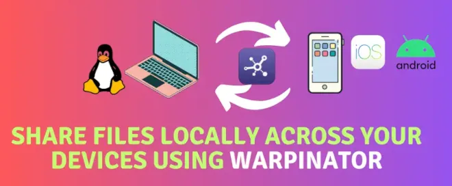

## Warpinator: Condividi File Facilmente in Rete Locale

**Warpinator** è uno strumento open source e gratuito progettato per semplificare l'invio e la ricezione di file tra computer connessi alla stessa rete locale. Con Warpinator, puoi condividere file in modo rapido e sicuro senza utilizzare servizi cloud o dispositivi esterni.

### Perché Scegliere Warpinator?

- **Sicurezza garantita**: Nessun file lascia la rete locale.
- **Facilità d'uso**: Basta installare l'app, impostare un codice di gruppo e iniziare.
- **Risparmio di banda**: Non è necessario caricare file su server esterni.
- **Flessibilità**: Funziona senza configurazioni complesse o server dedicati.

Sviluppata dal team di **Linux Mint**, Warpinator offre un'interfaccia utente intuitiva e supporta diverse distribuzioni Linux. È un'app ideale per chi cerca una soluzione open source per trasferire file in rete locale.

In questo post vedremo come installare e configurare Warpinator su sistemi basati su Debian, come **Ubuntu**, **Pop!\_OS** e altri.

---

## Installazione di Warpinator su Ubuntu

Su Ubuntu, il pacchetto ufficiale di Warpinator non è disponibile. Non preoccuparti, ti mostrerò come compilare il pacchetto `.deb` e installarlo facilmente.

Anche se può sembrare complicato, gli sviluppatori di Warpinator hanno reso il processo molto più semplice di quanto sembri.

### Preparazione dell'Ambiente

Per compilare e installare **Warpinator**, è necessario preparare l'ambiente di sviluppo configurando tutti i pacchetti richiesti. Segui questi passaggi per configurare correttamente il sistema.

#### Passo 1: Installare i Pacchetti Necessari

Apri una shell sul tuo sistema Linux e esegui il seguente comando per installare tutti i pacchetti richiesti:

```bash
sudo apt install python3-grpc-tools python3-grpcio gir1.2-xapp-1.0 \
gist libxapp1 python3-setproctitle python3-xapp xapps-common debhelper dh-python \
gnome-pkg-tools meson gobject-introspection appstream python3-grpc-tools git
```

Questo comando installerà gli strumenti di sviluppo essenziali, librerie e dipendenze per procedere con la compilazione e il building del pacchetto Warpinator.

### Clonare il Repository di Warpinator

Il primo passo per ottenere il codice sorgente di **Warpinator** è clonare il repository ufficiale. Segui questi comandi per scaricare i file necessari:

```bash
# Clona il repository ufficiale di Warpinator
git clone https://github.com/linuxmint/warpinator.git

# Accedi alla directory del progetto
cd warpinator

# Esegui il checkout dell'ultima versione stabile
git checkout 1.6.4
```

Cosa stai facendo:

- **Clonare il repository**: Scarichi il codice sorgente direttamente da GitHub.
- **Entrare nella directory**: Ti sposti nella cartella dove risiede il progetto.
- **Selezionare una versione stabile**: Garantisci l'uso di una release testata (in questo caso, la versione 1.6.4).

### Creare il Pacchetto Debian di Warpinator

Una volta clonati i file sorgente, il passo successivo è creare un pacchetto `.deb` utilizzabile per l'installazione su sistemi basati su Debian come Ubuntu.

#### Passo 1: Compilare il Pacchetto

Esegui il seguente comando per avviare il processo di build:

```bash
# Build del pacchetto Debian .deb
dpkg-buildpackage -b --no-sign
```

Cosa fa questo comando:

- **dpkg-buildpackage**: Strumento per la costruzione di pacchetti Debian.
- **-b**: Compila il pacchetto binario senza includere i sorgenti.
- **--no-sign**: Evita di firmare il pacchetto, rendendo il processo più semplice.

#### Passo 2: Installare Warpinator

Dopo aver creato il pacchetto `.deb`, sei pronto per installare **Warpinator** sul tuo sistema. Segui questi passaggi per completare l'installazione.

##### Passo 2.1: Spostarsi nella Directory Superiore

Prima di tutto, torna alla directory superiore rispetto a quella del progetto con:

```bash
cd ..
```

##### Passo 2.2: Installare il Pacchetto .deb

Esegui il seguente comando per installare il pacchetto:

```bash
sudo dpkg -i warpinator_1.6.4_all.deb
```

Durante l'installazione, vedrai un output simile al seguente:

```bash
(Lettura del database... 384604 file e directory attualmente installati.)
Preparativi per estrarre warpinator_1.6.4_all.deb...
Estrazione di warpinator (1.6.4) su (1.6.4)...
Configurazione di warpinator (1.6.4)...
Elaborazione dei trigger per mailcap (3.70+nmu1ubuntu1)...
Elaborazione dei trigger per desktop-file-utils (0.26-1ubuntu3)...
Elaborazione dei trigger per gnome-menus (3.36.0-1ubuntu3)...
Elaborazione dei trigger per libglib2.0-0:i386 (2.72.4-0ubuntu1)...
Elaborazione dei trigger per libglib2.0-0:amd64 (2.72.4-0ubuntu1)...
Elaborazione dei trigger per hicolor-icon-theme (0.17-2)...
```

#### Passo 3: Configurazione di Warpinator

Ora che hai installato **Warpinator** sul tuo sistema Linux, puoi configurarlo per condividere file in modo efficiente. Segui questi passaggi per impostare i parametri principali.

##### Passo 3.1: Accedere alle Preferenze

Avvia Warpinator e dal menu in alto a sinistra seleziona **_Preferenze_**.


---

##### Passo 3.2: Impostare la Directory di Scambio File

Nella scheda **_Generale_**, nella sezione **_Trasferimenti File_**, specifica la directory in cui desideri salvare i file ricevuti.

- Esempio di directory: `/home/antonio/Downloads/warpinator`.
- Scegli una directory che sia comoda e adeguata al tuo ambiente di lavoro.


---

##### Passo 3.3: Configurare il Codice di Gruppo e la Rete

Nella scheda **_Connessione_**, imposta un **codice di gruppo** per proteggere i trasferimenti da accessi non autorizzati. Fai clic su **_Imposta codice_** per applicare le modifiche.

Inoltre, scegli quale **interfaccia di rete** utilizzare per i trasferimenti, ad esempio la connessione Wi-Fi se disponibile.


Dopo aver configurato le preferenze, la directory per i file ricevuti e il codice di gruppo, **Warpinator** è pronto per essere utilizzato. Inizia a condividere file in modo semplice e sicuro!

#### Passo 4: Installazione su Smartphone

**Warpinator** è disponibile anche per smartphone Android e iOS. Per installare l'app sul tuo dispositivo, vai sullo store di riferimento (Google Play Store o App Store) e cerca l'applicazione **_Warpinator_**.


---

##### Passo 4.1: Configurazione di Warpinator sullo Smartphone

Dopo aver installato l'app, segui questi passaggi per configurarla:

1. Apri l'applicazione sul tuo smartphone.
2. Tocca i tre puntini in alto a destra per accedere al menu di configurazione.


---

##### Passo 4.2: Impostare il Codice di Gruppo

Per garantire la compatibilità con il tuo computer Linux:

1. Vai su **_Impostazioni_**.
2. Inserisci lo stesso **_codice di gruppo_** configurato su Linux.


---

Una volta configurato il codice di gruppo, il tuo smartphone è pronto per connettersi a **Warpinator** sul tuo computer e iniziare a condividere file in rete locale.

#### Passo 5: Scambiare File tra Linux e lo Smartphone

Per utilizzare **Warpinator** per trasferire file tra Linux e smartphone, è fondamentale assicurarsi che il firewall del proprio PC non blocchi le porte **42000** e **42001**, che sono necessarie per stabilire la connessione.

##### Passo 5.1: Verifica delle Porte del Firewall

Se le porte risultano bloccate, non sarà possibile connettere lo smartphone al PC. A scopo puramente di test, puoi temporaneamente disabilitare il firewall sul tuo sistema Linux con il seguente comando:

```bash
sudo iptables -F
```

Nota: Se dopo aver eseguito questo comando la connessione funziona correttamente, sarà necessario configurare il firewall in modo permanente per consentire il traffico sulle porte 42000 e 42001.

Se con questo comando la connessione di **Warpinator** funziona, sarà necessario configurare il firewall in modo permanente per consentire il traffico sulle porte 42000 e 42001.

A questo punto, sia sul PC che sullo smartphone, è possibile vedere i dispositivi trovati nella rete e appartenenti allo stesso codice di gruppo.


---

Ora puoi scegliere se condividere un'intera directory o un singolo file.


---

Una volta selezionato il file, il trasferimento inizierà immediatamente. Sul PC verrà richiesto di accettare il trasferimento del file.


---

Dopo aver accettato la richiesta, il file sarà trasferito e salvato nella directory configurata durante l'installazione di Warpinator su Linux.


## Conclusioni

**Warpinator** è uno strumento fantastico, open source e sicuro che permette di scambiare file tra smartphone e PC Linux attraverso la rete locale, proteggendo la privacy dei tuoi dati.

In questa guida abbiamo esplorato:

- Come installare **Warpinator** su Linux e smartphone (Android).
- Come configurare correttamente le applicazioni per un utilizzo ottimale.
- Come effettuare un trasferimento di file da Android a Linux in pochi semplici passaggi.

Ti invito a utilizzare questo tool per semplificare il trasferimento di file, evitando metodi obsoleti come l'invio di foto o documenti tramite email.

Se hai trovato utile questa guida, lascia un commento qui sotto, metti un like all'articolo e condividilo con la tua rete sociale. **Prova Warpinator oggi stesso e scopri quanto è facile trasferire file in sicurezza!**
