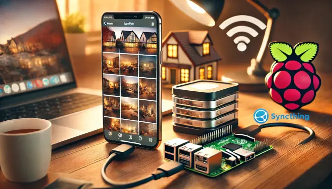
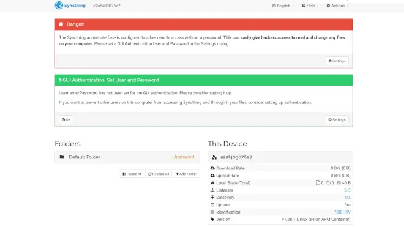
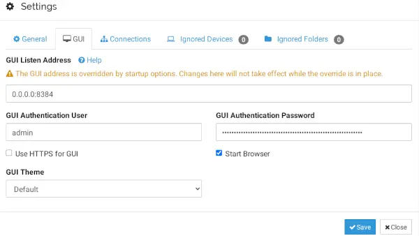
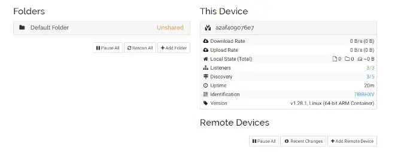
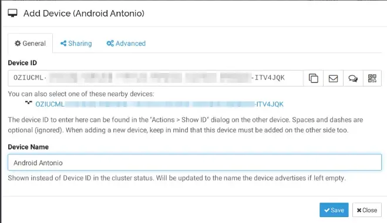
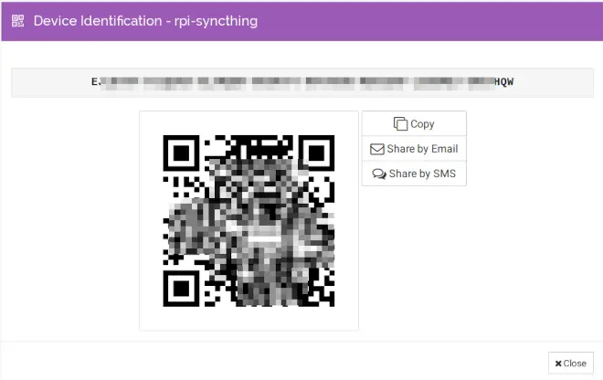
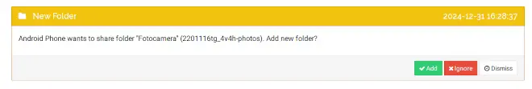
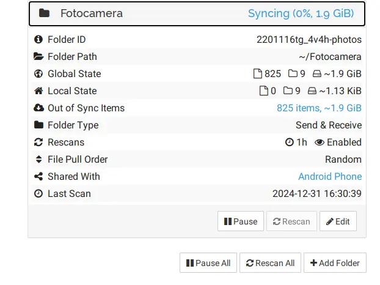

Con l’avvento degli smartphone, il numero di fotografie scattate da ciascuno di noi è cresciuto esponenzialmente. Ogni giorno, i nostri dispositivi raccolgono scatti che immortalano momenti preziosi, sia nella vita personale che professionale. Alcune foto hanno una vita effimera, come quelle condivise sui social, mentre altre meritano di essere conservate per essere riviste e ricordate in futuro.

Tuttavia, lo smartphone è un dispositivo fragile: può rompersi, essere smarrito o persino rubato. E se non proteggiamo le nostre foto, rischiamo di perderle per sempre. Immagina di festeggiare un compleanno indimenticabile e, solo pochi giorni dopo, il tuo telefono sparisce. Tutte le foto di quei momenti speciali andrebbero perse per sempre, insieme ai tuoi ricordi più cari.

Per questo motivo, è fondamentale adottare un metodo sicuro per proteggere le foto da perdite accidentali. In questo articolo, ti guiderò passo-passo nella creazione di una soluzione semplice e rispettosa della privacy. Scoprirai come utilizzare un Raspberry Pi e Syncthing per realizzare un backup automatico delle foto del tuo smartphone, senza affidarti a servizi di terze parti. Una soluzione sicura, privata e che ti aiuterà a preservare i tuoi ricordi senza il rischio di leak indesiderati.

## Syncthing: Cos'è e Come Funziona

Syncthing è un programma di sincronizzazione continua dei file, progettato per garantire sicurezza e privacy. Questo strumento open-source consente di sincronizzare file tra due o più dispositivi in tempo reale, come uno smartphone e un Raspberry Pi, garantendo che i tuoi dati siano sempre al sicuro e protetti da occhi indiscreti.

Con Syncthing, hai il pieno controllo sui tuoi dati: puoi decidere dove conservarli, con chi condividerli e come trasmetterli sulla rete. A differenza di molti servizi cloud di terze parti, Syncthing non memorizza i tuoi file su server remoti, ma li sincronizza direttamente tra i tuoi dispositivi. Questo elimina il rischio di leak accidentali o accessi non autorizzati da parte di terzi.

Grazie alla sua flessibilità, Syncthing è la scelta ideale per chi vuole una soluzione privata, sicura e affidabile per gestire i propri dati, inclusi i backup delle foto scattate con lo smartphone.

### Vantaggi di Syncthing

- **Privacy Totale**: Nessun dato viene inviato a server di terze parti.
- **Sicurezza**: Utilizza la crittografia TLS per proteggere i dati durante la sincronizzazione.
- **Tempo Reale**: I file vengono sincronizzati immediatamente dopo essere stati modificati.
- **Flessibilità**: Compatibile con diversi sistemi operativi, inclusi Windows, macOS, Linux e Android.

## Installazione di Syncthing sul Raspberry Pi

Un metodo semplice ed efficace per installare Syncthing sul tuo Raspberry Pi è utilizzare i container Docker. Questo approccio garantisce un’installazione isolata e indipendente dagli altri servizi presenti sul dispositivo, evitando potenziali conflitti di librerie o problemi di compatibilità.

L’uso di Docker offre numerosi vantaggi:

- **Isolamento**: Syncthing opera in un ambiente separato, senza interferire con altre applicazioni o configurazioni.
- **Facilità di Aggiornamento**: Aggiornare Syncthing è semplice, grazie ai comandi Docker.
- **Flessibilità**: Puoi gestire e configurare Syncthing con facilità, senza modificare il sistema operativo sottostante.

### Prerequisiti

Prima di iniziare, assicurati di avere:

- Un Raspberry Pi configurato con Docker e Docker Compose installati.
- Accesso a una connessione Internet stabile.
- Un hard disk o una memoria USB collegata al Raspberry Pi, che sarà utilizzata per memorizzare le foto sincronizzate.

### Comandi per Installare Syncthing con Docker

Ecco i passaggi principali per l’installazione:

1. Scarica l'immagine di Syncthing eseguendo il comando seguente:

   ```bash
   docker pull syncthing/syncthing
   ```

2. Crea e avvia il container Esegui il comando per avviare Syncthing in un container:

   ```bash
   docker run -d \
     --name=syncthing \
     --hostname=rpi-syncthing \
     --network=host \
     -v /percorso/al/disco:/var/syncthing \
     -e PUID=1000 \
     -e PGID=1000 \
     -e TZ=Europe/Rome \
     --restart unless-stopped \
     syncthing/syncthing
   ```

   **Nota**: Sostituisci /percorso/al/disco con il percorso della directory del tuo hard disk collegato.

3. Accedi all’interfaccia web

   Una volta avviato il container, puoi accedere all’interfaccia web di Syncthing tramite il browser, visitando l’indirizzo:

   ```bash
   http://<IP-del-Raspberry-Pi>:8384
   ```

   Al primo accesso, Syncthing ti chiederà se desideri accettare o meno l'invio di informazioni anonime sull'utilizzo del software. Questa scelta è opzionale e non influisce sul funzionamento di Syncthing.

   Se tutto ha funzionato correttamente, accedendo alla home page di Syncthing dovresti vedere una pagina simile a questa:



### Configurazione delle Credenziali di Accesso a Syncthing

Quando accedi per la prima volta all’interfaccia di Syncthing, noterai due notifiche evidenziate in rosso e verde. Syncthing ti informa che l'accesso all'interfaccia di controllo è attualmente aperto a chiunque sulla rete locale. Per garantire la sicurezza, ti viene consigliato di configurare credenziali di accesso impostando un nome utente e una password.

#### Come Configurare le Credenziali

1. Accedi alle impostazioni premendo il pulsante Settings (in basso a destra, nel box rosso).

2. Modifica le impostazioni dell’interfaccia:
   Nella finestra Settings che si apre, seleziona il tab GUI.

3. Imposta le credenziali:
   Specifica un nome utente e una password sicura nei campi dedicati. È consigliabile utilizzare una password robusta, composta da almeno 12 caratteri con una combinazione di lettere maiuscole, minuscole, numeri e simboli.

4. Salva le modifiche:
   Una volta inserite le credenziali, premi Save per applicare le modifiche. Syncthing potrebbe riavviarsi per rendere effettiva la configurazione.



Dopo aver configurato correttamente le credenziali di accesso e autenticandoti con il nome utente e la password appena creati, visualizzerai l'home page finale di Syncthing. Questa pagina fornisce una panoramica dello stato attuale del sistema, mostrando i dispositivi connessi, le directory sincronizzate e altre informazioni utili.



## Installazione e Configurazione di un Dispositivo Remoto

Dalla home page di Syncthing sul Raspberry Pi, noterai che al momento è presente solo il dispositivo locale (il Raspberry Pi). Per iniziare a sincronizzare i tuoi file, è necessario aggiungere un dispositivo remoto, come il tuo smartphone.

In questa guida, vedremo come installare e configurare Syncthing su uno smartphone Android. Se utilizzi un iPhone, la procedura è simile e richiede l'installazione dell'app [Mobius Sync dall'App Store](https://apps.apple.com/us/app/m%C3%B6bius-sync/id1539203216?ign-itscg=30200&ign-itsct=apps_box#?platform=iphone).

---

### Scarica e Installa l’App Syncthing

Per motivi di policy, l’app Syncthing per Android non è più disponibile sul Google Play Store. Tuttavia, puoi scaricarla facilmente dal [repository ufficiale GitHub del progetto](https://github.com/syncthing/syncthing-android/releases/download/1.28.1/app-release.apk) oppure utilizzando il seguente QR code:

<br>
<center>

</center>
<br>

Dopo aver installato l’app, aprila. Se l’installazione è andata a buon fine, vedrai una schermata iniziale simile a questa:

<br>
<center>

</center>
<br>

---

### Concedi le Autorizzazioni Necessarie

Per permettere a Syncthing di funzionare correttamente, l’app richiede alcune autorizzazioni specifiche. Ecco cosa fare:

- **Accesso all’archiviazione**: Consenti all’app di accedere alle foto e ai file presenti sul tuo smartphone.
- **Posizione in background**: Questa autorizzazione è opzionale. Syncthing consiglia di concederla per un funzionamento ottimale, ma puoi anche scegliere di negarla (come ho fatto io).
- **Invio di notifiche**: Puoi consentire questa autorizzazione senza preoccupazioni, poiché serve solo per aggiornamenti sullo stato della sincronizzazione.
- **Disabilitazione dell’ottimizzazione batteria**: Questo passaggio è importante per garantire che Syncthing possa funzionare correttamente anche quando l’app è in background.

---

Ora sei pronto per configurare la sincronizzazione tra il tuo smartphone e il Raspberry Pi! Nel prossimo passaggio vedremo come collegare i due dispositivi.

## Collegare un Dispositivo Remoto al Raspberry Pi

Ora è necessario collegare lo smartphone al raspberry-pi e viceversa, in modo da abilitare la sincronizzazione automatica

### Configurare il Collegamento su Syncthing

#### Aggiungere un Dispositivo Remoto al Raspberry Pi

Per collegare lo smartphone al Raspberry Pi, segui i seguenti passaggi:

1. Accedi alla **home page di Syncthing** sul Raspberry Pi.
2. Premi il pulsante `Add Remote Device` in basso a destra.
3. Nella schermata che appare, seleziona l'ID del dispositivo remoto (lo smartphone), assegna un nome al dispositivo e premi **Save**.

Ecco un esempio visivo:



#### Collegare il Raspberry Pi allo Smartphone

Ora è necessario configurare lo smartphone per riconoscere il Raspberry Pi. Procedi come segue:

1. Dalla home page di Syncthing sul Raspberry Pi, premi **Identification**. Verrà visualizzato un **QR code** contenente le informazioni del dispositivo.



2. Apri l'app **Syncthing** sul tuo smartphone e vai al tab `Dispositivi`.
3. Premi il pulsante `+` per aggiungere un nuovo dispositivo.

<br>
<center>
   
</center>
<br>

4. Dalla schermata **Aggiungi Dispositivo**, seleziona l'icona del QR code.

<br>
<center>
   
</center>
<br>

5. Scansiona il QR code visualizzato sulla home page di Syncthing sul Raspberry Pi.
6. Assegna un nome al dispositivo, ad esempio: `rpi-syncthing`.

### Verificare la Connessione

Se tutto è stato configurato correttamente, lo smartphone apparirà nella colonna di destra della home page di Syncthing sul Raspberry Pi.

<center>
   
</center>

A questo punto, i due dispositivi sono **correttamente connessi** e pronti per avviare la sincronizzazione automatica dei file.

## Sincronizzare le Foto dallo Smartphone al Raspberry Pi con Syncthing

Una volta configurato Syncthing su entrambi i dispositivi, il passo finale è abilitare la sincronizzazione della cartella delle foto dal tuo smartphone al Raspberry Pi. Segui questi passaggi per completare la configurazione:

### Passaggi per Configurare la Sincronizzazione

1. **Accedere alla Cartella "Fotocamera" sullo Smartphone**  
   Apri l'app **Syncthing** sullo smartphone, vai al tab `Cartelle` e seleziona la cartella denominata `Fotocamera`. Questa cartella, solitamente preconfigurata, include tutte le foto scattate con il telefono.

<br>
<center>
   
</center>
<br>

2. **Abilitare la Condivisione della Cartella con il Raspberry Pi**  
   Nella schermata della cartella `Fotocamera`, individua l’opzione **Condividi con dispositivo** (o equivalente) e seleziona il Raspberry Pi dall’elenco dei dispositivi disponibili. Conferma la configurazione come mostrato in figura.

<br>
<center>
   
</center>
<br>

3. **Accettare la Condivisione sul Raspberry Pi**  
   Dopo qualche istante, nella home page di Syncthing sul Raspberry Pi apparirà una notifica che ti informa della richiesta di condivisione da parte dello smartphone. La notifica mostrerà il nome della cartella e il dispositivo richiedente.

   

   Premi `Add` per accettare la condivisione e configurare la cartella sul Raspberry Pi.

4. **Avviare la Sincronizzazione**  
   A questo punto, Syncthing inizierà immediatamente la sincronizzazione della cartella `Fotocamera` dal tuo smartphone al Raspberry Pi. Le foto saranno archiviate localmente sul Raspberry Pi, mettendo al sicuro i tuoi ricordi.

   

---

### Automazione della Sincronizzazione

D'ora in poi, ogni volta che lo smartphone si connetterà al WiFi di casa, la sincronizzazione avverrà automaticamente, proteggendo le tue foto.

## Conclusione: Proteggi i Tuoi Ricordi in Sicurezza

Configurando Syncthing e il Raspberry Pi, hai realizzato un sistema di backup automatico, sicuro e rispettoso della privacy per le tue foto. Questo approccio ti permette di archiviare i tuoi ricordi in modo affidabile senza dover ricorrere a servizi cloud di terze parti, proteggendoli da perdite accidentali o accessi non autorizzati.

### Perché Scegliere Questa Soluzione?

- **Privacy**: Nessuna condivisione dei tuoi dati con provider esterni.
- **Sicurezza**: I file sono sempre crittografati durante il trasferimento.
- **Praticità**: La sincronizzazione automatica semplifica la gestione dei tuoi backup.
- **Controllo Totale**: I tuoi dati sono esclusivamente sotto il tuo controllo.

Ora puoi goderti la tranquillità di sapere che le tue foto sono al sicuro ogni volta che sei a casa.

### Fai il Prossimo Passo!

Hai trovato utile questa guida? Condividila con amici e familiari che potrebbero beneficiare di una soluzione di backup simile! Se hai domande, suggerimenti o vuoi raccontarci la tua esperienza, lascia un commento qui sotto.

**Hai altre idee per migliorare la sicurezza dei dati personali? Scrivimi! Mi piacerebbe sentire la tua opinione e discutere nuove soluzioni insieme.**

Grazie per aver letto questa guida e buon backup dei tuoi ricordi!
