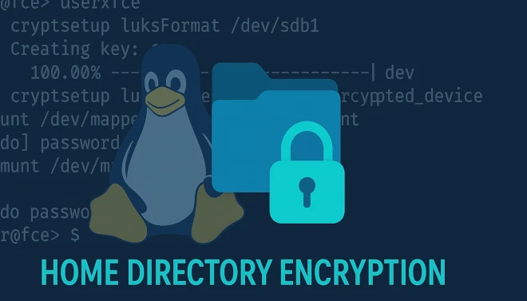

## Introduzione

La quasi totalità delle moderne distribuzioni Linux supporta la **crittografia dei dati** tramite il potente sistema **LUKS (Linux Unified Key Setup)**, che permette di aggiungere un importante livello di protezione per la tua home directory e altre partizioni del sistema.

LUKS cifrando l’intera partizione garantisce una sicurezza superiore rispetto ad altre soluzioni come ecryptfs, anche se richiede l’inserimento della passphrase al boot, prima dell’accesso utente.

Ma cosa fare se hai già un sistema Linux installato e funzionante e vuoi proteggere la tua home directory senza dover reinstallare o perdere i dati?

Niente paura: in questa guida completa scoprirai tutti i passaggi per **cifrare in sicurezza la tua home directory esistente usando LUKS**, senza rischio di perdita dati. Inoltre, vedremo come configurare il sistema con ambiente XFCE4 e LightDM per uno sblocco della crittografia semplice e integrato con la password utente, per un’esperienza di login fluida e sicura.


## Scenario di partenza

Questa guida è basata su un sistema Linux già funzionante con una struttura a due partizioni principali:

1. Partizione **root**  
2. Partizione separata **home**

In aggiunta, l’ambiente desktop utilizzato è **XFCE4** con il gestore di login **LightDM**, quindi la guida presuppone questa configurazione specifica.

Tuttavia, se il tuo sistema ha una configurazione diversa, come un altro desktop environment o un gestore di login differente, sarà comunque semplice adattare i passaggi alle tue esigenze specifiche, grazie alla natura modulare di Linux e della cifratura LUKS.

Sono inoltre utilizzate le seguenti ipotesi di partenza:

- Punto di mount per disco esterno: **/media/usb**  
- Partizione di home: **/dev/nvme0n1p5**  
- Utente Linux: **jon**

Adatta ovviamente questi parametri al tuo caso specifico.

## Passi per la cifratura della home

La cifratura della partizione **home** è un'operazione **distruttiva**, nel senso che tutti i dati presenti saranno **persi** durante il processo. Per questo motivo è **fondamentale effettuare un backup completo e sicuro** prima di procedere.

Ipotizzando di utilizzare un disco esterno montato in **/media/usb** per il backup, il primo passo sarà copiare tutti i dati importanti della home in questa posizione, garantendo così la loro sicurezza.

Solo dopo aver verificato che il backup sia completo e accessibile, si potrà procedere con la cifratura della partizione home usando **LUKS (Linux Unified Key Setup)** e relativi strumenti come `cryptsetup`. 

Ricorda: questa procedura richiede attenzione e precisione per evitare la perdita definitiva dei dati. Seguendo correttamente ogni passaggio potrai proteggere in modo efficace la tua home directory senza compromettere i tuoi file personali.

### 1. Crea una directory chiamata home_backup

Per creare una directory per il backup dei dati sul disco esterno montato in `/media/usb`, usa questo comando:

```bash
mkdir -p /media/usb/home_backup
```

Se non hai i permessi necessari, aggiungi `sudo` per eseguire il comando con privilegi di root:


### 2. Copia della home

Per copiare l’intera home directory nel disco di backup, usa il seguente comando:

```bash
cd ~
tar cvfh /media/usb/home_backup/backup.tar .
```

Questo comando crea un archivio compresso (`backup.tar`) di tutti i file e le cartelle presenti nella tua home directory, salvandolo nella directory di backup sul disco esterno montato in `/media/usb`.

Assicurati che lo spazio disponibile sul disco esterno sia sufficiente per contenere tutti i dati della home.

In questo modo avrai una copia sicura e completa dei tuoi dati pronta per essere ripristinata dopo la cifratura.


### 3. Rimozione della home

Per poter procedere con la cifratura, è necessario che la partizione della **home** non sia montata. Per fare questo, modifica il file **/etc/fstab** commentando la riga relativa alla tua partizione home.

Ad esempio, apri il file con un editor di testo come `nano` o `vim`:

```bash
vi /etc/fstab
```

Individua la riga che monta la partizione della home, che potrebbe somigliare a questa:

```bash
...
...
UUID=a2b8dacf-caa7-4704-bb06-72eadabd6682 /home          ext4    defaults 0 0
...
...
```

e commentala aggiungendo un cancelletto (`#`) all’inizio della linea, così:


```bash
...
...
#UUID=a2b8dacf-caa7-4704-bb06-72eadabd6682 /home          ext4    defaults 0 0
...
...
```

> **IMPORTANTE:** Assicurati di non modificare o rimuovere altre voci nel file **/etc/fstab**, altrimenti il sistema potrebbe non avviarsi correttamente.

Salva e chiudi il file.  


### 4. Reboot del sistema

Dopo aver modificato il file **/etc/fstab** e smontato la partizione home, effettua un riavvio del sistema per applicare le modifiche:

```bash
sudo reboot
```


### 5. Login come root

Poiché la partizione **home** non è montata dopo il reboot, è necessario effettuare il login come **root** o utilizzare un terminale con privilegi di root per procedere con le operazioni di cifratura.

> Assicurati di lavorare con attenzione come root per evitare modifiche indesiderate al sistema.

### 6. Preparazione della home cifrata e sicura

Ora prepariamo la partizione della home abilitando la cifratura con LUKS:

```bash
cryptsetup luksFormat /dev/nvme0n1p5 
```

> **IMPORTANTE:** Questa operazione cancellerà **tutti i dati** presenti sulla partizione home in modo **irreversibile**. Assicurati di aver effettuato un backup completo e verificato prima di procedere.

Durante il processo ti verrà richiesta una **passphrase** per proteggere la partizione cifrata.

> **IMPORTANTE:** Imposta la passphrase **uguale alla password di login** dell’utente *jon*, in modo da integrare il processo di decrittazione con l’accesso utente e rendere l’esperienza di login fluida e sicura.


### 7. Formatta la home

Ora possiamo formattare la partizione home cifrata. In questo esempio assumiamo di usare il filesystem **ext4**, ma puoi scegliere qualsiasi altro filesystem supportato da Linux, come **xfs** o **btrfs**.

Apri la partizione cifrata con il comando:

```bash
cryptsetup open /dev/nvme0n1p5  luks
```

Questo crea un dispositivo mappato chiamato `/dev/mapper/luks`.

A questo punto, formatta il dispositivo con il filesystem ext4:

```bash
mkfs.ext4 /dev/mapper/luks
```

Al termine della formattazione, la tua partizione home cifrata sarà pronta per essere montata e utilizzata.

### 8. Restore dei dati della home

Per ripristinare i dati nella nuova partizione home cifrata, procedi innanzitutto montando la partizione sbloccata:


```bash
mount /dev/mapper/luks /home
```

Poi spostati nella directory di home:

```bash
cd /home
```

Crea la cartella dell’utente (esempio: *jon*) e assegna i permessi corretti:

```bash
mkdir jon

chown -R jon:jon jon
```

Assicurati che il disco esterno con il backup sia montato in **/media/usb**.  

Infine, esegui il restore dei dati dalla copia di backup:


```bash
cd /home/jon

tar xvfh /media/usb/home_backup/backup.tar .
```

In questo modo tutti i dati verranno ripristinati nella nuova home cifrata, mantenendo permessi e struttura dei file.

> **Nota:** se usi un altro nome utente o percorso di backup, adatta i comandi di conseguenza.


### 9. Ripristino della home al boot

Per ripristinare la home all'avvio del sistema, è necessario configurare correttamente i file **/etc/fstab** 

Quindi aggiungi la seguente linea al file *fstab*

```bash
/dev/mapper/crypthome /home ext4 defaults 0 2
```

Questa riga indica al sistema di montare il dispositivo decifrato /dev/mapper/luks nella directory /home utilizzando il filesystem ext4. I parametri defaults 0 2 indicano le opzioni di montaggio standard, di non effettuare il dump e di controllare il filesystem dopo la root

### 10. Integrazione con il sistema di login

Ad ogni avvio, prima di montare la home, è necessario "aprire" la partizione cifrata inserendo la passphrase scelta in fase di configurazione. Poiché abbiamo impostato la passphrase uguale alla password di login dell'utente, è possibile sbloccare la home inserendo **una sola volta** la password durante il login.

Per abilitare questo comportamento, configuriamo il sistema di autenticazione di Linux tramite **PAM (Pluggable Authentication Module)** utilizzando il modulo **pam_mount**, che supporta lo sblocco automatico delle partizioni cifrate durante la fase di login sia da console che da gestore grafico (LightDM).


#### Installazione di pam_mount

Se il modulo **pam_mount** non è già presente, installalo usando il comando adatto alla tua distribuzione:

```bash
sudo apt install pam-auth-update pam-mount # Ubuntu/Debian
sudo pacman -S pam_mount # Arch Linux
sudo dnf install pam_mount # Fedora/CentOS

```

Se preferisci, puoi anche utilizzare un gestore grafico per l’installazione del software.


#### Configurazione di pam_mount

1. Modifica il file di configurazione `/etc/security/pam_mount.conf.xml` e aggiungi o modifica la riga `<volume>` in questo modo (adattando l’utente e il path della partizione):

```xml
<pam_mount>
<volume user="jon" fstype="crypt" path="/dev/nvme0n1p5" mountpoint="/home" options="crypto_name=crypthome,allow_discard" />
<mkmountpoint enable="1" remove="true">
</pam_mount>
```

> **Nota:**  
> - `user="jon"` indica l’utente per cui avviene il mount.  
> - `fstype="crypt"` indica che si tratta di un volume cifrato LUKS.  
> - `path` è la partizione cifrata.  
> - `mountpoint` è la directory di mount (la tua home).  
> - `crypto_name` deve corrispondere al nome usato durante il `cryptsetup open` (es. `luks`).  
> - `allow_discard` abilita il supporto TRIM (opzionale).


2. Aggiungi le seguenti righe in fondo ai file PAM di sistema per abilitare pam_mount su login e sessioni.

**/etc/pam.d/system-login** (o `/etc/pam.d/common-auth` su alcune distro):


aggiungi al fondo del file

```bash
auth    optional pam_mount.so debug
session optional pam_mount.so debug
```

**/etc/pam.d/lightdm**

aggiungi al fondo del file

```bash
auth    optional pam_mount.so debug
session optional pam_mount.so debug
```

Se preferisci evitare i messaggi di debug, rimuovi `debug` dalle righe sopra.

#### Verifica e reboot

Riavvia il sistema:

```bash
sudo reboot
```

Effettua il login normalmente tramite LightDM o terminale. La partizione home cifrata dovrebbe sbloccarsi automaticamente usando la password del tuo utente, garantendo un accesso fluido e sicuro.


## Conclusioni

Seguendo questi passaggi, hai aumentato significativamente la sicurezza del tuo sistema Linux quotidiano, proteggendo i dati più importanti contenuti nella tua home directory.

In caso di smarrimento o furto del PC, chiunque trovi il dispositivo non potrà accedere ai tuoi file personali, grazie alla robusta cifratura con LUKS. Anche un accesso alla partizione root non consentirebbe di recuperare informazioni private contenute nella home.

Se invece il tuo sistema ha una configurazione differente da quella illustrata in questa guida, ti invito a condividere le tue esperienze e modifiche nei commenti qui sotto, così da arricchire questa risorsa per la community Linux.

Proteggi la tua privacy e rendi il tuo sistema davvero sicuro con la cifratura della home directory!


